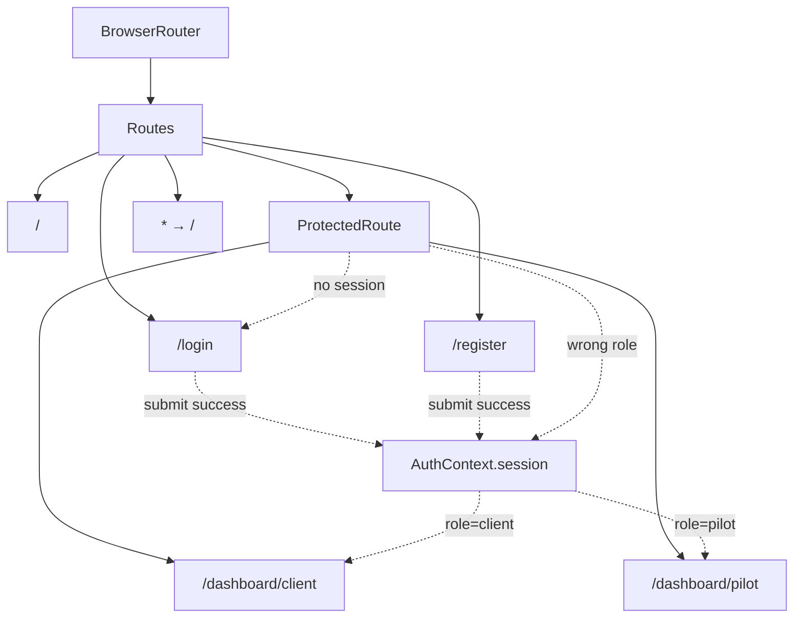
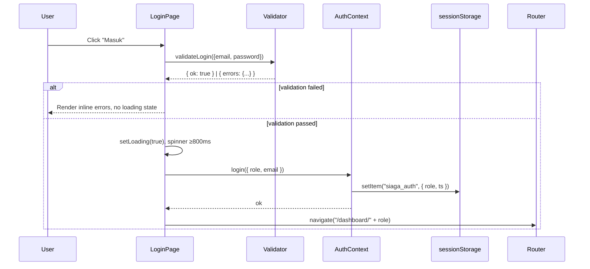
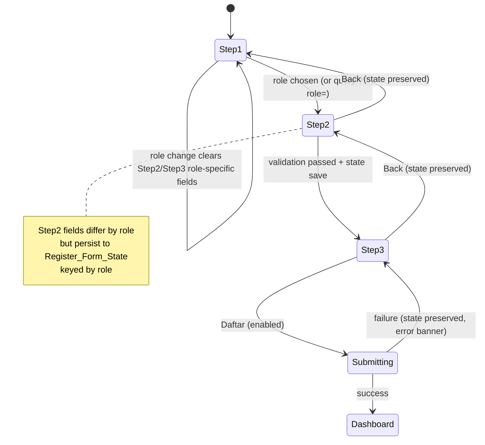

# Design Document

## Overview

Fitur **auth-pages** memperkenalkan dua halaman terotentikasi (`/login` dan `/register`) ke aplikasi SIAGA single-page existing, plus dua route dashboard placeholder (`/dashboard/client` dan `/dashboard/pilot`). Karena scope kompetisi SEFEST 2026 adalah demo frontend-only, autentikasi dilakukan secara mock (tanpa backend nyata) dan session disimpan di `sessionStorage` agar reset saat tab ditutup.

Desain memprioritaskan tiga tujuan strategis:

1. **Konsistensi brand** — halaman wajib terasa satu kesatuan dengan landing page existing. Reuse `CustomCursor`, `Drone_Model` (`public/models/drone.glb`), design tokens (`--color-primary`, `--color-accent`, `--color-surface`, `--color-danger`), dan font stack (Montserrat heading + Inter body).
2. **Form correctness** — validasi client-side ketat, state preservation antar step Register, dan role-gating konsisten antara form input dan session storage. Sebagian besar bug auth muncul di area ini, jadi logika validator dan reducer harus pure dan testable.
3. **Performa** — `Drone_Model` di-lazy-load dengan React Suspense supaya form area selalu interaktif lebih dahulu, dan disembunyikan di viewport mobile (<768px) untuk hemat memori GPU.

Keputusan arsitektural utama:

- **react-router-dom v6** diperkenalkan ke aplikasi. `App.jsx` saat ini single-route diubah menjadi konfigurasi `<Routes>` dengan landing page existing dipasang di route `/`.
- **Auth state** dikelola via React Context (`AuthContext`) dengan reducer pure, supaya logika role-gating bisa diuji terisolasi tanpa render component.
- **Register flow** menggunakan satu komponen `RegisterPage` dengan internal step state (1 → 2 → 3), bukan nested route. Alasan: `Register_Form_State` perlu hidup selama transisi step tanpa kehilangan data karena unmount.
- **Validator** dipisah ke modul pure function (`src/auth/validators.js`) sehingga dapat diuji property-based tanpa DOM.
- **Page transition** menggunakan Framer Motion (sudah dependency existing) dengan `AnimatePresence` di level `Routes` wrapper.

## Architecture

### Module Boundaries

```
src/
├── App.jsx                    # Router root (existing landing remains at "/")
├── auth/
│   ├── AuthContext.jsx        # Provider + useAuth hook (mock session)
│   ├── authReducer.js         # Pure reducer for session state
│   ├── validators.js          # Pure validation functions (PBT target)
│   ├── routes.js              # Centralized route paths + role→dashboard map
│   └── ProtectedRoute.jsx     # Route guard for /dashboard/*
├── pages/
│   ├── LoginPage/
│   │   ├── LoginPage.jsx
│   │   ├── LoginPage.css
│   │   ├── RoleTabSwitcher.jsx
│   │   └── LoginForm.jsx
│   ├── RegisterPage/
│   │   ├── RegisterPage.jsx
│   │   ├── RegisterPage.css
│   │   ├── RegisterStepper.jsx
│   │   ├── RoleSelector.jsx          # Step 1
│   │   ├── DataEntryForm.jsx         # Step 2
│   │   ├── VerificationStep.jsx      # Step 3 (branches by role)
│   │   ├── SidopiUpload.jsx          # Pilot-only file dropzone
│   │   └── registerReducer.js        # Pure reducer for Register_Form_State
│   └── DashboardPlaceholder/
│       ├── ClientDashboard.jsx
│       └── PilotDashboard.jsx
└── components/
    ├── AuthLayout.jsx         # Split-screen shell shared by Login/Register
    ├── AuthDroneScene.jsx     # Lazy-loaded Three.js scene (reuses Scene.jsx logic)
    └── PageTransition.jsx     # Framer Motion wrapper for route transitions
```

### Routing Architecture



### Auth State Lifecycle



### Register Step Flow



## Components and Interfaces

### `AuthContext`

Provider terletak di `App.jsx` membungkus `Routes`. State minimal:

```js
{ session: null | { role: 'client' | 'pilot', email: string, ts: number } }
```

API:

- `login({ role, email })` → write to `sessionStorage` key `siaga_auth`, set state.
- `logout()` → clear both.
- `useAuth()` hook returns `{ session, login, logout }`.

Storage key dipilih `sessionStorage` (bukan `localStorage`) sesuai Requirement 9.4 yang mengharuskan refresh Register_Page kembali ke Step 1 — sessionStorage tetap selama tab terbuka tetapi cocok dengan ekspektasi "demo only".

### `ProtectedRoute`

Wrapper untuk dashboard route. Logika:

```
function pickRedirect(session, requestedRole):
  if session is null: return '/login'
  if session.role !== requestedRole: return '/dashboard/' + session.role
  return null  // allow render
```

Logika ini di-extract ke pure function `pickRedirect(session, requestedRole)` di `src/auth/routes.js` agar bisa diuji property-based.

### `AuthLayout`

Komponen presentational yang dipakai oleh `LoginPage` dan `RegisterPage`. Props: `{ children }` (form area). Render split-screen 50/50 di `>=1024px`, stacked di `<1024px`, sembunyikan `AuthDroneScene` di `<768px`.

```
<div class="auth-layout">
  <aside class="auth-layout__hero">           // panel kiri, navy
    <Logo size="large" />
    <h1>SIAGA</h1>
    <p>Sistem Inspeksi Aerial Geospasial Andalan</p>
    <Suspense fallback={<DronePlaceholder />}>
      <AuthDroneScene />
    </Suspense>
  </aside>
  <section class="auth-layout__form">         // panel kanan, surface
    {children}
  </section>
</div>
```

### `LoginPage`

Komponen state:

```js
{
  role: 'client' | 'pilot',           // mirrored to RoleTabSwitcher
  email: string,
  password: string,
  rememberMe: boolean,
  errors: { email?: string, password?: string, global?: string },
  isSubmitting: boolean,
}
```

Submit handler urutan eksak (penting untuk Requirement 5.7–5.9 dan 14.4):

1. Run `validateLogin()`.
2. If errors non-empty → set `errors`, return early. **Tidak** set `isSubmitting`.
3. If `errors` masih punya pesan tampil di state → return early (Requirement 5.9).
4. If `isSubmitting === true` → return early (Requirement 14.4).
5. Set `isSubmitting = true`, await mock delay ≥800ms.
6. Mock auth: 95% success, 5% acak gagal (untuk Requirement 14.1).
7. On success: call `login({ role, email })` then `navigate('/dashboard/' + role)`.
8. On failure: set `errors.global`, set `isSubmitting = false`.

### `RoleTabSwitcher`

Props: `{ role, onChange }`. Implements WAI-ARIA tabs pattern (Requirement 12.5):

- `role="tablist"` pada container
- Setiap tab: `role="tab"`, `aria-selected`, `tabIndex={role === active ? 0 : -1}`
- Keyboard: ArrowLeft / ArrowRight memindah tab, Enter / Space mengaktifkan, Tab keluar dari komponen
- Animasi border bawah cyan slide saat tab ganti, durasi 300ms (range 200–400ms sesuai Requirement 4.3)

### `RegisterPage`

Komponen menggunakan reducer (`registerReducer`) untuk `Register_Form_State`:

```js
state = {
  step: 1 | 2 | 3,
  role: null | 'client' | 'pilot',
  client: { companyName, corporateEmail, phone, password, confirmPassword },
  pilot: { fullName, email, phone, password, confirmPassword },
  sidopiFile: null | { name, size, type, blob },
  termsAccepted: boolean,
  stepErrors: { [field]: string },
  globalError: string | null,
  isSubmitting: boolean,
}
```

Reducer actions: `SET_ROLE`, `SET_FIELD`, `SET_FILE`, `CLEAR_FILE`, `TOGGLE_TERMS`, `GO_TO_STEP`, `BACK`, `SET_ERRORS`, `CLEAR_ERROR`, `SUBMIT_START`, `SUBMIT_SUCCESS`, `SUBMIT_FAILURE`.

Penting:

- `SET_ROLE` ketika role berubah dari nilai sebelumnya yang berbeda → reset `client` dan `pilot` field, plus `sidopiFile` (Requirement 9.2).
- Step transitions hanya boleh terjadi via `GO_TO_STEP` dan `BACK` actions, dengan guard di reducer (mis. tidak bisa ke Step 2 jika `role === null`, sesuai Requirement 6.6).
- `GO_TO_STEP` melalui middleware: pertama panggil validator, jika lolos lakukan persistence simulation (atomic — write to internal ref), baru dispatch `GO_TO_STEP`. Jika persistence gagal → dispatch `SET_ERRORS({ global: 'Gagal menyimpan data, silakan coba lagi' })`, tidak transisi (Requirement 7.8a).
- `BACK` tidak menjalankan validator dan tidak menghapus field (Requirement 7.9, 8.9).
- Concurrent action protection (Requirement 7.8b): action handler menggunakan flag `inFlight` di reducer; aksi kedua dalam frame yang sama di-drop.

### `RoleSelector` (Step 1)

Dua kartu interaktif. Aksesibilitas:

- Setiap kartu adalah `<button>` (bukan `<div>`) untuk keyboard support otomatis (Requirement 12.6).
- Hover effect: `transform: translateY(-6px)` dengan transition `200ms ease-out`.
- Klik / Enter / Space → dispatch `SET_ROLE` lalu `GO_TO_STEP(2)`.

Query parameter `?role=client|pilot` di-read saat mount via `useSearchParams`. Jika valid dan `state.role === null` (mount pertama), auto-set role + go to Step 2 (Requirement 1.6). Listener untuk perubahan query selanjutnya **tidak** dipasang (Requirement 1.7a) — kita hanya pakai `useSearchParams` di efek yang berjalan satu kali (`[]` deps).

### `DataEntryForm` (Step 2)

Render fields berbeda berdasarkan `state.role`. Validasi dilakukan saat klik "Lanjut":

```
errors = validateStep2(state.role, state[state.role])
if errors non-empty: SET_ERRORS, no transition
else: persist + GO_TO_STEP(3)
```

Bordur input bottom-only seperti landing page, focus state dengan accent cyan + `box-shadow: 0 1px 0 0 var(--color-accent), 0 4px 12px -4px rgba(0,210,255,0.4)`.

### `VerificationStep` (Step 3)

Render bercabang (Requirement 8.6a — Client SAMA SEKALI tidak boleh me-render `SidopiUpload`):

```jsx
{state.role === 'pilot' ? <SidopiUpload /> : <ClientSummary />}
<TermsCheckbox />
<button disabled={!isSubmitEnabled(state)}>Daftar</button>
```

`isSubmitEnabled` = pure function di `validators.js`:

```
function isSubmitEnabled(state):
  if !state.termsAccepted: return false
  if state.role === 'pilot' && state.sidopiFile === null: return false
  if state.role === 'pilot' && !isValidSidopiFile(state.sidopiFile): return false
  return true
```

### `SidopiUpload`

Dropzone pakai native HTML5 drag/drop API (tidak butuh library tambahan). Validasi file:

```
function validateSidopiFile(file):
  if !ALLOWED_MIME.includes(file.type): return error('Format file harus PDF, JPG, atau PNG')
  if file.size > 5 * 1024 * 1024: return error('Ukuran file maksimal 5 MB')
  return ok
```

`ALLOWED_MIME = ['application/pdf', 'image/jpeg', 'image/png']`. Validasi MIME (bukan ekstensi) sesuai Requirement 11.2. Saat invalid, file ditolak total — tidak masuk ke `state.sidopiFile`, tidak menampilkan info file (Requirement 8.3, 8.4).

### `AuthDroneScene`

Component terpisah yang lazy-loaded:

```jsx
const AuthDroneScene = lazy(() => import('./AuthDroneScene'));
```

Internal: reuse pattern dari `Scene.jsx` existing dengan model `public/models/drone.glb`, tapi dengan environment lebih sederhana (no parallax mouse tracking, slow floating + propeller spin saja). Suspense fallback adalah `<div className="auth-drone-fallback" />` solid navy — tidak block form interaction (Requirement 10.2, 10.3).

### `PageTransition`

Wrapper pakai Framer Motion `<motion.div>` dengan variants:

```js
const variants = {
  initial: { opacity: 0, y: 24 },
  animate: { opacity: 1, y: 0, transition: { duration: 0.4, ease: 'easeOut' } },
  exit:    { opacity: 0, y: -16, transition: { duration: 0.3 } },
};
```

Durasi 400ms enter berada dalam range 300–600ms (Requirement 2.10). `AnimatePresence mode="wait"` di `App.jsx` memastikan unmount selesai sebelum mount route baru.

## Data Models

### Auth Session (`siaga_auth` key di sessionStorage)

```ts
type AuthSession = {
  role: 'client' | 'pilot',
  email: string,
  ts: number,        // unix epoch ms saat login
}
```

### Login Form State

```ts
type LoginFormState = {
  role: 'client' | 'pilot',
  email: string,
  password: string,
  rememberMe: boolean,
  errors: {
    email?: string,
    password?: string,
    global?: string,
  },
  isSubmitting: boolean,
}
```

### Register Form State

```ts
type RegisterFormState = {
  step: 1 | 2 | 3,
  role: null | 'client' | 'pilot',
  client: {
    companyName: string,
    corporateEmail: string,
    phone: string,
    password: string,
    confirmPassword: string,
  },
  pilot: {
    fullName: string,
    email: string,
    phone: string,
    password: string,
    confirmPassword: string,
  },
  sidopiFile: null | {
    name: string,
    size: number,           // bytes
    type: string,           // MIME
    blob: File,
  },
  termsAccepted: boolean,
  stepErrors: { [fieldName: string]: string },
  globalError: string | null,
  isSubmitting: boolean,
  inFlight: boolean,        // concurrent action guard
}
```

### Validator Contract

Semua validator adalah pure function dari `src/auth/validators.js`:

```ts
type ValidationResult<TFields extends string> = {
  ok: boolean,
  errors: Partial<Record<TFields, string>>,
}

validateEmail(s: string): { ok: boolean, error?: string }
validatePassword(s: string): { ok: boolean, error?: string }
validatePhone(s: string): { ok: boolean, error?: string }
validateLogin(input: { email, password }): ValidationResult<'email'|'password'>
validateStep2(role, fields): ValidationResult<keyof fields>
validateSidopiFile(file: File | null): { ok: boolean, error?: string }
isSubmitEnabled(state: RegisterFormState): boolean
pickRedirect(session: AuthSession | null, requestedRole: 'client'|'pilot'): string | null
roleToDashboardPath(role: 'client'|'pilot'): string
```

### Email Regex

Single source of truth (Requirement 5.2 dan 7.5 referensi balik):

```js
// Minimal 1 char sebelum @, 1 setelah @, lalu titik + minimal 2 char
export const EMAIL_RE = /^[^\s@]+@[^\s@]+\.[^\s@]{2,}$/;
```

### Phone Regex

Requirement 7.7: digit, `+`, spasi, atau `-` saja:

```js
export const PHONE_RE = /^[\d+\s-]+$/;
```

Plus minimal 8 digit setelah karakter non-digit dibuang, untuk menolak input terlalu pendek.

## Correctness Properties

*A property is a characteristic or behavior that should hold true across all valid executions of a system — essentially, a formal statement about what the system should do. Properties serve as the bridge between human-readable specifications and machine-verifiable correctness guarantees.*

PBT applies to this feature for the **pure logic layer**: validators, the `registerReducer`, and the `pickRedirect` routing function. It does NOT apply to the visual layout, animations, or 3D scene — those are covered by example-based component tests and visual snapshots.

### Property 1: Login validation rejects invalid inputs and accepts valid ones

*For any* input pair `(email, password)`, `validateLogin` returns `ok: true` if and only if `email` matches `EMAIL_RE` AND `password.length >= 8`; otherwise it returns specific error messages — `"Email wajib diisi"` for empty email, `"Format email tidak valid"` for malformed email, `"Password wajib diisi"` for empty password, `"Password minimal 8 karakter"` for password shorter than 8.

**Validates: Requirements 5.1, 5.2, 5.3, 5.4**

### Property 2: Step 2 validation enforces all field rules per role

*For any* role `r ∈ {'client', 'pilot'}` and any field record matching that role's shape, `validateStep2(r, fields)` returns `ok: true` if and only if every required field is non-empty AND email matches `EMAIL_RE` AND password length ≥ 8 AND `confirmPassword === password` AND phone matches `PHONE_RE`; otherwise the returned errors object contains exactly the field names that fail their respective rule.

**Validates: Requirements 7.1, 7.2, 7.3, 7.4, 7.5, 7.6, 7.7**

### Property 3: SIDOPI file validation accepts only allowed MIME and size

*For any* file with `(type, size)` attributes, `validateSidopiFile(file)` returns `ok: true` if and only if `type ∈ {'application/pdf', 'image/jpeg', 'image/png'}` AND `size <= 5 * 1024 * 1024`; rejected files never enter `Register_Form_State.sidopiFile`.

**Validates: Requirements 8.3, 8.4, 11.2, 11.3**

### Property 4: Register submit gating depends on terms + role-specific verification

*For any* `RegisterFormState s` at step 3, `isSubmitEnabled(s)` returns `true` if and only if `s.termsAccepted === true` AND (`s.role === 'client'` OR (`s.role === 'pilot'` AND `validateSidopiFile(s.sidopiFile).ok === true`)).

**Validates: Requirements 8.6, 8.6a, 8.7**

### Property 5: Reducer preserves prior step data on BACK and forward navigation

*For any* `RegisterFormState s` at any step, applying any sequence of `GO_TO_STEP` and `BACK` actions (interspersed with arbitrary other actions that don't write to the same fields) preserves the values of `s.client`, `s.pilot`, and `s.sidopiFile` at every intermediate state, until an explicit `SET_ROLE` to a *different* role occurs.

**Validates: Requirements 7.9, 8.9, 9.1, 9.3**

### Property 6: Changing role clears role-specific fields

*For any* `RegisterFormState s` with `s.role === r1` and any non-empty data in `s[r1]` and `s.sidopiFile`, dispatching `SET_ROLE(r2)` where `r2 !== r1` produces a state where `s[r1]`, `s[r2]`, and `s.sidopiFile` are all reset to their initial empty values.

**Validates: Requirement 9.2**

### Property 7: Role round-trip from form to session to dashboard

*For any* role `r ∈ {'client', 'pilot'}` chosen in `RoleTabSwitcher` (Login) or `RoleSelector` (Register), after a successful submit the value stored at `sessionStorage.siaga_auth.role` equals `r`, and `roleToDashboardPath(r)` is the route the router navigates to. Reading the session back and routing yields the same role consistently.

**Validates: Requirements 4.10, 13.1, 13.2, 13.3**

### Property 8: ProtectedRoute redirect logic is consistent

*For any* session value `s ∈ { null, { role: 'client', ... }, { role: 'pilot', ... } }` and any requested role `r ∈ {'client', 'pilot'}`, `pickRedirect(s, r)` returns:
- `'/login'` when `s === null`,
- `null` (allow render) when `s.role === r`,
- `'/dashboard/' + s.role` when `s.role !== r`.

This is a total function over the input domain and never throws.

**Validates: Requirements 13.4, 13.5, 13.6**

### Property 9: Submit guard prevents double-trigger

*For any* `RegisterFormState s` with `s.isSubmitting === true`, dispatching another `SUBMIT_START` action leaves `s` unchanged (specifically: `s.isSubmitting` stays `true` and no second persistence side-effect is queued). The same holds for `LoginFormState`.

**Validates: Requirement 14.4**

### Property 10: Failed submit preserves Register form state

*For any* `RegisterFormState s` at step 3, applying `SUBMIT_START` then `SUBMIT_FAILURE` produces a state `s'` where `s'.role === s.role`, `s'.client === s.client`, `s'.pilot === s.pilot`, `s'.sidopiFile === s.sidopiFile`, `s'.termsAccepted === s.termsAccepted`, and `s'.isSubmitting === false`.

**Validates: Requirement 14.2**

### Property 11: Error clears on field re-edit

*For any* `LoginFormState` or `RegisterFormState` with `errors.field` set for some field, dispatching a write action (`SET_FIELD(field, newValue)`) results in `errors.field === undefined` regardless of whether `newValue` is itself valid.

**Validates: Requirement 5.6**

## Error Handling

### Validation Errors (per-field, inline)

- Source: `validators.js` returns structured error map.
- UI: pesan ditampilkan via `<span id={`${fieldId}-err`} role="alert">` di bawah input. Input mendapat `aria-describedby={`${fieldId}-err`}` dan `aria-invalid="true"` (Requirement 12.2, 12.3).
- Border bottom field error berwarna `--color-danger` (Requirement 5.5).
- Pesan menghilang otomatis saat user mulai mengetik di field tersebut (Requirement 5.6, Property 11).

### File Validation Errors (Step 3 Pilot)

- File ditolak ditampilkan sebagai banner kecil di atas dropzone, **bukan** menggantikan UI dropzone (dropzone tetap aktif menerima file lain).
- File yang ditolak tidak pernah masuk state, sehingga tidak ada UI "file dipilih" yang harus di-cleanup.

### Mock Submit Errors (global, banner di atas form)

- Login gagal: `<div role="alert" className="auth-error-banner">Login gagal, silakan coba lagi</div>` di atas form, isSubmitting di-reset (Requirement 14.1).
- Register gagal: usaha tampilkan banner `"Pendaftaran gagal, silakan coba lagi"` di atas Step 3 (Requirement 14.2a). Penting: state preservation tetap dijamin meskipun rendering banner gagal (Requirement 14.2 — perhatikan kata "terlepas dari").
- Banner dapat ditutup user atau auto-dismiss saat user klik submit ulang setelah loading selesai (Requirement 14.3).

### Persistence Failure (Step 2 → Step 3)

- Walau dalam praktik in-memory React state hampir tidak pernah gagal, kita tetap implementasikan try/catch di action middleware untuk memenuhi Requirement 7.8a.
- Jika persistence gagal: dispatch `SET_ERRORS({ global: 'Gagal menyimpan data, silakan coba lagi' })`, **tidak** transisi ke Step 3, isSubmitting tidak pernah di-set.

### Concurrent Submit / Navigation

- `inFlight` flag di reducer (Requirement 7.8b). Action handler:
  ```
  if state.inFlight: return state  // drop
  return { ...state, inFlight: true, ...rest }
  ```
  `inFlight` di-reset oleh action terminal (`SUBMIT_SUCCESS`, `SUBMIT_FAILURE`, `GO_TO_STEP`).
- Submit double-click: `isSubmitting` flag plus `disabled` attribute pada button (Requirement 14.4, Property 9).

### 3D Scene Load Failure

- Suspense fallback adalah div solid navy (Requirement 10.2). Jika `useGLTF` throw setelah loading dimulai, kita pasang error boundary lokal (`AuthDroneErrorBoundary`) yang juga me-render fallback div yang sama. Form area tidak terdampak (Requirement 10.3).

### Password Logging Hygiene

- Convention: validator dan reducer tidak pernah memanggil `console.log` dengan argumen state. Tambah ESLint custom rule atau setidaknya code review checklist (Requirement 11.1). Test bisa memvalidasi via spy pada `console.log` (Property tambahan, lihat Testing Strategy).

## Testing Strategy

### Library Choice

- **Property-based testing**: [`fast-check`](https://github.com/dubzzz/fast-check) — library PBT terstandar untuk JavaScript, ekosistem React/Vite. Tidak perlu implementasi dari scratch.
- **Test runner**: Vitest (sudah cocok dengan Vite stack), tambah sebagai devDependency. `npx vitest run` untuk single execution (no watch).
- **Component tests**: `@testing-library/react` + `@testing-library/jest-dom` untuk interaksi UI.
- **Mock**: `vi.mock` untuk router navigate, sessionStorage stub.

### Property Tests

Setiap property di section sebelumnya dipetakan ke **satu** property-based test dengan minimum 100 iterations:

| Property | Test File | Generator Highlights |
|---|---|---|
| 1. Login validation | `validators.login.property.test.js` | `fc.string()` untuk email/password termasuk empty, whitespace, near-misses regex |
| 2. Step 2 validation | `validators.step2.property.test.js` | Custom arbitrary untuk client/pilot record dengan semua kombinasi missing field |
| 3. SIDOPI file | `validators.sidopi.property.test.js` | `fc.record({ type: fc.constantFrom(...allMimes), size: fc.integer({min:0, max:20MB}) })` |
| 4. Submit gating | `validators.submitEnabled.property.test.js` | Generate full RegisterFormState shapes |
| 5. State preservation | `registerReducer.preservation.property.test.js` | `fc.array(fc.oneof(actions))` sequence runner |
| 6. Role change clears | `registerReducer.roleChange.property.test.js` | Two distinct roles + arbitrary prior data |
| 7. Role round-trip | `auth.roundTrip.property.test.js` | Mock sessionStorage, run login → read → routing |
| 8. pickRedirect totality | `routes.pickRedirect.property.test.js` | All combinations of session × requested role |
| 9. Submit guard | `reducer.submitGuard.property.test.js` | Generate states with isSubmitting=true |
| 10. Failed submit preserves | `reducer.failurePreserve.property.test.js` | Arbitrary state + apply [start, failure] |
| 11. Error clears | `reducer.errorClear.property.test.js` | Arbitrary error map + SET_FIELD |

Configuration:

- `fc.assert(fc.property(...), { numRuns: 100 })` minimum.
- Tag setiap test dengan komentar:
  ```js
  // Feature: auth-pages, Property 1: Login validation rejects invalid inputs and accepts valid ones
  ```

### Unit Tests (example-based)

Untuk hal-hal yang **tidak** PBT-able tapi tetap perlu coverage:

- `LoginPage` integration: render → fill form → click submit → assert navigate called with right path. Cover error banner dismiss.
- `RegisterPage` Step 1: query param `?role=client` auto-advances; invalid query (`?role=foo`) stays at Step 1.
- `RoleTabSwitcher` keyboard: Tab → ArrowRight → Enter activates pilot tab.
- `SidopiUpload`: drag-drop a too-large file → state.sidopiFile remains null, error banner shows.
- `ProtectedRoute`: render `/dashboard/client` with no session → assert `<Navigate to="/login" />`.
- `AuthDroneScene` Suspense fallback: render with `Suspense` wrapping a never-resolving promise → fallback div visible, form button still clickable.

### Smoke / Integration

- One smoke test that boots `App.jsx` with React Router memory router and asserts:
  1. `/login` renders LoginPage,
  2. `/register?role=pilot` lands on Step 2 with pilot fields,
  3. `/dashboard/client` without session redirects to `/login`.

### Console Hygiene Test (Requirement 11.1)

Single example-based test yang spy on `console.log/info/warn/error`, jalankan flow login dengan password "secret123!", lalu assert tidak ada call yang argumennya mengandung substring `"secret123!"`.

### Accessibility Tests

- `axe-core` (via `@axe-core/react` atau `vitest-axe`) untuk Login dan Register pages — assert no violations.
- Manual test untuk keyboard navigation: tab order, focus indicator visible, ARIA tab pattern (Requirement 12.4–12.6).

### Visual Regression

Tidak dalam scope test otomatis. Konsistensi visual diverifikasi via review terhadap landing page existing.

### Test Tagging Format

Semua property test wajib dimulai dengan komentar:

```js
// Feature: auth-pages, Property {N}: {property text}
```

agar mudah dilacak balik ke design document.
