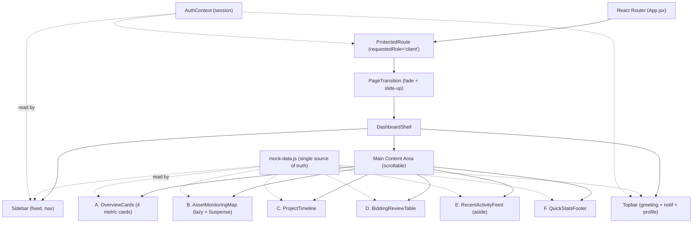
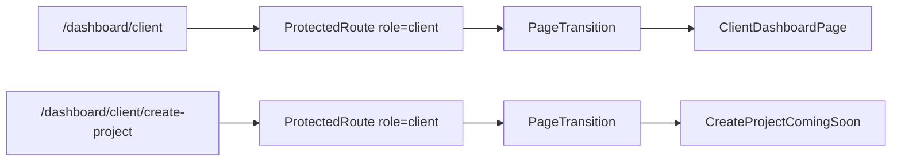
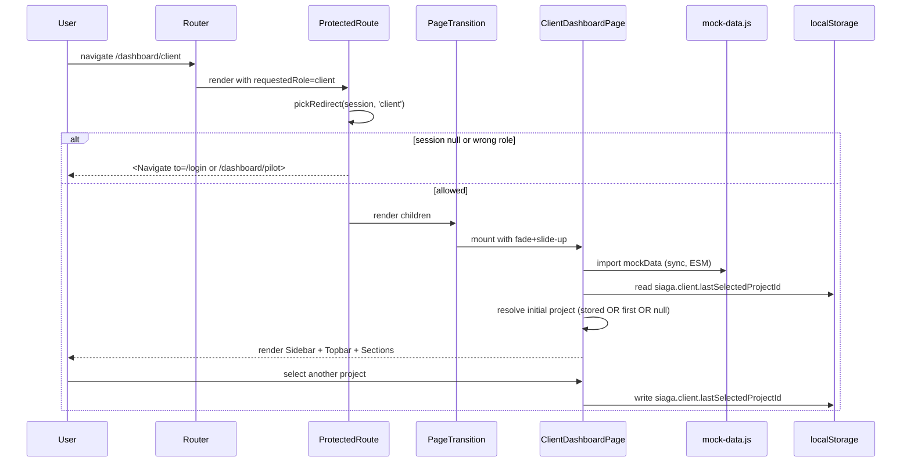

# Design Document — Client Dashboard

## Overview

Fitur **client-dashboard** menambahkan halaman utama area authenticated pada route `/dashboard/client` untuk Persona A (Pak Hendra, Manajer Pemeliharaan Aset PT PLN). Halaman menggantikan placeholder existing di `src/pages/DashboardPlaceholder/ClientDashboard.jsx` dan menjadi command center single-page yang memuat tujuh section vertikal: Overview Cards, Asset Monitoring Map (Mapbox), Project Timeline, Bidding Review Table, Recent Activity Feed, dan Quick Stats Footer — semuanya dibungkus oleh layout shell (Sidebar + Topbar + Main Content Area).

Karena target SEFEST 2026 berfokus pada demo frontend, seluruh data dummy dipusatkan pada satu modul `mock-data.js` ter-isolated agar mudah di-replace ketika API backend tersedia. Halaman wajib menjaga konsistensi visual ketat dengan landing page dan auth-pages existing (Design_Tokens, Montserrat + Inter, custom cursor cyan, Page_Transition fade + slide-up) dan menerapkan role gating melalui `ProtectedRoute` existing dari fitur auth-pages tanpa modifikasi.

Halaman ini juga menambahkan satu route placeholder `/dashboard/client/create-project` yang me-render Coming Soon page sederhana — wizard 4-step Create Project akan dibangun pada spec berikutnya.

### Scope yang Diliputi

- Routing baru: `/dashboard/client` (dirombak total dari placeholder) dan `/dashboard/client/create-project` (Coming Soon).
- Layout shell baru: `DashboardShell` (Sidebar fixed + Topbar + Main).
- Tujuh section konten Client_Dashboard.
- Modul mock-data tunggal (`src/pages/ClientDashboard/mock-data.js`).
- Lazy-loaded Mapbox section + Suspense fallback + error boundary.
- Persisted state untuk Project_Selector (cross-session via `localStorage`) dan Map_Filter (per-session in-memory).
- Page_Transition fade + slide-up yang konsisten dengan auth-pages.

### Scope yang TIDAK Diliputi

- Wizard Create Project 4-step (spec terpisah).
- API backend nyata atau persistensi server-side.
- Halaman Pilot Dashboard (di luar spec ini).
- Notifikasi real-time / WebSocket — semua aktivitas dan badge notifikasi adalah data statis dari mock module.

### Research Notes

Riset dilakukan langsung pada repo karena seluruh dependensi sudah terpasang dan ada precedent yang harus diikuti untuk konsistensi:

- **React + Vite** (`package.json`): `react@19.2.5`, `react-router-dom@6.30.3`, `framer-motion@12`, `mapbox-gl@3.23.1`, `recharts` belum terpasang → perlu ditambahkan (lihat Architecture > Dependencies). `react-countup` sudah terpasang → digunakan untuk count-up animasi tanpa implement manual.
- **Routing & guard existing** (`src/App.jsx`, `src/auth/ProtectedRoute.jsx`, `src/auth/routes.js`): `pickRedirect(session, requestedRole)` sudah total dan property-tested. Route baru cukup membungkus komponen baru dengan `<ProtectedRoute requestedRole="client">` tanpa menyentuh guard.
- **Auth session** (`src/auth/AuthContext.jsx`): `useAuth()` mengekspos `session` dengan field `{ role, email, ts }`. Sidebar identitas user dan greeting Topbar membaca dari sini. Field `nama_perusahaan` tidak ada di session — desain ini menambahkan resolver yang me-mapping `email → perusahaan` melalui `Mock_Data_Module.perusahaan` (dengan fallback ke `email` itu sendiri jika tidak ditemukan) sehingga tidak butuh modifikasi `AuthContext`.
- **Page_Transition existing** (`src/components/PageTransition.jsx`): variants fade + y:24→0 (400ms easeOut) → exit y:-16 (300ms). Durasi sudah dalam range 300-600ms requirement, jadi cukup di-reuse 1:1.
- **Mapbox pattern existing** (`src/components/JobRadarMap/JobRadarSection.jsx`): pola init via `mapboxgl.accessToken = import.meta.env.VITE_MAPBOX_TOKEN`, container ref, `style: 'mapbox://styles/mapbox/dark-v11'`, custom HTML markers via `new mapboxgl.Marker(el)`. Pola ini di-reuse untuk Asset Monitoring Map dengan style dark-v11 yang sama.
- **CustomCursor** (`src/components/CustomCursor.jsx`, mounted di `App.jsx`): sudah persisten lintas seluruh route → tidak perlu sentuh apapun untuk Requirement 14.5.
- **Hooks reusable**: `src/hooks/useVisibility.js` (IntersectionObserver, sudah ada dan tested) → pakai untuk Viewport_Trigger pada count-up dan donut chart render. `src/hooks/useMediaQuery.js` → pakai untuk responsive breakpoint Sidebar collapse.
- **Tokens warna**: `src/index.css` mendefinisikan `--brand-navy`, `--brand-cyan`, `--color-danger`, `--color-success`, `--color-warning`. Requirement memakai nama lebih formal `--color-primary`, `--color-accent`, `--color-surface` sesuai PRD. Desain ini menambahkan alias CSS variable di scope dashboard (`.dashboard-shell { --color-primary: var(--brand-navy); --color-accent: var(--brand-cyan); --color-surface: #F4F7F6; }`) sehingga komponen dashboard dapat memakai nama dari requirement tanpa merusak landing page existing.

## Architecture

### High-Level Architecture



### Routing Architecture

Route baru ditambahkan di `src/App.jsx` di dalam `<AnimatedRoutes>`:



Catatan: `ProtectedRoute` existing belum membungkus pesan "Akses ditolak" (Requirement 17.4). Untuk Coming Soon page, desain ini menerapkan pesan tersebut **di dalam komponen `CreateProjectComingSoon`** yang dipasang di route — bukan dengan memodifikasi guard. Strategi: route tetap dibungkus `ProtectedRoute requestedRole="client"`, dan untuk role mismatch user pilot tetap di-bounce ke `/dashboard/pilot` oleh guard existing. Pesan "Akses ditolak" untuk pilot direalisasikan dengan menambahkan flash toast pada pilot dashboard saat parameter query `?denied=create-project` terdeteksi (lihat Components > AccessDeniedFlash). Ini menjaga `ProtectedRoute` tetap pure dan mempertahankan property test existing.

### Folder Structure

```
src/pages/ClientDashboard/
  ClientDashboardPage.jsx          // page entry, composes shell + sections
  ClientDashboardPage.css
  CreateProjectComingSoon.jsx      // /dashboard/client/create-project
  CreateProjectComingSoon.css
  mock-data.js                     // SINGLE source of truth for all dummy data
  shell/
    DashboardShell.jsx             // grid: sidebar + topbar + main
    DashboardShell.css
    Sidebar.jsx
    Sidebar.css
    Topbar.jsx
    Topbar.css
  sections/
    OverviewCards/
      OverviewCards.jsx
      OverviewCard.jsx             // single card
      BudgetDonut.jsx               // Recharts wrapper, viewport-triggered
      OverviewCards.css
    AssetMonitoringMap/
      AssetMonitoringMap.jsx       // default-exported, code-split entry
      AssetDetailDrawer.jsx
      MapLegend.jsx
      MapFilter.jsx
      MapFloatingStats.jsx
      AssetMapFallback.jsx         // basic HTML fallback (Req 15.5a)
      AssetMonitoringMap.css
      index.js                     // re-export for React.lazy
    ProjectTimeline/
      ProjectTimeline.jsx
      ProjectSelector.jsx
      MilestoneNode.jsx
      ProjectTimeline.css
    BiddingReviewTable/
      BiddingReviewTable.jsx
      BidRow.jsx
      BidFilterChips.jsx
      PilotProfileDrawer.jsx
      PilotSelectionModal.jsx
      BiddingReviewTable.css
    RecentActivityFeed/
      RecentActivityFeed.jsx
      ActivityItem.jsx
      RecentActivityFeed.css
    QuickStatsFooter/
      QuickStatsFooter.jsx
      QuickStatsFooter.css
  utils/
    selectors.js                   // pure derivations from mock-data
    storage.js                     // safe localStorage read/write helpers
    formatRupiah.js
    formatDate.js
    relativeTime.js
```

Path file mock-data tunggal: `src/pages/ClientDashboard/mock-data.js` (memenuhi Requirement 10.1).

### Data Flow



### Dependencies

Yang sudah ada (tidak perlu install):

- `react@19`, `react-dom@19`, `react-router-dom@6.30`, `framer-motion@12`, `mapbox-gl@3.23`, `lucide-react`, `react-countup`, `gsap`, `vitest`, `fast-check`.

Yang perlu ditambahkan ke `package.json`:

- `recharts` — dipakai oleh `BudgetDonut.jsx` pada Overview_Card "Budget Terpakai" (Requirement 4.5). Pilih versi compatible dengan React 19 (≥ 2.13.0). Recharts dipilih karena disebut eksplisit di Plan_Frontend dan PRD.

Tidak ada dependency lain yang ditambahkan. Semua chart selain donut digambar dengan SVG inline atau div + CSS untuk menjaga bundle ramping.

### Code-Splitting Strategy

`AssetMonitoringMap` dan `BudgetDonut` adalah dua kandidat utama untuk code-splitting karena membawa library berat (Mapbox GL JS ~ 700KB gz, Recharts ~ 90KB gz):

```jsx
// ClientDashboardPage.jsx
const AssetMonitoringMap = lazy(() => import('./sections/AssetMonitoringMap'));

// OverviewCards/OverviewCard.jsx
const BudgetDonut = lazy(() => import('./BudgetDonut'));
```

`AssetMonitoringMap` dibungkus `<Suspense fallback={<AssetMapFallback variant="loading" />}>` (Requirement 5.16, 5.17) dan `<AssetMapErrorBoundary>` class component yang men-tangkap baik chunk-load error maupun runtime Mapbox error → render `<AssetMapFallback variant="error" assets={...} />` (Requirement 5.18, 15.5).

`BudgetDonut` dirender hanya saat parent `OverviewCard` masuk viewport (`useVisibility`). Sebelum visible, slot dipenuhi `<ChartSkeleton />` dengan dimensi tetap (Requirement 11.2, 11.5a, 15.7, 15.7a).

## Components and Interfaces

### `ClientDashboardPage` (page entry)

Tanggung jawab: compose shell + tujuh section, resolve session → company name, resolve initial selected project dari localStorage.

Props: tidak ada (route-level).

State:

- `selectedProjectId: string | null` — project_id yang dipilih di Project_Selector. Initial value diresolusi dari `safeReadLocalStorage('siaga.client.lastSelectedProjectId')`, jatuh ke `mockData.proyek_aktif[0]?.id ?? null`.
- `mapFilter: 'all' | 'kritis' | 'perlu_perhatian'` — state filter Map (per-session, in-memory only; Requirement 5.11).
- `bidFilters: { siagaVerifiedOnly: boolean, ratingMin4: boolean }` — state Bid_Filter_Chip.
- `bidSort: { key: 'harga' | 'rating' | 'estimasi_hari', direction: 'asc' | 'desc' } | null`.
- `drawer: { kind: 'asset' | 'pilot' | 'pilot-confirm' | null, payload: any }` — single-drawer state machine (hanya satu drawer/modal aktif per waktu).

Effects:

- `useEffect` write-back: setiap perubahan `selectedProjectId` ditulis ke localStorage via `safeWriteLocalStorage` (Requirement 6.4a). Kegagalan tulis di-swallow tanpa crash (mengikuti pola `AuthContext`).

### `DashboardShell`

Layout grid CSS:

```
@media (min-width: 1280px) {
  grid-template-columns: minmax(240px, 280px) 1fr;
  grid-template-rows: 64px 1fr;
  grid-template-areas: "sidebar topbar" "sidebar main";
}
@media (min-width: 768px) and (max-width: 1279px) {
  grid-template-columns: 64px 1fr;     /* icon-only sidebar (Req 12.2) */
}
@media (max-width: 767px) {
  grid-template-columns: 1fr;          /* sidebar = drawer (Req 12.3) */
}
```

Props: `{ session, mockData, children }`.

### `Sidebar`

Props:

```ts
interface SidebarProps {
  companyName: string;            // resolved from session.email + mockData.perusahaan
  variant: 'full' | 'icon' | 'drawer';
  drawerOpen?: boolean;
  onDrawerClose?: () => void;
  onLogout: () => Promise<void> | void;
}
```

Struktur (atas ke bawah):

1. Logo SIAGA kecil (`/images/logo/siaga-icon.png`).
2. Identity block: avatar (initial dari companyName), companyName, badge "Client" (background `--color-accent` 12% opacity).
3. Tombol primary "Buat Proyek Baru" (gradient cyan, `Link` ke `/dashboard/client/create-project`).
4. `<nav aria-label="Navigasi utama">` berisi 6 menu item dari konstanta `SIDEBAR_MENU`.
5. Spacer.
6. Tombol Logout di footer.

Konstanta:

```js
const SIDEBAR_MENU = [
  { id: 'dashboard',  label: 'Dashboard',   icon: 'LayoutDashboard', to: '/dashboard/client', active: true },
  { id: 'proyek',     label: 'Proyek',      icon: 'FolderKanban',    to: '#',                 disabled: true },
  { id: 'asset-map',  label: 'Asset Map',   icon: 'Map',             to: '#',                 disabled: true },
  { id: 'bidding',    label: 'Bidding',     icon: 'Gavel',           to: '#',                 disabled: true },
  { id: 'laporan',    label: 'Laporan',     icon: 'FileText',        to: '#',                 disabled: true },
  { id: 'pengaturan', label: 'Pengaturan',  icon: 'Settings',        to: '#',                 disabled: true },
];
```

Item dengan `to: '#'` di-render sebagai `<button disabled>` dengan tooltip "Segera tersedia" — menjaga sidebar terlihat lengkap tanpa membutuhkan halaman yang belum dispek-kan. Item `dashboard` selalu aktif pada Client_Dashboard (Requirement 2.7) dan menggunakan `aria-current="page"` (Requirement 13.5).

Active state styling (Requirement 2.8):

```css
.sidebar__item[aria-current="page"] {
  background: rgba(0, 210, 255, 0.10);
  border-left: 3px solid var(--color-accent);
  padding-left: calc(1rem - 3px);
}
```

Logout handler (Requirement 16.1, 16.1a, 16.2, 16.3):

```js
async function handleLogout() {
  try {
    logout();                       // AuthContext.logout — already swallows storage errors internally
    // verify clearance before navigating
    if (window.sessionStorage.getItem('siaga_auth') !== null) {
      throw new Error('Logout failed: session still present');
    }
    navigate('/login');             // Page_Transition triggered by AnimatePresence on route change
  } catch (e) {
    setLogoutError('Logout gagal, silakan coba lagi');
  }
}
```

`AuthContext.logout()` existing sudah men-swallow exception storage. Verifikasi tambahan (`getItem !== null`) memberikan path eksplisit untuk Requirement 16.1a tanpa memodifikasi `AuthContext`.

### `Topbar`

Props: `{ companyName, todayDate, unreadCount, onSidebarToggle }`.

Struktur (kiri ke kanan):

- Hamburger icon button (visible hanya pada `< 768px`, Requirement 12.4) — `aria-label="Buka navigasi"`.
- Greeting block: `<h1>Halo, {companyName}</h1>` + `<span>{todayDate}</span>`.
- Spacer.
- `NotificationBell` (icon-only button, `aria-label="Notifikasi (N belum dibaca)"`) — badge angka hanya jika `unreadCount > 0` (Requirement 3.4a).
- `ProfileButton` (icon-only, `aria-label="Menu profil"`).

`todayDate` di-format via `formatIndonesianDate(new Date())` → `"Senin, 15 Januari 2026"` menggunakan `Intl.DateTimeFormat('id-ID', { weekday: 'long', day: 'numeric', month: 'long', year: 'numeric' })`.

### `OverviewCards` (Section A)

Renders 4 instance dari `OverviewCard`:

```jsx
<section className="overview-cards">
  <OverviewCard variant="proyek-aktif"      data={metrics.proyekAktif} />
  <OverviewCard variant="aset-terinspeksi"  data={metrics.asetTerinspeksi} />
  <OverviewCard variant="budget"            data={metrics.budget} />
  <OverviewCard variant="proyek-selesai"    data={metrics.proyekSelesai} />
</section>
```

Grid responsive: 4 kolom ≥1280px, 2 kolom 768-1279px, 1 kolom <768px (Requirement 4.7-4.9).

`OverviewCard` props:

```ts
interface OverviewCardProps {
  variant: 'proyek-aktif' | 'aset-terinspeksi' | 'budget' | 'proyek-selesai';
  data: { primaryValue: number; ...variantSpecificFields };
}
```

Animasi count-up via `react-countup` di-trigger oleh `useVisibility` ref + `start={isVisible ? data.primaryValue : 0}` (Requirements 4.11, 11.3, 4.12). Pola:

```jsx
const ref = useRef(null);
const visible = useVisibility(ref, { rootMargin: '100px' });
return <CountUp end={visible ? value : 0} duration={1.0} preserveValue start={0} />;
// duration ∈ [0.8, 1.5]s sesuai Requirement 4.11
```

Property 4.12 (round-trip): `react-countup` API menjamin `end` tepat tercapai → kita tambahkan unit test yang mount `<OverviewCard data={{ primaryValue: V }}>` dan asserts text === `formatNumber(V)` setelah animasi selesai untuk berbagai V (lihat Testing Strategy).

`BudgetDonut` (variant="budget" only):

```jsx
<Suspense fallback={<ChartSkeleton width={140} height={140} />}>
  {visibleAndDataReady ? <BudgetDonut used={data.used} total={data.total} /> : <ChartSkeleton ... />}
</Suspense>
```

Kondisi `visibleAndDataReady = isVisible && mockData != null && rechartsLoaded` memastikan skeleton tetap tampil sampai chart benar-benar render (Requirement 11.5a, 15.7a). Karena mock-data adalah ESM import (sync), `mockData != null` dipenuhi sejak mount; untuk konsistensi pola (dan skenario API real di masa depan), kondisi ini tetap dievaluasi.

### `AssetMonitoringMap` (Section B)

Code-split entry. Init pattern reuse dari `JobRadarSection.jsx`:

```jsx
mapboxgl.accessToken = import.meta.env.VITE_MAPBOX_TOKEN;
const map = new mapboxgl.Map({
  container: ref.current,
  style: 'mapbox://styles/mapbox/dark-v11',
  center: computeCenterOfAssets(assets), // fitBounds setelah load
  zoom: 4.5,
});
```

Custom marker per asset (Requirement 5.4-5.7):

```jsx
const el = document.createElement('div');
el.className = `asset-pin asset-pin--${asset.status}`;
if (asset.status === 'kritis') {
  el.classList.add('asset-pin--pulse'); // CSS animation 1.6s loop
}
el.setAttribute('role', 'button');
el.setAttribute('aria-label', `Aset ${asset.nama}, status ${asset.status}`);
new mapboxgl.Marker(el).setLngLat([asset.lng, asset.lat]).addTo(map);
el.addEventListener('click', () => onPinClick(asset));
```

CSS pulse:

```css
.asset-pin--pulse::after {
  content: '';
  position: absolute; inset: -8px;
  border-radius: 50%;
  background: var(--color-danger);
  opacity: 0.4;
  animation: asset-pulse 1.6s ease-out infinite;
}
@keyframes asset-pulse {
  0%   { transform: scale(0.6); opacity: 0.6; }
  100% { transform: scale(1.8); opacity: 0; }
}
```

Filter logic (Requirement 5.10, 5.10a):

```js
const visibleStatuses = useMemo(() => new Set(assets.map(a => a.status)), [assets]);
// Disable filter option jika tidak ada asset dengan status tersebut
const filterOptions = [
  { value: 'all',              label: 'Semua',                disabled: false },
  { value: 'kritis',           label: 'Kritis Saja',          disabled: !visibleStatuses.has('kritis') },
  { value: 'perlu_perhatian',  label: 'Perlu Perhatian Saja', disabled: !visibleStatuses.has('perlu_perhatian') },
];
```

Marker visibility di-toggle dengan `el.style.display = matchesFilter ? '' : 'none'` agar tidak perlu remove/add marker setiap perubahan filter.

Suspense + Error Boundary (Requirements 5.16-5.18, 11.1, 15.5, 15.5a):

```jsx
// ClientDashboardPage.jsx
<AssetMapErrorBoundary fallback={<AssetMapFallback variant="error" assets={assets} />}>
  <Suspense fallback={<AssetMapFallback variant="loading" />}>
    <AssetMonitoringMap assets={assets} ... />
  </Suspense>
</AssetMapErrorBoundary>
```

`AssetMapFallback` punya tiga variant: `loading` (spinner + teks), `error` (pesan + list teks aset nama+status), dan `bare` (statis HTML "Peta tidak dapat dimuat" — last-resort untuk Requirement 15.5a; dipakai oleh inner try/catch di dalam error fallback itu sendiri jika rendering list aset gagal).

`AssetDetailDrawer` (Requirement 5.13-5.15, 13.10, 13.11):

- Slide-in dari kanan via Framer Motion `motion.aside` dengan variants `{ hidden: { x: '100%' }, visible: { x: 0 } }`, durasi 280ms easeOut.
- `useEffect` saat open: cari `firstFocusable = drawerRef.current.querySelector('button, a, [tabindex]')` dan `firstFocusable.focus()`.
- Listen `keydown` Escape → close.
- Click outside detection via overlay backdrop button.

### `ProjectTimeline` (Section C)

Project_Selector adalah `<div role="tablist">` pada ≥1280px atau `<select>` pada <1280px untuk simplicity di mobile. Default selection logic (Requirements 6.3, 6.4a-c):

```js
function resolveInitialProjectId(mockData) {
  const stored = safeReadLocalStorage('siaga.client.lastSelectedProjectId');
  const list = mockData.proyek_aktif;
  if (list.length === 0) return null;             // empty state, Req 15.1
  if (stored && list.some(p => p.id === stored)) return stored;  // 4b
  return list[0].id;                              // 3 / 4c fallback
}
```

Milestone constants (Requirement 6.5):

```js
const MILESTONES = [
  { key: 'posted',                  label: 'Posted',                icon: 'Send' },
  { key: 'bidding_open',            label: 'Bidding Open',          icon: 'Megaphone' },
  { key: 'pilot_selected',          label: 'Pilot Selected',        icon: 'UserCheck' },
  { key: 'inspection_in_progress',  label: 'Inspection In Progress', icon: 'PlaneTakeoff' },
  { key: 'report_ready',            label: 'Report Ready',          icon: 'FileCheck2' },
];
```

Status per milestone disimpan di project: `project.milestones = { posted: { status, date }, bidding_open: { ... }, ... }`. Render:

```jsx
<ol className="timeline" role="list">
  {MILESTONES.map((m, idx) => {
    const node = project.milestones[m.key];
    return <MilestoneNode key={m.key} {...m} {...node} isLast={idx === 4} />;
  })}
</ol>
```

Progress bar antar milestone: `<li>` rendering pseudo-element `::after` lebar 100% berwarna `--color-accent` jika milestone berikutnya completed/in_progress, opacity 0.2 jika upcoming.

### `BiddingReviewTable` (Section D)

Pre-filter (Requirement 7.2a — threshold rating ≥ 2 SELALU diterapkan):

```js
const ELIGIBLE_BIDS = bids.filter(b => b.rating >= 2);
const FILTERED_BIDS = applyChips(ELIGIBLE_BIDS, bidFilters);
const SORTED_BIDS  = applySort(FILTERED_BIDS, bidSort);
```

`applyChips`:

```js
function applyChips(bids, { siagaVerifiedOnly, ratingMin4 }) {
  return bids.filter(b =>
    (!siagaVerifiedOnly || b.siaga_verified === true) &&
    (!ratingMin4 || b.rating >= 4)
  );
}
```

Sort (Requirement 7.5, 7.6) — total ordering, dengan tie-break pada `pilot_id` agar stable:

```js
function applySort(bids, sort) {
  if (!sort) return bids;
  const { key, direction } = sort;
  return [...bids].sort((a, b) => {
    const cmp = a[key] === b[key] ? a.pilot_id.localeCompare(b.pilot_id)
                                   : (a[key] > b[key] ? 1 : -1);
    return direction === 'asc' ? cmp : -cmp;
  });
}
```

Rendering keadaan empty:

- `bids.length === 0` (no bid masuk) → empty state Requirement 7.14.
- `ELIGIBLE_BIDS.length > 0` tapi `SORTED_BIDS.length === 0` → empty state filter aktif Requirement 7.10a (pesan + reset filter).

Tabel dipakai sebagai `<table>` semantic dengan `<th scope="col">` dan `aria-sort` per kolom yang sortable (Requirement 13.8, 13.9). Pada `< 768px` tabel beralih layout ke stacked card (Requirement 12.5) lewat CSS:

```css
@media (max-width: 767px) {
  .bid-table thead { display: none; }
  .bid-table, .bid-table tbody, .bid-table tr, .bid-table td { display: block; }
  .bid-table tr { border: 1px solid ...; border-radius: 12px; padding: 1rem; margin-bottom: 1rem; }
  .bid-table td::before { content: attr(data-label); font-weight: 600; ... }
}
```

Setiap `<td>` ditambahkan `data-label` lewat JSX agar layout card tetap terbaca.

Pilot_Selection_Modal: portal via `createPortal(document.body)`, animasi scale-in 200ms, focus trap, Escape closes (Requirements 7.12, 7.13, 13.10, 13.11).

### `RecentActivityFeed` (Section E)

`<aside aria-label="Aktivitas terbaru">` (Requirement 13.3). Layout:

- ≥1280px: ditempatkan pada kolom kanan grid Main Content (sticky, top: 80px).
- <1280px: stacked di bawah `BiddingReviewTable`.

Grid pada Main Content untuk akomodasi sticky aside:

```css
@media (min-width: 1280px) {
  .main-content {
    display: grid;
    grid-template-columns: minmax(0, 1fr) 320px;
    gap: 24px;
  }
  .main-content__primary { grid-column: 1; }
  .main-content__aside   { grid-column: 2; position: sticky; top: 80px; max-height: calc(100vh - 96px); overflow-y: auto; }
}
```

Pulse pada item baru (Requirement 8.4): item dengan `activity.is_new === true` mendapat class `.activity-item--new` yang menjalankan keyframe pulse selama 1 siklus (1.4s) lalu menambahkan listener `animationend` untuk remove class.

### `QuickStatsFooter` (Section F)

Tiga `react-countup` instance, di-trigger oleh `useVisibility` pada container. Skip animasi jika value 0 (Requirement 9.5a):

```jsx
{value === 0 ? <span className="qs__num">0</span> : <CountUp end={visible ? value : 0} ... />}
```

### Mock Data Module

`src/pages/ClientDashboard/mock-data.js`:

```js
export const mockData = Object.freeze({
  perusahaan: {
    nama: 'PT PLN (Persero)',
    email: 'hendra@pln.co.id',  // mapped to session.email
    avatar: '/images/avatars/avatar-engineer.png',
  },
  overview_metrics: {
    proyek_aktif: { value: 12, trend_pct: +8 },
    aset_terinspeksi: { value: 487, target_tahunan: 600 },
    budget: { used: 4_320_000_000, total: 6_000_000_000 },
    proyek_selesai_bulan_ini: { value: 7, delta_vs_last_month: +3 },
  },
  assets: [/* 7 entries — mix aman/perlu_perhatian/kritis */],
  proyek_aktif: [
    { id: 'P-001', nama: 'Inspeksi SUTET Bandung Selatan', milestones: { ... } },
    /* 2-3 more */
  ],
  bids: [/* keyed per project_id; 5-7 entries each */],
  activities: [/* 10 entries with timestamps */],
  quick_stats: {
    total_hemat_rp: 1_250_000_000,
    total_pilot_kerjasama: 47,
    rata_rata_waktu_bidding_hari: 5,
  },
  notifications: { unread_count: 3 },
});
```

Module di-`Object.freeze` untuk menjamin immutability — section yang me-mutate akan throw, sehingga konsistensi cross-section (Requirement 10.4-10.9) terjaga di compile/runtime.

Selectors murni (`utils/selectors.js`):

```js
export const selectAssetCount        = (data) => data.assets.length;
export const selectKritisCount       = (data) => data.assets.filter(a => a.status === 'kritis').length;
export const selectPerluPerhatianCount = (data) => data.assets.filter(a => a.status === 'perlu_perhatian').length;
export const selectActiveProjectCount = (data) => data.proyek_aktif.filter(p => p.is_active !== false).length;
export const selectBidsForProject    = (data, pid) => data.bids.filter(b => b.project_id === pid);
```

`OverviewCard` "Proyek Aktif" memakai `selectActiveProjectCount`, `MapFloatingStats` memakai `selectAssetCount/selectKritisCount/selectPerluPerhatianCount`. Karena selectors operate atas object yang sama dan deterministik, konsistensi cross-section (Requirement 10.4-10.9) bersifat invariant by construction — bukan property test runtime.

### `CreateProjectComingSoon`

Halaman sederhana (Requirement 17.2-17.3):

```jsx
<DashboardShell session={session} mockData={mockData}>
  <main className="coming-soon">
    <Construction size={64} />
    <h1>Buat Proyek Baru</h1>
    <p>Wizard 4-step akan segera tersedia.</p>
    <Link to="/dashboard/client" className="btn-primary">Kembali ke Dashboard</Link>
  </main>
</DashboardShell>
```

Tetap memakai `DashboardShell` agar konsistensi visual (cursor, font, transition) terjaga; Sidebar item Dashboard tidak aktif pada halaman ini (active highlight bisa di-set ke null karena tidak ada menu untuk Create Project).

### `useVisibility` (existing) — usage notes

Hook existing `src/hooks/useVisibility.js` di-pakai apa adanya. Default `rootMargin: '100px'` (sudah enforced). Pemakaian:

```jsx
const ref = useRef(null);
const visible = useVisibility(ref);
// pakai `visible` untuk gating count-up start, donut render, dll.
```

## Data Models

### `Asset`

```ts
interface Asset {
  id: string;                            // 'A-001'
  nama: string;                          // 'SUTET Bandung Utara'
  kategori: 'sutet' | 'pipa' | 'jembatan' | 'kilang' | 'tower';
  lat: number;
  lng: number;
  status: 'aman' | 'perlu_perhatian' | 'kritis';
  inspeksi_terakhir: { tanggal: string; pilot_nama: string };
  foto_url: string;
}
```

### `Project` (proyek_aktif)

```ts
type MilestoneStatus = 'completed' | 'in_progress' | 'upcoming';

interface Milestone {
  status: MilestoneStatus;
  date: string;                          // ISO 'YYYY-MM-DD'
}

interface Project {
  id: string;                            // 'P-001'
  nama: string;
  is_active: boolean;
  milestones: {
    posted: Milestone;
    bidding_open: Milestone;
    pilot_selected: Milestone;
    inspection_in_progress: Milestone;
    report_ready: Milestone;
  };
}
```

Invariant: paling banyak satu milestone berstatus `in_progress`; semua milestone sebelum `in_progress` adalah `completed`; semua milestone setelah adalah `upcoming`. Invariant dijaga manual di mock-data dan tidak divalidasi runtime (data adalah single source under our control).

### `Bid`

```ts
interface Bid {
  pilot_id: string;
  project_id: string;
  pilot_nama: string;
  pilot_avatar: string;
  siaga_verified: boolean;
  rating: number;                        // 0..5
  harga: number;                         // Rupiah
  estimasi_hari: number;
  drone_type: string;                    // 'DJI Matrice 300'
  portfolio_thumbs: string[];
}
```

### `Activity`

```ts
interface Activity {
  id: string;
  type: 'bid_received' | 'project_completed' | 'report_ready' | 'pilot_uploaded' | 'asset_alert';
  description: string;
  timestamp: string;                     // ISO datetime
  is_new?: boolean;                      // triggers pulse animation
}
```

### `OverviewMetrics`, `QuickStats`

Lihat shape pada `mock-data.js` di section sebelumnya.

### Storage Schema

| Storage    | Key                                       | Value             | Lifetime         |
| ---------- | ----------------------------------------- | ----------------- | ---------------- |
| sessionStorage | `siaga_auth` (existing, owned by AuthContext) | JSON of session   | session         |
| localStorage   | `siaga.client.lastSelectedProjectId`        | string (project id) | persistent      |

`localStorage` dipakai untuk `selectedProjectId` (Requirement 6.4a) dan dibungkus dengan `safeReadLocalStorage` / `safeWriteLocalStorage` yang try/catch (mengikuti pola defensif `AuthContext`).

## Correctness Properties

*A property is a characteristic or behavior that should hold true across all valid executions of a system — essentially, a formal statement about what the system should do. Properties serve as the bridge between human-readable specifications and machine-verifiable correctness guarantees.*

PBT applies to a subset of this feature. Sebagian besar acceptance criteria adalah pernyataan UI rendering, layout responsive, animasi visual, dan integrasi pihak ketiga (Mapbox) — lebih cocok ditangani dengan unit/integration test berbasis contoh (RTL + jest-axe), snapshot test, atau visual review. Namun ada beberapa lapisan logika murni yang ideal untuk PBT: filter/sort tabel bidding, role-based redirect (sudah ada via auth-pages — di-reuse), resolver project terpilih, dan formatter Rupiah. Properti di bawah berfokus pada lapisan pure tersebut.

### Property 1: Bidding rating threshold tidak dapat dilanggar

*For any* bid list `bids` dan kombinasi filter chips `chips`, hasil `applyChips(bids.filter(b => b.rating >= 2), chips)` SHALL TIDAK pernah mengandung bid dengan `rating < 2`.

**Validates: Requirements 7.2a**

### Property 2: Bidding filter chips bersifat AND dan monotonic

*For any* bid list `bids`, `applyChips(bids, { siagaVerifiedOnly: true, ratingMin4: true }).length <= applyChips(bids, { siagaVerifiedOnly: true, ratingMin4: false }).length` dan `<= applyChips(bids, { siagaVerifiedOnly: false, ratingMin4: false }).length`. Selain itu, semua bid pada hasil `siagaVerifiedOnly=true` SHALL memiliki `siaga_verified === true`, dan semua bid pada hasil `ratingMin4=true` SHALL memiliki `rating >= 4`.

**Validates: Requirements 7.8, 7.9, 7.10**

### Property 3: Bidding sort menghasilkan permutation yang ter-urut

*For any* bid list `bids` dan `sort = { key, direction }` dengan `key ∈ {'harga', 'rating', 'estimasi_hari'}`, `applySort(bids, sort)` SHALL menghasilkan multiset yang sama dengan `bids` (permutation), dan untuk setiap pasangan adjacent `(a, b)` pada hasil, `a[key] <= b[key]` jika `direction === 'asc'`, `a[key] >= b[key]` jika `direction === 'desc'`.

**Validates: Requirements 7.5, 7.6**

### Property 4: Project resolver memberikan id valid atau null

*For any* `mockData.proyek_aktif` (mungkin kosong) dan nilai `stored` (mungkin id valid, mungkin id stale, mungkin null), `resolveInitialProjectId(mockData, stored)` SHALL mengembalikan `null` jika dan hanya jika `proyek_aktif` kosong; jika stored ada di list mengembalikan stored; jika stored stale atau null, mengembalikan `proyek_aktif[0].id`.

**Validates: Requirements 6.3, 6.4b, 6.4c, 15.1**

### Property 5: Format Rupiah round-trip

*For any* integer non-negatif `n`, `parseRupiah(formatRupiah(n)) === n`. Ini menjamin bahwa nilai numerik yang dimuat dari `Mock_Data_Module.budget` dan ditampilkan ke user dapat dibaca-balik tanpa kehilangan presisi (round-trip property untuk serializer).

**Validates: Requirements 10.9, 4.5, 9.2**

### Property 6: Map filter monotonicity dan visible-set membership

*For any* daftar aset `assets` dan filter `f ∈ {'all', 'kritis', 'perlu_perhatian'}`, `filterAssets(assets, f).length <= assets.length`, dan saat `f !== 'all'`, semua aset pada hasil SHALL memiliki `status === f`. Selain itu, opsi filter yang dinonaktifkan (Requirement 5.10a) SHALL berkorespondensi tepat dengan status yang tidak ada pada `assets` (`disabled === true ⟺ tidak ada asset dengan status tersebut`).

**Validates: Requirements 5.10, 5.10a**

### Property 7: ProtectedRoute role gating (re-uses existing property)

*For any* session dan requested role, `pickRedirect` dari `src/auth/routes.js` SHALL mengikuti decision table existing (null → /login, mismatch → other dashboard, match → null). Properti ini sudah di-test pada `auth-pages` dan tidak ditulis ulang di sini, namun dijadikan dependency assumption untuk Requirements 1.2-1.5 dan 17.1, 17.4, 17.5.

**Validates: Requirements 1.2, 1.3, 1.4, 1.5, 17.1, 17.4, 17.5** (via test reuse)

### Property Reflection

Reflection di atas pre-work telah menggabungkan:

- Filter chip individual (siaga_verified-only, rating-min-4) digabung ke Property 2 (AND + monotonicity + membership) karena keduanya berbagi struktur "subset filter".
- Filter rating threshold dipisah ke Property 1 karena bersifat invariant pre-filter, bukan komposisi user-facing chips.
- Sort dan filter dipisah karena mereka memvalidasi properti ortogonal (ordering vs membership).
- Properti routing tidak ditulis ulang karena sudah di-cover oleh property 8 di spec auth-pages — penambahan duplikat akan redundant.
- Animasi count-up TIDAK dijadikan property test runtime karena `react-countup` adalah library pihak ketiga yang sudah teruji; sebagai gantinya kita menulis 1 example test yang asserts final value === source value setelah animasi selesai (Requirement 4.12).

## Error Handling

### Mapbox Loading Failures (Requirements 5.18, 15.5, 15.5a)

Tiga lapis fallback:

1. **Suspense fallback** (`AssetMapFallback variant="loading"`) — saat chunk `AssetMonitoringMap` belum termuat. Berisi spinner dan teks "Memuat peta…" (Requirement 5.17).
2. **Error boundary** (`AssetMapErrorBoundary`) — class component dengan `componentDidCatch` yang men-tangkap error chunk-load, error inisialisasi Mapbox, dan error runtime di pohon section. Render `AssetMapFallback variant="error"` berisi pesan "Peta tidak tersedia saat ini" + list teks aset (nama + status) sebagai fallback informasi.
3. **Bare fallback** — di dalam `AssetMapFallback variant="error"`, render dibungkus internal try-catch yang jika gagal (mis. data aset corrupt) mengembalikan minimal HTML statis `<div>Peta tidak dapat dimuat</div>` (Requirement 15.5a, 5.5a).

### Storage Failures (Requirements 16.1, 16.1a, 6.4a)

Helper `safeReadLocalStorage` / `safeWriteLocalStorage` wrapping `try/catch`. Read failure → return null → resolver fall-back ke project pertama default. Write failure → di-log ke console.warn dan di-swallow; user UX tidak terganggu.

Logout flow tambahan: setelah call `logout()`, kita verifikasi `sessionStorage.getItem('siaga_auth') === null`; jika tidak (storage failure di luar AuthContext yang tertangkap), tampilkan inline error banner "Logout gagal, silakan coba lagi" pada Sidebar dan TIDAK navigasi ke `/login` (Requirement 16.1a, 16.3a).

### Empty States

| Kondisi                           | Komponen                  | Pesan / Aksi                                                               | Requirement |
| --------------------------------- | ------------------------- | -------------------------------------------------------------------------- | ----------- |
| `proyek_aktif` kosong             | ProjectTimeline           | Ikon + "Belum ada proyek aktif" + tombol "Buat Proyek Baru"                | 15.1        |
| `assets` kosong                   | AssetMonitoringMap        | Peta dark kosong + overlay tengah "Belum ada aset terdaftar"               | 15.2        |
| `bids[selectedProjectId]` kosong  | BiddingReviewTable        | Empty state + tombol opsional "Promosikan Proyek"                          | 7.14, 15.3  |
| Filter chips tidak menghasilkan match | BiddingReviewTable    | Pesan + ringkasan filter aktif + tombol "Reset Filter"                     | 7.10a       |
| `activities` kosong               | RecentActivityFeed        | "Belum ada aktivitas terbaru"                                              | 15.4        |

### Page-level Render Failure (Requirement 1.6a)

Top-level `<DashboardErrorBoundary>` membungkus `ClientDashboardPage` di dalam `<PageTransition>`. Saat error caught, render minimal fallback yang TIDAK menjalankan animasi `<motion.div>` keluar — komponen fallback adalah plain DOM dengan pesan "Terjadi kesalahan memuat dashboard" + tombol reload. Dengan begitu animasi dapat dianggap "diabaikan" sesuai Requirement 1.6a.

### Notifications Edge (Requirement 3.4a)

```jsx
{unreadCount > 0 && <span className="badge">{unreadCount}</span>}
```

Tidak render badge sama sekali saat `unreadCount === 0` (alih-alih render "0" yang misleading).

### Pulse Animation Timing Edge

CSS-only pulse via `@keyframes` — durasi siklus 1.6s (range 1.2-2s memenuhi Req 5.7, 6.8, 8.4). Animasi otomatis di-`pause` saat `prefers-reduced-motion: reduce` aktif:

```css
@media (prefers-reduced-motion: reduce) {
  .asset-pin--pulse::after,
  .milestone--in-progress::after,
  .activity-item--new .activity-item__icon { animation: none; }
}
```

## Testing Strategy

### Test Frameworks (existing)

- **Vitest** + **jsdom** (`npm test`) untuk unit dan integration.
- **@testing-library/react** untuk komponen.
- **fast-check** untuk property-based testing.
- **vitest-axe** untuk a11y assertion (sudah dipakai pada `src/pages/auth.a11y.test.jsx`).

### Test Layers

#### Property-based tests (lapisan pure)

Direkomendasikan minimum 100 iterations per property (sesuai default fast-check). Tagging format **Feature: client-dashboard, Property N: {text}**.

| File                                                            | Property | Target                                                  |
| --------------------------------------------------------------- | -------- | ------------------------------------------------------- |
| `src/pages/ClientDashboard/utils/bids.threshold.property.test.js` | 1        | `applyChips` rating threshold invariant                 |
| `src/pages/ClientDashboard/utils/bids.chips.property.test.js`   | 2        | `applyChips` AND + monotonicity + membership            |
| `src/pages/ClientDashboard/utils/bids.sort.property.test.js`    | 3        | `applySort` permutation + ordering                      |
| `src/pages/ClientDashboard/utils/projectResolver.property.test.js` | 4    | `resolveInitialProjectId` totality                      |
| `src/pages/ClientDashboard/utils/formatRupiah.roundTrip.property.test.js` | 5 | `formatRupiah`/`parseRupiah` round-trip          |
| `src/pages/ClientDashboard/utils/mapFilter.property.test.js`    | 6        | `filterAssets` + disabled-option correspondence         |

`fast-check` arbitraries:

```js
const bidArb = fc.record({
  pilot_id: fc.uuid(),
  project_id: fc.constantFrom('P-001', 'P-002'),
  rating: fc.double({ min: 0, max: 5, noNaN: true }),
  harga: fc.integer({ min: 0, max: 1_000_000_000 }),
  estimasi_hari: fc.integer({ min: 1, max: 60 }),
  siaga_verified: fc.boolean(),
  // ... padded fields
});
```

#### Example unit tests (per komponen)

| Komponen                | Skenario                                                                   |
| ----------------------- | -------------------------------------------------------------------------- |
| OverviewCard            | Final count-up value === source value (Req 4.12, 4.11 boundary)            |
| OverviewCard            | Hover triggers `transform: translateY(-Npx)` (Req 4.10) via class assertion |
| Sidebar                 | "Buat Proyek Baru" navigates to `/dashboard/client/create-project` (Req 2.10) |
| Sidebar                 | Logout removes `siaga_auth` and navigates to `/login` (Req 16.1, 16.2)     |
| Sidebar                 | Active item has `aria-current="page"` (Req 13.5)                           |
| Topbar                  | Badge tidak render saat `unreadCount === 0` (Req 3.4a)                     |
| MapFilter               | Opsi tanpa data berstatus disabled (Req 5.10a)                             |
| AssetDetailDrawer       | Escape menutup drawer + focus berpindah ke first focusable (Req 13.10, 13.11) |
| BiddingReviewTable      | Threshold `rating < 2` selalu di-hide regardless of chip state (Req 7.2a)  |
| BiddingReviewTable      | Empty state "no bids" vs "no match" dibedakan (Req 7.10a vs 7.14)          |
| ProjectTimeline         | Stored stale id → fallback ke proyek pertama (Req 6.4c)                    |
| QuickStatsFooter        | Value 0 → tidak run count-up, render "0" langsung (Req 9.5a)               |
| CreateProjectComingSoon | Tombol "Kembali" navigates ke `/dashboard/client` (Req 17.2)               |

#### Integration tests

| Skenario                                                                    | Requirement      |
| --------------------------------------------------------------------------- | ---------------- |
| Login as client → /dashboard/client renders shell + 7 sections              | 1.1, 1.3         |
| Refresh /dashboard/client preserves render (no flash to /login)             | 1.7              |
| Pilot session navigates to /dashboard/client → redirected to /dashboard/pilot | 1.5            |
| No session navigates to /dashboard/client → redirected to /login            | 1.4              |
| Logout → /login + DOM bersih dari nama perusahaan                           | 16.2, 16.5       |
| Back button after logout → masih di /login (ProtectedRoute redirect)        | 16.4             |
| Pilot navigates to /dashboard/client/create-project → redirected to /dashboard/pilot | 17.4    |

#### Accessibility tests

Reuse pola `src/pages/auth.a11y.test.jsx`. File baru: `src/pages/ClientDashboard/clientDashboard.a11y.test.jsx`:

- `expect(await axe(container)).toHaveNoViolations()` pada full ClientDashboardPage rendered dengan mock session.
- Keyboard tab traversal: Sidebar items focusable (Req 13.4), focus indicator visible (Req 13.6).
- `<table>` punya `<th scope="col">` (Req 13.8); kontrol sort punya `aria-sort` (Req 13.9).
- Drawer trap focus + Escape close (Req 13.10, 13.11) — pakai `userEvent.keyboard('{Escape}')`.

#### Snapshot / smoke tests

- `app.smoke.test.jsx` (existing) ditambahkan case: render `/dashboard/client` dengan client session → tidak crash, header "Halo" + "PT PLN" terbaca.
- Snapshot Coming Soon page untuk verifikasi konsistensi visual structure (bukan untuk regress styling).

### Test untuk Visual / Animation

Tidak menggunakan property-based test untuk:

- Mapbox map rendering (third-party, integrasi dijaga lewat 1 integration test menggunakan stub `mapbox-gl` mirip pattern existing pada test JobRadar bila ada, atau menjalankan dengan `vi.mock('mapbox-gl')` dan asserts `Marker` constructor dipanggil sesuai jumlah aset).
- Pulse animation, count-up speed, glassmorphism backdrop — divalidasi via class/CSS variable assertion saja, bukan visual diff.
- Page_Transition durasi — diasumsikan benar karena di-reuse dari `PageTransition.jsx` existing (sudah teruji di auth-pages).

### Mocking Strategy

- `mapbox-gl` di-mock pada test files yang me-mount `AssetMonitoringMap`:
  ```js
  vi.mock('mapbox-gl', () => ({
    default: { accessToken: '', Map: vi.fn(() => mockMap), Marker: vi.fn(() => mockMarker), NavigationControl: vi.fn() },
  }));
  ```
- `react-countup` tidak di-mock — final value setelah animation flush dapat di-assert via `await screen.findByText(...)` dengan timeout 2000ms.
- `localStorage`/`sessionStorage` di-clear pada `beforeEach` sesuai pattern `auth.roundTrip.property.test.js`.

### Coverage Targets

- Property tests: 100% pada modul `utils/` (selectors, bids, project resolver, formatters).
- Component tests: 80%+ branches pada komponen dengan logic non-trivial (Sidebar, BiddingReviewTable, AssetMonitoringMap, ProjectTimeline).
- A11y: zero axe violations pada full page render.

