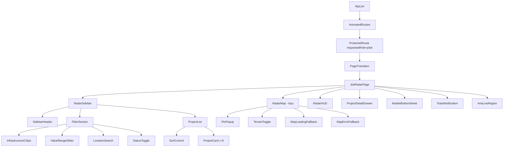
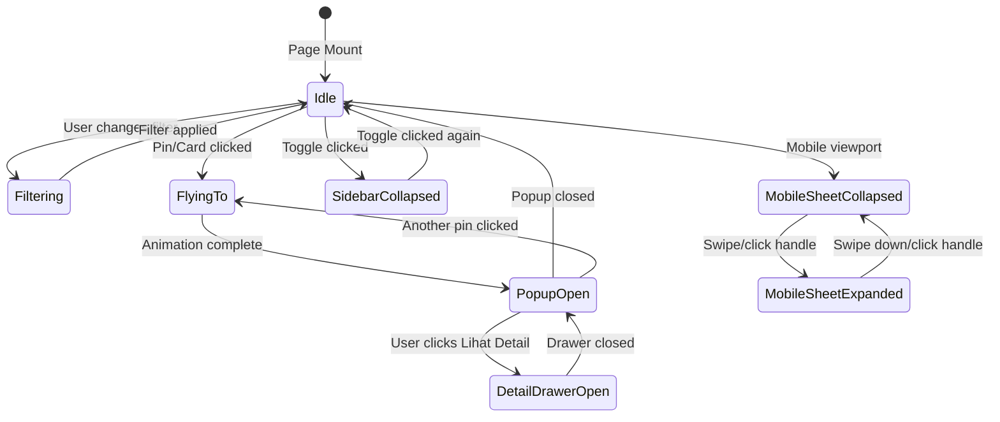

# Design Document: Job Radar Page

## Overview

Job Radar Page adalah halaman full-screen geospasial interaktif untuk pilot UAV pada platform SIAGA. Halaman ini menjadi pengalaman utama bagi pilot setelah login untuk menemukan, memfilter, melihat, dan memilih proyek inspeksi yang tersedia untuk bidding.

Halaman ini bukan sekadar peta dengan sidebar, tetapi harus terasa seperti:

```text
SIAGA Pilot Radar Command Center
```

Kesan visual utama:

```text
premium, modern, glassmorphism, dark-cyan radar, aerospace-tech, informatif, real-time, cinematic, dan selaras dengan landing page/auth/client-dashboard SIAGA
```

Job Radar Page menyediakan:
- Peta Mapbox GL JS 3D terrain Indonesia.
- Pin proyek inspeksi aktif berbasis status.
- Sidebar filter/list proyek berbentuk dark glass command panel.
- Radar HUD di atas peta.
- Mission cards untuk setiap proyek.
- Pin popup premium.
- Project detail drawer.
- Mobile bottom sheet untuk pengalaman mobile.
- Interaksi dua arah antara sidebar dan peta.
- Data mock terpusat melalui `mock-data.js`.

Halaman ini diakses melalui route:

```text
/dashboard/pilot/job-radar
```

dan hanya boleh diakses oleh user dengan role:

```text
pilot
```

---

## Product Experience Goal

Tujuan utama halaman ini adalah membuat pilot merasa sedang membuka radar misi inspeksi profesional, bukan hanya melihat daftar pekerjaan biasa.

Halaman harus menjawab kebutuhan pilot:

```text
Di mana proyek inspeksi tersedia?
Mana proyek yang urgent?
Berapa nilai kontraknya?
Berapa bidder yang sudah masuk?
Apakah proyek ini cocok dengan spesialisasi saya?
Bisakah saya langsung melihat detail dan melakukan bid?
```

Target demo SEFEST:

```text
Saat juri melihat halaman ini, mereka langsung merasa SIAGA adalah platform drone inspection marketplace yang premium, real-time, modern, dan siap dikembangkan ke produk nyata.
```

---

## Key Design Decisions

- **Mapbox GL JS** digunakan untuk rendering peta 3D terrain Indonesia dengan dark style, fog, custom markers, cluster, dan route lines.
- **React.lazy() + Suspense** digunakan untuk code-splitting bundle Mapbox agar sidebar/list tetap muncul cepat.
- **Single source of truth** menggunakan `mock-data.js` agar jumlah pin, list proyek, dan stats selalu konsisten.
- **Pure filter/sort/stats logic** diletakkan di `filters.js` agar mudah dites.
- **Bidirectional map-sidebar interaction** menjadi inti UX: hover card highlight pin, klik card flyTo pin, klik pin scroll ke card.
- **Radar HUD** menggantikan stats bar biasa agar tampilan lebih premium dan cinematic.
- **Mission Cards** menggantikan project card biasa agar proyek terasa seperti peluang misi profesional.
- **Project Detail Drawer** digunakan untuk detail proyek, bukan sekadar popup kecil.
- **Mobile Bottom Sheet** digunakan pada mobile agar peta tetap menjadi fokus utama.
- **CSS per component** mengikuti pola existing project.
- **Framer Motion** digunakan untuk transisi halaman dan microinteraction.
- **fast-check** digunakan untuk property-based testing pure logic.
- **Design Tokens SIAGA** wajib dipertahankan agar halaman selaras dengan landing page, login, register, dan client dashboard.

---

## Visual Direction

### Visual Concept

```text
Dark Radar Map + Glass Sidebar + Cyan HUD + Premium Mission Cards
```

Halaman harus terasa seperti dashboard radar pilot UAV:

- peta gelap dan cinematic,
- panel kaca gelap di kiri,
- pin radar berdenyut,
- HUD transparan di atas peta,
- kartu proyek seperti mission opportunity,
- detail drawer seperti control panel.

### Visual Keywords

```text
dark glassmorphism
cyan glow
radar grid
aerospace-tech
premium map HUD
mission discovery
real-time project marketplace
cinematic geospatial UI
```

---

## Design Tokens

Gunakan token existing SIAGA jika sudah tersedia. Jika perlu token tambahan, tetap harus mengikuti palet SIAGA.

### Core Tokens

```css
--color-primary: #0A192F;
--color-accent: #00D2FF;
--color-surface: #F4F7F6;
--color-danger: #FF4C4C;
--color-success: #00C48C;
--color-warning: #F5B740;
```

### Job Radar Extended Tokens

```css
--radar-navy: #061A33;
--radar-deep: #020B16;
--radar-panel: rgba(6, 26, 51, 0.72);
--radar-panel-strong: rgba(6, 26, 51, 0.86);
--radar-glass: rgba(255, 255, 255, 0.10);
--radar-glass-border: rgba(0, 210, 255, 0.22);
--radar-cyan-glow: rgba(0, 210, 255, 0.28);
--radar-text-primary: rgba(245, 252, 255, 0.96);
--radar-text-secondary: rgba(220, 240, 255, 0.72);
--radar-text-muted: rgba(220, 240, 255, 0.52);
```

### Typography

```text
Display font: Montserrat
Body font: Inter
```

Usage:
- Heading besar: Montserrat 700/800
- Label, metadata, body: Inter 400/500/600
- Badge/status: Inter 600/700 dengan letter spacing halus

### Radius

```css
--radius-sm: 12px;
--radius-md: 18px;
--radius-lg: 24px;
--radius-xl: 32px;
```

### Glassmorphism Style

```css
background: rgba(6, 26, 51, 0.72);
backdrop-filter: blur(24px);
border: 1px solid rgba(0, 210, 255, 0.22);
box-shadow: 0 24px 80px rgba(0, 18, 38, 0.35);
```

---

## Architecture

### High-Level Component Tree



---

## State Management Architecture



---

## Data Flow

```text
Mock_Data_Module (single source of truth)
        │
        ▼
JobRadarPage
(state owner: filters, sort, selectedPin, popupProject, detailProject, sidebarOpen, bottomSheetState)
        │
        ├── applyFilters(projects, filterState)
        │        │
        │        ▼
        │   filteredProjects
        │        │
        │        ├── RadarSidebar receives filteredProjects
        │        ├── RadarMap renders visible pins from filteredProjects
        │        ├── RadarHUD computes stats from filteredProjects
        │        └── MobileBottomSheet receives filteredProjects
        │
        ├── sortProjects(filteredProjects, sortBy)
        │        │
        │        ▼
        │   sortedProjects for list/card rendering
        │
        └── Bidirectional events:
              - Card hover → highlight pin
              - Card click → flyTo pin + open popup
              - Pin click → scroll to card + highlight card
              - Popup detail → open ProjectDetailDrawer
              - Filter change → update sidebar, map pins, HUD stats
```

---

## File Structure

```text
src/pages/JobRadar/
├── JobRadarPage.jsx
├── JobRadarPage.css
├── mock-data.js
├── filters.js
├── components/
│   ├── RadarSidebar/
│   │   ├── RadarSidebar.jsx
│   │   ├── RadarSidebar.css
│   │   ├── SidebarHeader.jsx
│   │   ├── FilterSection.jsx
│   │   ├── FilterSection.css
│   │   ├── InfrastructureChips.jsx
│   │   ├── ValueRangeSlider.jsx
│   │   ├── LocationSearch.jsx
│   │   ├── StatusToggle.jsx
│   │   ├── ProjectList.jsx
│   │   ├── ProjectList.css
│   │   ├── ProjectCard.jsx
│   │   ├── ProjectCard.css
│   │   └── SortControl.jsx
│   ├── RadarMap/
│   │   ├── index.js
│   │   ├── RadarMap.jsx
│   │   ├── RadarMap.css
│   │   ├── PinPopup.jsx
│   │   ├── PinPopup.css
│   │   ├── TerrainToggle.jsx
│   │   ├── MapLoadingFallback.jsx
│   │   ├── MapErrorBoundary.jsx
│   │   └── MapErrorFallback.jsx
│   ├── RadarHUD/
│   │   ├── RadarHUD.jsx
│   │   └── RadarHUD.css
│   ├── ProjectDetailDrawer/
│   │   ├── ProjectDetailDrawer.jsx
│   │   └── ProjectDetailDrawer.css
│   ├── MobileBottomSheet/
│   │   ├── MobileBottomSheet.jsx
│   │   └── MobileBottomSheet.css
│   └── ToastNotification/
│       ├── ToastNotification.jsx
│       └── ToastNotification.css
└── __tests__/
    ├── filters.property.test.js
    ├── filters.unit.test.js
    ├── jobRadar.integration.test.jsx
    └── jobRadar.a11y.test.jsx
```

---

## Layout Design

## Desktop Layout >= 1280px

```text
┌──────────────────────────────────────────────────────────────┐
│ RadarSidebar 320px │ RadarMap fullscreen area                 │
│                    │                                         │
│ SIAGA Job Radar    │ [Radar HUD]                              │
│ Pilot Marketplace  │ 18 Active • 11 Open • 3 Urgent           │
│                    │                                         │
│ Search + Filters   │                                         │
│ Mission Cards      │         Mapbox 3D Indonesia              │
│                    │         Custom Drone Pins                │
│                    │         Cluster + Routes                 │
│                    │                                         │
│                    │                      [Terrain Toggle]    │
│                    │                      [Detail Drawer]     │
└──────────────────────────────────────────────────────────────┘
```

### Desktop Rules

- Sidebar visible by default.
- Sidebar width: `320px`.
- Map width: `calc(100vw - 320px)`.
- Radar HUD floating at top center/right map area.
- Terrain toggle at top/right or bottom/right.
- Project detail drawer slides from right.
- Pin popup appears above selected pin.
- No page-level vertical scroll.

---

## Tablet Layout 768px - 1279px

```text
┌────────────────────────────────────────────┐
│ RadarMap fullscreen                         │
│                                            │
│ [Compact Radar HUD]                         │
│                                            │
│ Mapbox 3D Indonesia                         │
│                                            │
│ [Sidebar Toggle]                            │
│                                            │
│ Overlay Sidebar when opened                 │
└────────────────────────────────────────────┘
```

### Tablet Rules

- Sidebar collapsed by default.
- Sidebar opens as overlay panel from left.
- Map always occupies full viewport width.
- Radar HUD becomes more compact.
- Detail drawer can still slide from right, but max-width should be smaller.
- `map.resize()` must run after layout changes.

---

## Mobile Layout < 768px

Mobile must not force desktop sidebar layout.

Use:

```text
┌──────────────────────────────┐
│ Compact Radar HUD             │
│                               │
│ Fullscreen Map                │
│                               │
│                               │
│                               │
│ ┌──────────────────────────┐ │
│ │ Bottom Sheet Collapsed   │ │
│ │ 18 proyek • drag handle  │ │
│ └──────────────────────────┘ │
└──────────────────────────────┘
```

Expanded state:

```text
┌──────────────────────────────┐
│ Fullscreen Map                │
│                              │
│ ┌──────────────────────────┐ │
│ │ drag handle              │ │
│ │ SIAGA Job Radar          │ │
│ │ Filter chips             │ │
│ │ Location search          │ │
│ │ Sort control             │ │
│ │ Mission card list        │ │
│ └──────────────────────────┘ │
└──────────────────────────────┘
```

### Mobile Rules

- Map remains fullscreen behind bottom sheet.
- Bottom sheet has two states:
  - collapsed: 60–80px
  - expanded: 60–70vh
- Bottom sheet uses glassmorphism.
- Drag handle must be clearly visible.
- Mission cards must remain readable.
- No horizontal scroll at viewport >= 320px.
- Detail drawer becomes detail bottom sheet.

---

## Components and Interfaces

## JobRadarPage

```jsx
// Props: none
// Reads session from AuthContext / existing auth
// Reads data from mock-data.js

// State:
// filters: FilterState
// sortBy: 'terbaru' | 'nilai_tertinggi' | 'deadline_terdekat'
// sidebarOpen: boolean
// bottomSheetState: 'collapsed' | 'expanded'
// selectedPinId: string | null
// hoveredCardId: string | null
// highlightedCardId: string | null
// popupProject: Project | null
// detailProject: Project | null
// toastMessage: string | null
// flyToTarget: { lat: number, lng: number } | null
```

### Responsibilities

- Owns filter, sorting, selected pin, popup, drawer, sidebar, and bottom sheet state.
- Computes filtered/sorted projects using pure functions.
- Passes filtered projects to sidebar, map, HUD, and bottom sheet.
- Handles card click, pin click, flyTo, popup, detail drawer.
- Handles mobile/desktop layout state.
- Ensures count consistency between cards, pins, and HUD.
- Calls `map.resize()` after sidebar or viewport changes.
- Provides `aria-live` announcement after flyTo completes.

---

## filters.js

```js
export function applyFilters(projects, filters) {}
export function sortProjects(projects, sortBy) {}
export function computeStats(projects) {}
export function getLocationSuggestions(projects) {}
export function formatRupiah(value) {}
export function formatCompactRupiah(value) {}
export function isWithinRange(project, range) {}
export function matchesInfrastructure(project, activeChips) {}
export function matchesLocation(project, location) {}
export function matchesStatus(project, statusFilter) {}
export function getStatusVisual(status) {}
```

### Logic Rules

- Filters use AND between categories.
- Infrastructure chips use OR inside infrastructure category.
- Status filter `open` includes `open`, `urgent`, and `deadline_dekat`.
- Status filter `all` includes all statuses including `closed`.
- Sorting must be stable.
- `computeStats()` always reflects visible filtered projects.
- `formatRupiah()` uses Indonesian Rupiah style.
- `formatCompactRupiah()` can output values like:
  - `Rp 350 jt`
  - `Rp 1,2 M`
  - `Rp 2 M`

---

## RadarSidebar

```jsx
<RadarSidebar
  isOpen={sidebarOpen}
  onToggle={handleSidebarToggle}
  filters={filters}
  onFiltersChange={setFilters}
  sortBy={sortBy}
  onSortChange={setSortBy}
  projects={sortedProjects}
  stats={visibleStats}
  hoveredCardId={hoveredCardId}
  highlightedCardId={highlightedCardId}
  onCardHover={handleCardHover}
  onCardClick={handleCardClick}
  onResetFilters={handleResetFilters}
/>
```

### Visual Requirements

RadarSidebar must look like a dark glass command panel.

Style:

```css
background: linear-gradient(180deg, rgba(6, 26, 51, 0.88), rgba(2, 11, 22, 0.92));
backdrop-filter: blur(24px);
border-right: 1px solid rgba(0, 210, 255, 0.18);
box-shadow: 24px 0 80px rgba(0, 10, 30, 0.35);
```

Add:
- subtle radar grid,
- cyan glow near logo/header,
- dark glass cards,
- premium filter controls,
- internal scroll only.

---

## SidebarHeader

Header content:

```text
SIAGA Job Radar
Live Project Discovery
[18 proyek aktif]
```

Visual:
- SIAGA logo/mark.
- Title in Montserrat.
- Pulse live badge.
- Small helper text:
  `Temukan misi inspeksi UAV aktif di seluruh Indonesia.`

---

## FilterSection

Contains:
- Infrastructure chips.
- Value range slider.
- Location search.
- Status toggle.
- Reset filter button if any active filter.

### UI Requirements

- Filter section must be compact.
- Use glass card grouping.
- Chips use rounded pill shape.
- Active chip uses cyan glow.
- Inputs use dark glass background with cyan focus ring.
- Value range should not feel like default browser slider.

---

## InfrastructureChips

Options:
- SUTET
- Jembatan
- Kilang
- Solar Panel
- Bendungan
- Tower

Accessibility:
- `role="checkbox"` or `role="switch"`.
- `aria-checked`.
- Keyboard accessible.

---

## ValueRangeSlider

Range:
- Min: `Rp 0`
- Max: `Rp 2.500.000.000`
- Step: `Rp 50.000.000`

UI:
- Display compact value text:
  - `Rp 0 - Rp 2,5 M`
- Dual thumb preferred.
- Fallback single range accepted if necessary, but still must be polished.

---

## LocationSearch

- Autocomplete from unique `kota` and `provinsi`.
- Search must filter project list and map pins.
- Empty/no match state must be clear.
- On mobile, input width must be full.

---

## StatusToggle

Options:
- `Bidding Terbuka`
- `Semua`

Visual:
- segmented control.
- active state cyan.
- inactive state dark glass.

---

## ProjectList

Contains:
- SortControl
- ProjectCard list
- Empty state

Empty state:

```text
Tidak ada proyek yang cocok dengan filter.
Coba reset filter atau perluas kriteria pencarian.
[Reset Filter]
```

The empty state must be clear and not look like an error.

---

## ProjectCard as Mission Card

ProjectCard must feel like a mission opportunity, not a normal list item.

### Content Hierarchy

```text
[Status Badge] [Infrastructure Type]
Project Name
Location

Contract Value
Deadline
Bidder Count

[ Lihat Detail ] [ Bid Sekarang ]
```

### Example

```text
URGENT • SUTET
Inspeksi SUTET Bandung Utara
Bandung, Jawa Barat

Rp 350 jt
Deadline 15 Mar 2026
5 bidder aktif

[Lihat Detail] [Bid Sekarang]
```

### Visual Style

```css
background: rgba(255, 255, 255, 0.08);
border: 1px solid rgba(0, 210, 255, 0.14);
border-radius: 22px;
backdrop-filter: blur(18px);
```

Hover:
- lift subtle,
- cyan border,
- glow,
- related pin highlights.

Selected/highlighted:
- cyan outline,
- soft background,
- 3-second highlight after pin click.

---

## SortControl

Options:
- Terbaru
- Nilai Tertinggi
- Deadline Terdekat

UI:
- pill/select hybrid.
- dark glass background.
- keyboard navigable.
- `aria-label` showing active sorting.

---

## RadarMap

```jsx
<RadarMap
  projects={filteredProjects}
  selectedPinId={selectedPinId}
  hoveredPinId={hoveredCardId}
  flyToTarget={flyToTarget}
  popupProject={popupProject}
  onPinClick={handlePinClick}
  onPinHover={handlePinHover}
  onMapReady={handleMapReady}
  onFlyToComplete={handleFlyToComplete}
  onPopupClose={handlePopupClose}
  onBidClick={handleBidClick}
  onDetailClick={handleOpenDetail}
/>
```

### Mapbox Settings

- Token: `import.meta.env.VITE_MAPBOX_TOKEN`.
- Style: `mapbox://styles/mapbox/dark-v11`.
- Center: Indonesia.
- Initial center: `[118, -2.5]`.
- Initial zoom: around `5`.
- Terrain source: `mapbox-dem`.
- Terrain exaggeration: `1.5`.
- Fog via `map.setFog()`.

### Visual Requirements

- Dark cinematic map.
- Terrain 3D enabled by default.
- Fog/atmosphere enabled.
- Custom drone pins.
- Clustering at low zoom.
- Cyan route lines.
- Terrain toggle.
- No default ugly Mapbox controls unless styled.

---

## Custom Project Pins

Pin must be a custom SVG drone/radar marker.

Status visual:
- `open`: cyan + pulse
- `urgent`: red + faster pulse
- `deadline_dekat`: yellow, no pulse
- `closed`: grey, opacity 0.5–0.7

Hover:
- scale 1.3–1.5x
- cyan glow
- z-index above other pins

Accessibility:
- `aria-label` includes name, status, location.

---

## Pin Clustering

At zoom `< 7`:
- nearby pins group into cluster.
- cluster displays count.
- cluster uses cyan glass/radar style.
- clicking cluster zooms in.

Cluster must prevent overcrowded map visuals.

---

## Line Routes

Line routes connect projects within 100 km radius.

Style:
```css
line-color: rgba(0, 210, 255, 0.42);
line-width: 1;
line-opacity: 0.3;
```

Line routes must not dominate the map.

---

## RadarHUD

RadarHUD replaces ordinary FloatingStatsBar.

```jsx
<RadarHUD
  stats={visibleStats}
  activeFilterCount={activeFilterCount}
  isCompact={isMobile}
/>
```

### Desktop HUD Content

```text
SIAGA Job Radar
Live Project Discovery for Certified UAV Pilots

18 Proyek Aktif | 11 Bidding Terbuka | 3 Urgent
```

Optional:
- Live badge
- Updated just now
- Active filter count

### Mobile HUD Content

```text
LIVE RADAR • 18 Proyek • 3 Urgent
```

### Visual Style

```css
background: rgba(6, 26, 51, 0.72);
backdrop-filter: blur(24px);
border: 1px solid rgba(0, 210, 255, 0.22);
border-radius: 999px or 28px;
box-shadow: 0 20px 70px rgba(0, 15, 35, 0.35);
```

HUD must not block map interaction:
- `pointer-events: none` on container.
- `pointer-events: auto` only on interactive child elements if needed.

---

## PinPopup

PinPopup is a quick mission preview card.

Content:
- Project name
- Status badge
- Infrastructure type
- Location
- Contract value
- Deadline
- Bidder count
- Buttons:
  - `Lihat Detail`
  - `Bid Sekarang`

Visual:
- dark glass
- cyan border
- rounded 24px
- compact but readable

Behavior:
- Opens after flyTo animation completes.
- Closes when clicking outside or close button.
- Only one popup open at a time.
- `Bid Sekarang` triggers placeholder toast.
- `Lihat Detail` opens ProjectDetailDrawer.

Accessibility:
- `role="dialog"`
- `aria-labelledby`
- close button keyboard accessible.

---

## ProjectDetailDrawer

ProjectDetailDrawer provides richer project information.

Desktop:
- slides from right.
- width: 380–460px.
- glassmorphism dark panel.
- map remains visible behind.

Mobile:
- becomes bottom sheet detail view.
- height: 65–75vh.

Content:
- Project name
- Status
- Infrastructure type
- Client name
- Location
- Contract value
- Deadline
- Bidder count
- Description
- CTA `Bid Sekarang`
- Secondary CTA `Tutup`

Behavior:
- Opens from PinPopup or ProjectCard.
- Closes on close button, Escape key, or overlay click.
- Does not break map state.
- Uses focus management when opened.

---

## MobileBottomSheet

MobileBottomSheet replaces desktop sidebar on viewport `<768px`.

### Collapsed State

Height: 60–80px.

Content:
```text
drag handle
18 proyek tersedia
3 urgent
Swipe up untuk filter dan list
```

### Expanded State

Height: 60–70vh.

Content:
- Header
- Quick stats
- FilterSection
- SortControl
- ProjectList / Mission Cards

Visual:
- glassmorphism dark panel
- rounded top corners 28–32px
- visible drag handle
- internal scroll
- no horizontal overflow

Interaction:
- click/drag handle toggles expanded/collapsed.
- Escape or downward swipe collapses.
- map remains behind the sheet.

---

## ToastNotification

Used for placeholder feedback.

Examples:
```text
Fitur bidding akan tersedia di versi berikutnya.
Detail proyek dibuka.
Filter berhasil direset.
```

Visual:
- glass toast
- cyan accent
- rounded 18–22px
- auto dismiss 3–5 seconds
- accessible live region.

---

## Data Models

## Project

```ts
interface Project {
  id: string;
  nama: string;
  jenis_infrastruktur: InfraType;
  nilai_kontrak: number;
  lokasi: {
    lat: number;
    lng: number;
    kota: string;
    provinsi: string;
  };
  deadline: string;
  status: PinStatus;
  jumlah_bidder: number;
  deskripsi?: string;
  client_nama?: string;
}
```

```ts
type InfraType =
  | 'SUTET'
  | 'Jembatan'
  | 'Kilang'
  | 'Solar Panel'
  | 'Bendungan'
  | 'Tower';

type PinStatus =
  | 'open'
  | 'urgent'
  | 'deadline_dekat'
  | 'closed';
```

---

## FilterState

```ts
interface FilterState {
  chips: InfraType[];
  valueRange: [number, number];
  location: string | null;
  statusFilter: 'open' | 'all';
}
```

---

## StatusVisual

```ts
interface StatusVisual {
  color: string;
  pulse: boolean;
  opacity: number;
  pulseSpeed?: string;
}
```

---

## Stats

```ts
interface Stats {
  aktif: number;
  open: number;
  urgent: number;
}
```

---

## Interaction Design

## Sidebar → Map

- Hover ProjectCard:
  - corresponding pin scales up.
  - glow applied.
- Leave ProjectCard:
  - pin returns normal.
- Click ProjectCard:
  - map flyTo project location.
  - popup opens after animation.
  - card remains highlighted briefly.

---

## Map → Sidebar

- Click Project_Pin:
  - flyTo animation runs.
  - popup opens.
  - sidebar scrolls to corresponding ProjectCard.
  - ProjectCard receives temporary highlight.
- Click cluster:
  - map zooms into cluster area.
- Filter change:
  - pins update.
  - cards update.
  - HUD stats update.

---

## Popup → Detail

- `Lihat Detail` opens drawer.
- `Bid Sekarang` triggers toast placeholder.

---

## Filter UX

When filters produce 0 results:
- sidebar shows empty state.
- map shows clean map with no pins.
- HUD stats show 0.
- reset filter CTA visible.

Empty state copy:
```text
Tidak ada proyek yang cocok dengan filter.
Coba reset filter atau perluas kriteria pencarian.
```

---

## Responsive Behavior

### >= 1280px

- sidebar open by default.
- map fills remaining width.
- HUD full.
- drawer slides from right.
- bottom sheet disabled.

### 768px - 1279px

- sidebar collapsed by default.
- sidebar opens as overlay.
- map full width.
- HUD compact.
- drawer still right-side but narrower.

### < 768px

- no desktop sidebar.
- bottom sheet enabled.
- map fullscreen.
- HUD compact pill.
- detail drawer becomes bottom sheet.
- cards become compact mission cards.
- no horizontal scroll.

### >= 320px

- all elements must fit.
- no horizontal overflow.
- bottom sheet internal scroll allowed.
- page-level scroll not allowed.

---

## Performance Strategy

- RadarMap loaded using `React.lazy()`.
- Suspense fallback should show premium loading state.
- Sidebar and list interactive before Mapbox finishes loading.
- Mapbox terrain can be toggled off.
- Use cluster to reduce marker overload.
- Use ResizeObserver for map container.
- Debounce `map.resize()` on layout transitions.
- Avoid rendering unnecessary DOM markers.
- Keep pulse animation performant using CSS transforms/opacity.

---

## Loading States

### MapLoadingFallback

Visual:
- dark navy background.
- subtle radar grid.
- spinner cyan.
- text: `Memuat peta…`

Fallback should feel premium, not generic.

### Skeleton Rules

- Skeleton should match final component size.
- Avoid skeleton → blank → content.
- Use soft cyan shimmer.
- Fade from skeleton to final content.

---

## Error Handling

| Scenario | Handling Strategy | User Experience |
|----------|------------------|-----------------|
| Mapbox token invalid / network error | `MapErrorBoundary` catches, renders `MapErrorFallback` | User sees "Peta tidak tersedia saat ini" + fallback list |
| Terrain DEM source fails | `map.on('error')` disables terrain | Seamless fallback to flat map |
| Lazy chunk fails | Suspense fallback then error boundary | Retry option visible |
| All filters return 0 projects | Empty state + reset filter | User knows filters are too strict |
| Popup open + another pin clicked | Close old popup then flyTo new pin | No overlapping popup |
| Resize during animation | Debounced `map.resize()` | No map distortion |
| Mock data import fails | Page error boundary | Graceful degradation |
| Detail drawer fails | Basic fallback card/text | User still gets feedback |

---

## Error Boundary Hierarchy

```text
DashboardErrorBoundary
  └── JobRadarPage
        ├── RadarSidebar
        ├── RadarHUD
        ├── ProjectDetailDrawer
        └── MapErrorBoundary
              └── RadarMap
                    └── Suspense fallback: MapLoadingFallback
```

---

## Accessibility

Requirements:
- All interactive controls keyboard navigable.
- Chips use `role="checkbox"` or `role="switch"`.
- Slider uses correct ARIA values.
- ProjectCard uses `role="button"`.
- Project_Pin has aria label.
- PinPopup uses `role="dialog"`.
- DetailDrawer traps focus while open.
- Escape closes popup/drawer/bottom sheet.
- Sidebar toggle uses `aria-expanded`.
- Sort control has descriptive aria label.
- Focus indicator visible with cyan glow.
- FlyTo completion announced via `aria-live="polite"`.

---

## Correctness Properties

A property is a characteristic or behavior that should hold true across valid executions of the system.

---

### Property 1: Status-to-visual mapping is deterministic and correct

For any valid status (`open`, `urgent`, `deadline_dekat`, `closed`), `getStatusVisual(status)` returns the correct visual configuration:

- `open` → cyan + pulse
- `urgent` → red + faster pulse
- `deadline_dekat` → yellow + no pulse
- `closed` → grey + no pulse + reduced opacity

Mapping must be total and deterministic.

Validates:
- Requirements 4.3, 4.4, 4.5, 4.6, 7.8

---

### Property 2: Combined filter logic applies AND across categories and OR within infrastructure chips

For any projects and filter state, `applyFilters(projects, filters)` returns only projects satisfying all active filter categories.

Rules:
- Infrastructure chips are OR within category.
- Value range must match.
- Location must match if set.
- Status must match statusFilter.
- No active filters returns all projects.

Validates:
- Requirements 6.3, 6.4, 6.6, 6.8, 6.10, 8.5

---

### Property 3: Sort ordering invariant

For any non-empty project array and valid sort criterion:
- `nilai_tertinggi`: descending by `nilai_kontrak`
- `deadline_terdekat`: ascending by deadline
- `terbaru`: descending by deadline

Sort must be stable and output length equals input length.

Validates:
- Requirement 7.4

---

### Property 4: Data consistency invariant — stats reflect filtered data

For any filtered array:
- `aktif` equals status not `closed`
- `open` equals status `open`
- `urgent` equals status `urgent`

Also:
```text
filteredProjects.length === visible cards count === visible pins count
```

Validates:
- Requirements 7.5, 8.7, 9.4, 9.5, 9.6, 9.7, 10.8

---

### Property 5: Rendering completeness

For any valid project:
- ProjectCard must render:
  - nama
  - lokasi
  - formatted nilai_kontrak
  - deadline
  - jumlah_bidder
  - status indicator

PinPopup must render:
- nama
- jenis_infrastruktur
- formatted nilai_kontrak
- deadline
- jumlah_bidder

Validates:
- Requirements 5.4, 7.2

---

### Property 6: Mock data schema validation

For every exported project:
- required fields exist,
- status is valid,
- infrastructure type is valid,
- nilai_kontrak is positive,
- coordinates are inside Indonesia bounding box.

Bounding box:
```text
lat: -11 to 6
lng: 95 to 141
```

Validates:
- Requirements 10.3, 10.4, 10.5, 10.6, 10.7

---

### Property 7: HUD data reflects visible projects

For every filter state:
```text
RadarHUD stats === computeStats(filteredProjects)
```

HUD must never display stale totals when filters change.

---

### Property 8: Detail drawer uses selected project data

When detail drawer opens for a project:
```text
drawer.project.id === selected project id
```

Drawer content must come from the same project object from `mock-data.js`.

---

## Testing Strategy

## Property-Based Tests

Library:
```text
fast-check
```

Minimum:
```text
100 iterations per property
```

Location:
```text
src/pages/JobRadar/__tests__/filters.property.test.js
```

Covers:
- Property 1: status visual mapping
- Property 2: filter AND/OR logic
- Property 3: sort invariant
- Property 4: stats consistency
- Property 5: rendering completeness
- Property 6: mock data schema
- Property 7: HUD visible stats
- Property 8: selected project drawer consistency

---

## Unit Tests

Location:
```text
src/pages/JobRadar/__tests__/filters.unit.test.js
```

Covers:
- empty filters return all projects
- single chip filter
- multiple chip filter
- value range boundary
- location search no match
- status filter open/all
- sort stable with equal values
- formatRupiah edge cases
- getStatusVisual edge cases
- active filter count

---

## Integration Tests

Covers:
- pilot session renders `/dashboard/pilot/job-radar`
- no session redirects to `/login`
- client session redirects to `/dashboard/client`
- sidebar filter updates map pins/list/HUD
- card click triggers flyTo and popup
- pin click scrolls to card
- detail drawer opens from popup
- reset filter restores project list
- lazy fallback renders while map loads
- map error fallback renders on failure

---

## Accessibility Tests

Use:
```text
vitest-axe
```

Covers:
- no accessibility violations on initial render
- chips have correct ARIA roles
- slider has ARIA values
- cards keyboard accessible
- popup dialog labelled
- detail drawer focus trap
- sidebar toggle aria-expanded
- focus indicators visible
- aria-live announcement after flyTo

---

## Visual QA Checklist

Check at viewport:
- 320px
- 360px
- 390px
- 430px
- 768px
- 1024px
- 1280px
- 1440px

Must verify:
- no horizontal scroll
- map remains usable
- bottom sheet usable on mobile
- sidebar overlay works on tablet
- HUD does not block important pins
- mission cards readable
- pin popup not clipped
- detail drawer responsive
- filters usable
- loading/error states premium
- visual style consistent with SIAGA

---

## Final Acceptance Criteria

The Job Radar Page is successful if:

### Functional

- Route `/dashboard/pilot/job-radar` works.
- ProtectedRoute allows only pilot.
- Mapbox 3D terrain loads lazily.
- Sidebar works before map fully loads.
- Filters update cards, pins, and HUD.
- Sorting works.
- Card/pin bidirectional interaction works.
- Popup and detail drawer work.
- Bid button shows placeholder toast.
- Mock data remains single source of truth.

### Visual

- Page feels like SIAGA Pilot Radar Command Center.
- Sidebar is dark glass premium panel.
- Mission cards look modern and polished.
- Radar HUD feels cinematic and informative.
- Map overlay does not feel generic.
- Popup and drawer match glassmorphism style.
- Mobile bottom sheet feels intentional.
- Page is visually aligned with SIAGA landing page, auth pages, and client dashboard.

### Responsive

- Desktop layout is full-screen and premium.
- Tablet uses overlay sidebar.
- Mobile uses bottom sheet.
- No horizontal overflow at 320px.
- Map remains main focus.

### Robustness

- Map failure shows fallback.
- Terrain failure gracefully falls back.
- No-project filter state is clear.
- Resize does not break map.
- Popup/drawer state remains stable.
- Error boundaries prevent blank page.

---

## Notes for Implementation

- Do not implement this as a generic Mapbox demo.
- Do not make sidebar look like a plain admin panel.
- Do not use default Mapbox markers.
- Do not hardcode counts outside `mock-data.js`.
- Do not break existing auth, PageTransition, or custom cursor.
- Do not allow mobile layout to become desktop squeezed into a small screen.
- Prioritize UI/UX polish because SIAGA is being judged heavily on frontend quality.

Final design direction:

```text
Job Radar Page harus terasa seperti radar misi inspeksi UAV premium milik SIAGA — dark, glassy, real-time, informatif, cinematic, dan sangat selaras dengan brand utama SIAGA.
```