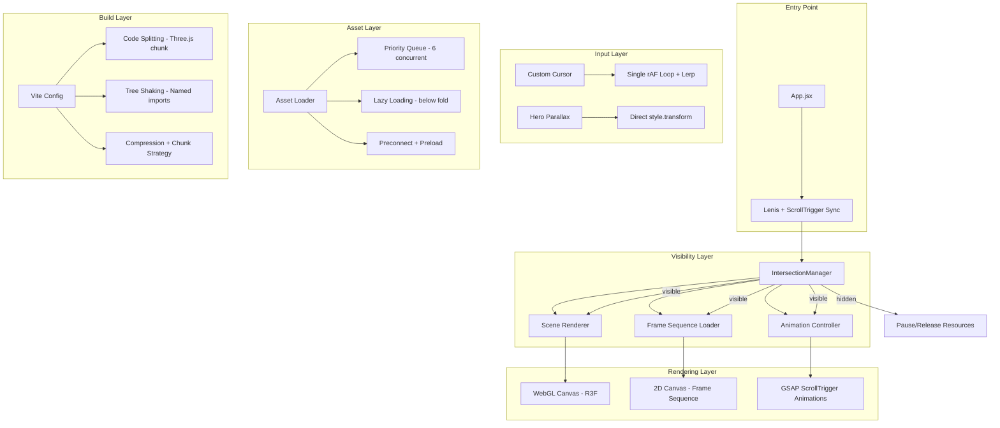
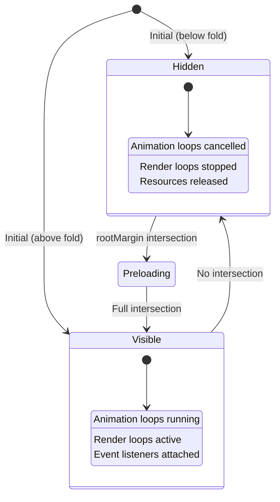

# Design Document: Performance Optimization

## Overview

This design describes the performance optimization strategy for the SIAGA landing page — a Vite + React application with scroll-based animations (GSAP + Lenis), a 240-frame drone anatomy sequence, 3D WebGL models (React Three Fiber), image-heavy sections, and a custom cursor. The optimization targets smoother scrolling, faster initial load, lighter animations, and stable frame rates while maintaining pixel-perfect visual fidelity.

The approach is non-destructive: no visual, layout, or design changes are permitted. Only the underlying rendering techniques, resource loading strategies, and runtime behavior are modified.

### Key Design Decisions

1. **Visibility-driven resource management**: All heavy components (3D scene, frame sequence, animations) are paused when off-screen using IntersectionObserver with generous rootMargin.
2. **DPR clamping**: All canvas/WebGL surfaces cap device pixel ratio at 1.5x to balance visual quality and GPU memory.
3. **Priority-based loading with concurrency control**: The 240-frame sequence uses a priority queue (keyframes first) with max 6 concurrent requests.
4. **Single animation loop per component**: Each component uses exactly one rAF loop with lerp interpolation, avoiding multiple independent loops.
5. **GPU-compositable properties only**: All scroll-triggered animations use transform/opacity exclusively.
6. **Code-splitting**: Three.js and React Three Fiber are split into separate chunks via dynamic import.

## Architecture



## Components and Interfaces

### 1. IntersectionManager

A shared utility that wraps IntersectionObserver to manage visibility state for all heavy components.

```typescript
interface IntersectionManagerOptions {
  rootMargin?: string;  // minimum "100px" 
  threshold?: number;
}

interface VisibilityState {
  isVisible: boolean;
  entry: IntersectionObserverEntry;
}

// Hook API
function useVisibility(ref: RefObject<Element>, options?: IntersectionManagerOptions): boolean;
```

**Responsibilities:**
- Detect viewport intersection for sections with heavy rendering
- Provide a `useVisibility` hook that components consume
- Use rootMargin of at least 100px to preload content before it enters viewport
- Trigger pause/resume of animation loops and render loops

### 2. FrameSequenceLoader

Manages the 240-frame drone anatomy scroll animation with optimized loading and rendering.

```typescript
interface FrameLoaderConfig {
  totalFrames: number;          // 240
  maxConcurrent: number;        // 6
  dprCap: number;               // 1.5
  frameSrcTemplate: (i: number) => string;
}

interface LoadingState {
  loaded: number;
  total: number;
  ready: boolean;
  lastSuccessfulFrame: number;
}
```

**Optimization techniques:**
- Priority-based preloading: frame 0, every 10th frame, last frame, then fill gaps
- Concurrency limiter: max 6 simultaneous image requests
- Redundant draw skipping: only draw when computed frame index changes
- DPR cap at 1.5x on canvas
- Visibility-gated animation loop (pause when off-screen)
- Graceful degradation on load failure (show last successful frame)

### 3. SceneRenderer

The React Three Fiber 3D canvas with visibility-based render loop control.

```typescript
interface SceneConfig {
  dpr: [number, number];        // [1, 1.5]
  antialias: boolean;           // false
  stencil: boolean;             // false
  particleCount: number;        // 80
  frameloop: "always" | "never";
}
```

**Optimization techniques:**
- frameloop toggles between "always" and "never" based on IntersectionObserver
- Antialiasing and stencil buffer disabled
- DPR clamped to [1, 1.5]
- Particle count capped at 80 with depthWrite disabled
- frustumCulled=false on visible meshes, envMapIntensity capped
- useGLTF.preload() at module level

### 4. AnimationController

GSAP-based animation system with proper lifecycle management.

```typescript
interface AnimationConfig {
  gpuOnly: boolean;             // true - only transform/opacity
  toggleActions: string;        // "play none none reverse"
  useContext: boolean;          // true - gsap.context() for cleanup
}
```

**Optimization techniques:**
- All animations use only GPU-compositable properties (transform, opacity)
- toggleActions: "play none none reverse" prevents animation buildup
- gsap.context() wraps all animations, context.revert() on unmount
- Hero parallax uses direct style.transform with translate3d (no gsap.set per frame)
- Visibility-gated: timelines pause when section is off-screen

### 5. CustomCursor

Pointer-following cursor with single animation loop.

```typescript
interface CursorConfig {
  lerpFactor: number;           // 0.14 normal, 1.0 for reduced-motion
  passiveListeners: boolean;    // true
  touchDeviceSkip: boolean;     // true
}
```

**Optimization techniques:**
- Skip initialization entirely on touch devices via media query check
- Passive event listeners for pointermove and pointerover
- Single rAF loop with lerp interpolation
- prefers-reduced-motion: lerp=1 (instant follow)
- Proper cleanup: cancelAnimationFrame + removeEventListener on unmount

### 6. AssetLoader

Resource loading strategy for images, fonts, and 3D models.

**Optimization techniques:**
- Native lazy loading (loading="lazy") for all below-fold images
- Above-fold assets prioritized (hero background, logo, nav)
- Preconnect to fonts.googleapis.com and fonts.gstatic.com
- font-display: swap for Google Fonts
- useGLTF.preload() for 3D models
- CSS aspect-ratio or explicit dimensions on all image containers

### 7. Vite Build Configuration

```javascript
// vite.config.js
export default defineConfig({
  plugins: [react()],
  build: {
    rollupOptions: {
      output: {
        manualChunks: {
          'three-vendor': ['three', '@react-three/fiber', '@react-three/drei'],
          'gsap-vendor': ['gsap'],
        }
      }
    },
    cssCodeSplit: true,
    minify: 'terser',
    terserOptions: {
      compress: { drop_console: false, passes: 2 }
    }
  }
});
```

## Data Models

### Visibility State Machine



### Frame Loading Priority Queue

```typescript
interface PriorityFrame {
  index: number;
  priority: 'keyframe' | 'fill';
  status: 'pending' | 'loading' | 'loaded' | 'failed';
}

// Priority order:
// 1. Frame 0 (first frame - immediate display)
// 2. Every 10th frame (keyframes for smooth scrubbing)
// 3. Last frame (TOTAL_FRAMES - 1)
// 4. All remaining frames (gap fill)
```

### Component Lifecycle

```typescript
interface ComponentLifecycle {
  mount: {
    registerObserver: boolean;
    attachListeners: boolean;
    startAnimationLoop: boolean;
  };
  visible: {
    resumeAnimations: boolean;
    startRenderLoop: boolean;
  };
  hidden: {
    pauseAnimations: boolean;
    stopRenderLoop: boolean;
    releaseResources: boolean;
  };
  unmount: {
    revertGsapContext: boolean;
    cancelRaf: boolean;
    removeListeners: boolean;
    disconnectObserver: boolean;
  };
}
```

## Correctness Properties

*A property is a characteristic or behavior that should hold true across all valid executions of a system — essentially, a formal statement about what the system should do. Properties serve as the bridge between human-readable specifications and machine-verifiable correctness guarantees.*

### Property 1: Frame Loading Priority Order

*For any* total frame count N, the loading order SHALL always load frame 0 first, then every 10th frame, then the last frame, before any gap-fill frames — ensuring keyframes are available for smooth scrubbing before the full sequence is loaded.

**Validates: Requirements 1.1**

### Property 2: Redundant Draw Skipping (Idempotence)

*For any* sequence of scroll positions that map to the same frame index, the canvas draw function SHALL be called exactly once — subsequent calls with the same frame index SHALL be skipped without side effects.

**Validates: Requirements 1.2**

### Property 3: DPR Clamping

*For any* device pixel ratio value R, the effective DPR used by all rendering surfaces (2D canvas and WebGL) SHALL equal `Math.min(Math.max(1, R), 1.5)` — never exceeding 1.5 regardless of the device's native pixel ratio.

**Validates: Requirements 1.3, 2.3**

### Property 4: Visibility-Based Resource Pausing

*For any* component with animation loops or render loops, when the component's section is not intersecting the viewport (as reported by IntersectionObserver), all associated requestAnimationFrame callbacks SHALL be cancelled and all GSAP timelines SHALL be paused — no CPU/GPU work occurs for hidden sections.

**Validates: Requirements 1.4, 2.1, 7.1, 7.2**

### Property 5: Component Cleanup on Unmount

*For any* component that registers event listeners, requestAnimationFrame callbacks, or GSAP contexts during its lifecycle, unmounting that component SHALL result in: all event listeners removed, all rAF callbacks cancelled, and all GSAP contexts reverted — leaving zero dangling references.

**Validates: Requirements 3.4, 5.5**

### Property 6: GPU-Compositable Animation Properties

*For any* scroll-triggered animation definition in the codebase, the animated CSS properties SHALL be exclusively from the set {transform, opacity, x, y, scale, rotation, scaleX, scaleY} (GSAP transform shorthands) — no properties that trigger layout or paint (top, left, width, height, margin, padding) SHALL be used.

**Validates: Requirements 3.2**

### Property 7: Touch Device Cursor Skip

*For any* device where the media query `(hover: none), (pointer: coarse)` matches, the CustomCursor component SHALL not register any event listeners, not start any animation loops, and not render any visible cursor elements.

**Validates: Requirements 7.4**

### Property 8: Reduced Motion Adaptation

*For any* environment where `prefers-reduced-motion: reduce` matches, the CustomCursor lerp factor SHALL equal 1 (instant follow with no animation delay), and animation durations across all components SHALL be reduced.

**Validates: Requirements 7.5**

### Property 9: Below-Fold Lazy Loading

*For any* image element whose initial position is below the viewport fold, the element SHALL have the `loading="lazy"` attribute set — ensuring no below-fold image blocks the initial page render.

**Validates: Requirements 4.1**

### Property 10: Layout Stability (Space Reservation)

*For any* dynamically loaded content element (images, canvas, 3D viewport, map embeds), its container SHALL have explicit dimensions defined via CSS `aspect-ratio`, `width`+`height` attributes, or equivalent — ensuring zero Cumulative Layout Shift regardless of load timing or failure.

**Validates: Requirements 4.5, 6.1**

### Property 11: IntersectionObserver RootMargin Minimum

*For any* IntersectionObserver instance created in the application, the `rootMargin` option SHALL be at least "100px" — ensuring content begins loading/activating before it enters the visible viewport.

**Validates: Requirements 6.5**

### Property 12: Animation Visual Preservation

*For any* animation that is optimized (e.g., switching from top/left to transform), the visual output SHALL preserve identical timing (duration), easing curve, travel distance, and direction — only the underlying CSS property or rendering technique may change.

**Validates: Requirements 9.4**

### Property 13: Concurrency Limit on Frame Loading

*For any* point in time during the frame loading process, the number of simultaneously in-flight image requests SHALL not exceed 6 — ensuring the browser's connection pool is not saturated and other resources can load concurrently.

**Validates: Requirements 1.1**

## Error Handling

### Frame Loading Failures

- **Strategy**: Graceful degradation — display the last successfully loaded frame
- **Implementation**: Track `lastSuccessfulFrame` index; on image.onerror, increment loaded count but don't update the frame reference; the draw function falls back to the last valid frame
- **User impact**: The animation may appear to "stick" on a frame momentarily but never shows a broken image or throws an error

### WebGL Context Loss

- **Strategy**: The Canvas component handles context loss events natively via React Three Fiber
- **Implementation**: R3F's internal error boundary catches WebGL context loss; the scene gracefully degrades to a static state
- **User impact**: The 3D drone model may freeze but the page remains functional

### IntersectionObserver Unavailability

- **Strategy**: Feature detection with fallback to "always visible"
- **Implementation**: If `IntersectionObserver` is not available (very old browsers), components default to `isVisible = true` — no optimization but no breakage
- **User impact**: Performance optimizations don't apply, but functionality is preserved

### Event Listener Cleanup Failures

- **Strategy**: Defensive cleanup in useEffect return functions
- **Implementation**: All cleanup functions use try/catch around removeEventListener and cancelAnimationFrame; errors are silently caught
- **User impact**: None — cleanup failures only affect memory in edge cases

### Build/Bundle Errors

- **Strategy**: The Vite config changes are additive (manualChunks, terser options) and don't alter existing functionality
- **Implementation**: If chunk splitting fails, Vite falls back to default bundling behavior
- **User impact**: Slightly larger initial bundle but no functional breakage

## Testing Strategy

### Unit Tests (Example-Based)

Focus on specific configurations and edge cases:

1. **WebGL config verification**: Verify Canvas props include `antialias: false`, `stencil: false`, `dpr: [1, 1.5]`
2. **Particle count check**: Verify particle count ≤ 80 with `depthWrite: false`
3. **Lenis configuration**: Verify duration is 1.0 and ScrollTrigger.update is connected
4. **Preconnect links**: Verify `<link rel="preconnect">` exists for font origins
5. **useGLTF.preload()**: Verify called at module level for drone.glb
6. **Loading screen dimensions**: Verify full viewport height during loading state
7. **Named imports**: Verify lucide-react uses named imports (no barrel)
8. **toggleActions pattern**: Verify ScrollTrigger instances use "play none none reverse"
9. **Passive listeners**: Verify pointermove/pointerover use `{ passive: true }`

### Property-Based Tests

Using **fast-check** (JavaScript property-based testing library) with minimum 100 iterations per property:

| Property | Test Description |
|----------|-----------------|
| 1 | Generate random frame counts, verify priority ordering |
| 2 | Generate scroll position sequences, verify single draw per unique frame index |
| 3 | Generate random DPR values (0.5–4.0), verify clamping to [1, 1.5] |
| 4 | Generate visibility state sequences, verify resource pausing on hidden |
| 5 | Simulate mount/unmount cycles, verify zero dangling references |
| 6 | Parse animation configs, verify only GPU-compositable properties |
| 7 | Generate device capability combinations, verify cursor skip on touch |
| 8 | Generate motion preference states, verify lerp=1 on reduced-motion |
| 9 | Generate image element positions, verify lazy loading on below-fold |
| 10 | Generate container configurations, verify explicit dimensions exist |
| 11 | Generate observer configs, verify rootMargin ≥ 100px |
| 12 | Generate animation parameter sets, verify visual parameters preserved after optimization |
| 13 | Simulate concurrent load sequences, verify max 6 in-flight at any time |

**Configuration:**
- Library: fast-check
- Minimum iterations: 100 per property
- Tag format: `Feature: performance-optimization, Property {N}: {title}`

### Integration Tests

1. **Lighthouse CI**: Automated LCP < 2.5s, CLS = 0, TBT reduction ≥ 30%
2. **Visual regression**: Percy or Playwright screenshots at 1920px, 768px, 375px
3. **Build output verification**: Verify Three.js chunk is separate from main bundle
4. **Console error check**: Run full page scroll with no console errors/warnings
5. **60 FPS verification**: Performance trace during continuous scroll

### Smoke Tests

1. **Font display**: Verify Google Fonts URL includes `display=swap`
2. **No new dependencies**: Verify package.json is unchanged
3. **WebGL context options**: Verify antialias/stencil disabled in production
