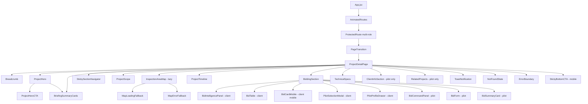
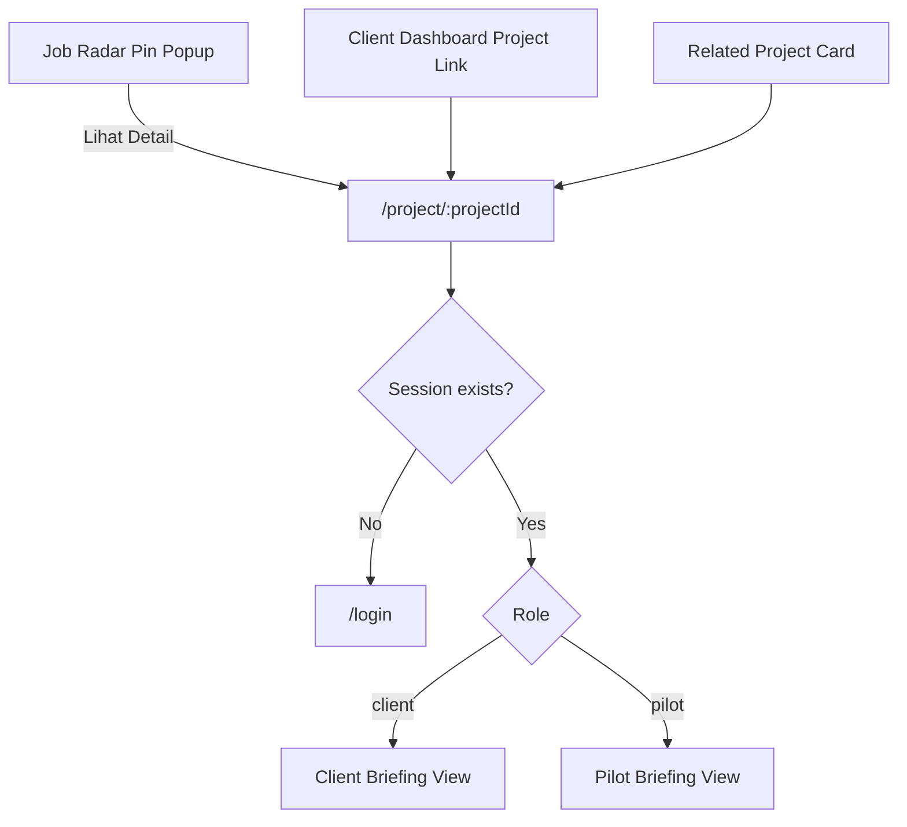
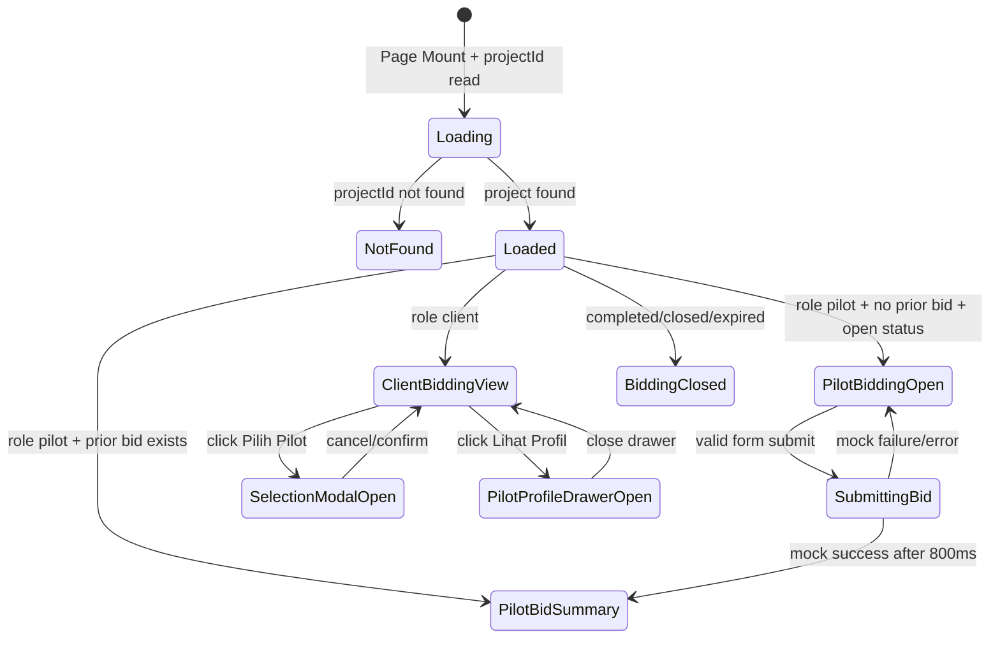

# Design Document: Project Detail Page

## Overview

Project Detail Page adalah halaman informasi lengkap proyek inspeksi pada route:

```text
/project/:projectId
```

Halaman ini dapat diakses oleh dua role utama SIAGA:

```text
Client dan Pilot
```

Halaman ini menjadi destinasi dari dua entry point penting:

1. Tombol **Lihat Detail** pada Job Radar Pin Popup untuk Pilot.
2. Link proyek pada Client Dashboard untuk Client.

Project Detail Page bukan sekadar halaman detail proyek biasa. Halaman ini harus terasa seperti:

```text
SIAGA Project Intelligence Briefing
```

atau lebih spesifik:

```text
Premium Project Intelligence Briefing Dashboard
```

Kesan visual utama:

```text
premium, informatif, role-aware, glassmorphism, clean, aerospace-tech, modern, soft-blue, dark-cyan accent, professional, dan selaras dengan Landing Page, Job Radar Page, Client Dashboard, Login, dan Register SIAGA.
```

Halaman ini harus menyajikan detail proyek seperti sebuah briefing operasional drone inspection:

- apa proyeknya,
- di mana lokasinya,
- bagaimana cakupan area inspeksi,
- apa deliverables-nya,
- status milestone proyek,
- bagaimana kondisi bidding,
- apa spesifikasi teknisnya,
- siapa client-nya,
- dan proyek relevan lainnya untuk pilot.

Target UI:

```text
Halaman harus terlihat seperti product-grade SaaS dashboard, bukan halaman detail data biasa.
```

---

## Product Experience Goal

Tujuan utama halaman ini adalah membuat pengguna merasa sedang membuka dokumen briefing proyek profesional.

Untuk **Client**, halaman ini harus membantu:

```text
memantau detail proyek,
membandingkan penawaran pilot,
melihat progres,
dan memilih pilot terbaik.
```

Untuk **Pilot**, halaman ini harus membantu:

```text
memahami scope proyek,
menilai kelayakan bidding,
melihat spesifikasi teknis,
mengetahui kredibilitas client,
dan mengajukan penawaran dengan percaya diri.
```

Target demo SEFEST:

```text
Saat juri membuka halaman detail proyek, mereka langsung melihat bahwa SIAGA bukan hanya landing page, tetapi sudah memiliki alur produk nyata: discovery proyek → detail proyek → bidding → monitoring.
```

---

## Key Design Decisions

- **Single page, dual rendering**  
  Satu komponen `ProjectDetailPage` digunakan untuk dua role: Client dan Pilot. Tidak ada route terpisah per role. Konten ditampilkan dengan conditional rendering berdasarkan role dari `AuthContext`.

- **Role-aware UI**  
  Client melihat Bid Table lengkap, harga bid, dan aksi memilih pilot. Pilot hanya melihat jumlah kompetitor dan form bid, tanpa melihat harga/nama/detail kompetitor lain.

- **Project Intelligence Briefing UI**  
  Layout diperbaiki menjadi briefing dashboard dengan Hero split layout, Briefing Summary Cards, Sticky Section Navigator, Premium Inspection Area Stage, Bid Intelligence Panel, dan Spec Matrix.

- **Extended Mock Data**  
  Data proyek di-extend dari Job Radar `mock-data.js` dengan field tambahan seperti polygon, milestones, bids, client info, spesifikasi teknis, deliverables, dan titik inspeksi. Data tetap menjadi single source of truth.

- **Pure logic layer**  
  Logic seperti `getProjectStatus`, `getRelatedProjects`, `validateBidForm`, `getRoleVisibility`, dan `getHeroCTA` diletakkan di `project-logic.js` agar testable.

- **Mapbox lazy loading**  
  `InspectionAreaMap` di-load menggunakan `React.lazy()` + `Suspense`, agar Hero, Scope, dan Summary tampil cepat tanpa menunggu Mapbox.

- **Viewport-triggered sections**  
  Section di bawah fold dapat menggunakan Intersection Observer untuk animasi masuk dan mengurangi initial render cost.

- **Bid state in sessionStorage**  
  Bid yang sudah dikirim disimpan di `sessionStorage` dengan key berbasis projectId:

  ```text
  siaga_bid_{projectId}
  ```

- **CSS per component**  
  Mengikuti pola existing project: setiap komponen punya file `.css` sendiri.

- **Framer Motion**  
  Digunakan untuk page transition, section reveal, modal/drawer animation, dan microinteraction halus.

- **Design Tokens SIAGA**  
  Warna, font, radius, shadow, dan visual style harus selaras dengan SIAGA. Tidak boleh terasa seperti template admin generic.

---

## Visual Direction

### Core Concept

```text
SIAGA Project Intelligence Briefing
```

### Visual Keywords

```text
clean
premium
soft glassmorphism
aerospace-tech
data-rich
role-aware
briefing dashboard
dark-cyan accent
soft-blue background
operational intelligence
```

### UI Mood

Halaman harus terasa:

```text
rapi, luas, informatif, elegan, modern, dan mahal.
```

Bukan:

```text
halaman detail biasa, form page generic, admin table polos, atau layout section vertikal monoton.
```

---

## Design Tokens

Gunakan token existing SIAGA jika sudah ada. Jika perlu tambahan token visual, tetap berada dalam palet SIAGA.

### Core Tokens

```css
--color-primary: #0A192F;
--color-accent: #00D2FF;
--color-surface: #F4F7F6;
--color-danger: #FF4C4C;
--color-success: #00C48C;
--color-warning: #F5B740;
```

### Extended Visual Tokens

```css
--siaga-navy: #071A34;
--siaga-navy-soft: #082747;
--siaga-blue: #106DFF;
--siaga-cyan: #00D2FF;
--siaga-cyan-soft: #22D3EE;

--siaga-bg: #F4FAFF;
--siaga-bg-soft: #EEF6FF;
--siaga-bg-white: #FFFFFF;

--glass-white: rgba(255, 255, 255, 0.72);
--glass-white-strong: rgba(255, 255, 255, 0.86);
--glass-dark: rgba(7, 26, 52, 0.78);
--glass-border: rgba(180, 220, 245, 0.45);
--glass-border-cyan: rgba(0, 210, 255, 0.24);

--text-primary: #071A34;
--text-secondary: #58708E;
--text-muted: #8AA0B8;

--shadow-soft: 0 24px 70px rgba(10, 40, 80, 0.10);
--shadow-glass: 0 28px 90px rgba(0, 20, 50, 0.16);
--shadow-cyan: 0 18px 60px rgba(0, 210, 255, 0.18);
```

### Typography

```text
Display / Heading: Montserrat
Body / Metadata: Inter
```

Usage:

- H1: Montserrat 700/800
- H2: Montserrat 700
- Section label: Inter 700 uppercase with letter spacing
- Body: Inter 400/500
- Metadata: Inter 500/600

### Radius

```css
--radius-sm: 12px;
--radius-md: 18px;
--radius-lg: 24px;
--radius-xl: 32px;
--radius-full: 999px;
```

### Glassmorphism Pattern

Light glass:

```css
background: rgba(255, 255, 255, 0.72);
backdrop-filter: blur(24px);
border: 1px solid rgba(180, 220, 245, 0.45);
box-shadow: 0 24px 70px rgba(10, 40, 80, 0.10);
```

Dark glass:

```css
background: linear-gradient(135deg, rgba(7, 26, 52, 0.90), rgba(8, 39, 71, 0.86));
backdrop-filter: blur(24px);
border: 1px solid rgba(0, 210, 255, 0.22);
box-shadow: 0 28px 90px rgba(0, 20, 50, 0.22);
```

---

## Visual Background

Project Detail Page tidak boleh memakai background putih polos.

Gunakan background utama:

```css
background:
  radial-gradient(circle at 12% 0%, rgba(16, 109, 255, 0.12), transparent 32%),
  radial-gradient(circle at 88% 12%, rgba(0, 210, 255, 0.10), transparent 28%),
  linear-gradient(135deg, #F4FAFF 0%, #EEF6FF 45%, #FFFFFF 100%);
```

Tambahkan subtle grid pattern:

```css
background-image:
  linear-gradient(rgba(7, 26, 52, 0.035) 1px, transparent 1px),
  linear-gradient(90deg, rgba(7, 26, 52, 0.035) 1px, transparent 1px);
background-size: 56px 56px;
```

Grid harus halus, tidak mengganggu readability.

---

## Architecture

### High-Level Component Tree



---

## Route Integration



---

## State Management



---

## Data Flow

```text
ProjectDetailData
(extended from Job Radar mock data)
        │
        ▼
ProjectDetailPage
(reads projectId from useParams + role from useAuth)
        │
        ├── getProjectById(projects, projectId)
        │        ├── null → NotFoundState
        │        └── project → sections
        │
        ├── getProjectStatus(project, today)
        │
        ├── getRoleVisibility(role, projectStatus, hasBid)
        │
        ├── getHeroCTA(role, projectStatus, hasBid)
        │
        ├── getRelatedProjects(currentProject, allProjects)
        │
        ├── validateBidForm(formData)
        │
        └── sessionStorage bid state:
             - hasBid(projectId)
             - saveBid(projectId, bidData)
             - getBid(projectId)
```

---

## File Structure

```text
src/pages/ProjectDetail/
├── ProjectDetailPage.jsx
├── ProjectDetailPage.css
├── project-detail-data.js
├── project-logic.js
├── components/
│   ├── Breadcrumb/
│   │   ├── Breadcrumb.jsx
│   │   └── Breadcrumb.css
│   ├── ProjectHero/
│   │   ├── ProjectHero.jsx
│   │   └── ProjectHero.css
│   ├── BriefingSummaryCards/
│   │   ├── BriefingSummaryCards.jsx
│   │   └── BriefingSummaryCards.css
│   ├── StickySectionNavigator/
│   │   ├── StickySectionNavigator.jsx
│   │   └── StickySectionNavigator.css
│   ├── ProjectScope/
│   │   ├── ProjectScope.jsx
│   │   └── ProjectScope.css
│   ├── InspectionAreaMap/
│   │   ├── index.js
│   │   ├── InspectionAreaMap.jsx
│   │   ├── InspectionAreaMap.css
│   │   ├── MapLoadingFallback.jsx
│   │   └── MapErrorFallback.jsx
│   ├── ProjectTimeline/
│   │   ├── ProjectTimeline.jsx
│   │   └── ProjectTimeline.css
│   ├── BiddingSection/
│   │   ├── BiddingSection.jsx
│   │   ├── BiddingSection.css
│   │   ├── BidIntelligencePanel.jsx
│   │   ├── BidTable.jsx
│   │   ├── BidTable.css
│   │   ├── BidCardMobile.jsx
│   │   ├── BidCommandPanel.jsx
│   │   ├── BidForm.jsx
│   │   ├── BidForm.css
│   │   ├── BidSummaryCard.jsx
│   │   ├── PilotSelectionModal.jsx
│   │   ├── PilotSelectionModal.css
│   │   ├── PilotProfileDrawer.jsx
│   │   └── PilotProfileDrawer.css
│   ├── TechnicalSpecs/
│   │   ├── TechnicalSpecs.jsx
│   │   └── TechnicalSpecs.css
│   ├── ClientInfoSection/
│   │   ├── ClientInfoSection.jsx
│   │   └── ClientInfoSection.css
│   ├── RelatedProjects/
│   │   ├── RelatedProjects.jsx
│   │   └── RelatedProjects.css
│   ├── StickyBottomCTA/
│   │   ├── StickyBottomCTA.jsx
│   │   └── StickyBottomCTA.css
│   ├── NotFoundState/
│   │   ├── NotFoundState.jsx
│   │   └── NotFoundState.css
│   └── ToastNotification/
│       ├── ToastNotification.jsx
│       └── ToastNotification.css
└── __tests__/
    ├── project-logic.property.test.js
    ├── project-detail.unit.test.js
    ├── project-detail.integration.test.jsx
    └── project-detail.a11y.test.jsx
```

---

## Layout Design

## Desktop Layout >= 1280px

Desktop harus menggunakan layout briefing dashboard, bukan section vertikal polos.

```text
┌──────────────────────────────────────────────────────────────┐
│ Breadcrumb                                                   │
│                                                              │
│ ┌───────────────────────────────┐ ┌────────────────────────┐ │
│ │ Project Briefing Hero          │ │ Briefing Summary Card  │ │
│ │ Status, title, location, CTA   │ │ Deadline, area, titik  │ │
│ └───────────────────────────────┘ └────────────────────────┘ │
│                                                              │
│ Sticky Section Nav                                           │
│ [Overview] [Area Inspeksi] [Timeline] [Bidding] [Specs]      │
│                                                              │
│ ┌───────────────────────────────┐ ┌────────────────────────┐ │
│ │ Mission Scope                  │ │ Key Requirements       │ │
│ │ Description + deliverables     │ │ Specs preview          │ │
│ └───────────────────────────────┘ └────────────────────────┘ │
│                                                              │
│ ┌──────────────────────────────────────────────────────────┐ │
│ │ Premium Inspection Area Stage / Mapbox                    │ │
│ └──────────────────────────────────────────────────────────┘ │
│                                                              │
│ ┌──────────────────────────────────────────────────────────┐ │
│ │ Project Timeline                                          │ │
│ └──────────────────────────────────────────────────────────┘ │
│                                                              │
│ ┌──────────────────────────────────────────────────────────┐ │
│ │ Bidding Intelligence / Bid Command Panel                  │ │
│ └──────────────────────────────────────────────────────────┘ │
│                                                              │
│ ┌───────────────────────────────┐ ┌────────────────────────┐ │
│ │ Technical Specs Matrix         │ │ Client / Related       │ │
│ └───────────────────────────────┘ └────────────────────────┘ │
└──────────────────────────────────────────────────────────────┘
```

### Desktop Rules

- Max content width: `1180px–1280px`.
- Centered container.
- Section spacing: `28px–40px`.
- Cards use glassmorphism.
- Hero uses 2-column layout.
- Map stage full width.
- Bidding section full width.
- Specs + Pilot-only sections can use two-column layout if space allows.

---

## Tablet Layout 768px - 1279px

```text
Breadcrumb
Hero full width
Briefing summary 2-column
Sticky nav horizontal scroll
Scope + requirements stacked
Map stage 300px
Timeline horizontal compact or scrollable
Bidding section full width
Technical specs 2-column
Client info / related projects 2-column or stacked
```

### Tablet Rules

- Padding reduced.
- Hero becomes one column or `60/40` depending available width.
- Bid table can be horizontally scrollable if still table.
- Prefer card/hybrid layout for bidding if width is tight.
- Map height: around `300px`.
- No horizontal page overflow.

---

## Mobile Layout < 768px

Mobile must feel intentionally designed, not squeezed desktop.

```text
Breadcrumb compact
Hero compact card
Summary cards 2x2 or stacked
Sticky section nav horizontal pills
Scope card
Map stage card
Timeline vertical compact
Bidding card / form
Technical specs accordion/card stack
Client info card
Related project cards
Sticky bottom CTA
```

### Mobile Rules

- Viewport support: minimum `320px`.
- No horizontal overflow.
- Hero CTA must remain accessible.
- Sticky Bottom CTA appears when primary action is important:
  - Pilot open project: `Bid Sekarang`
  - Client open/urgent project: `Lihat Bidding`
- Bid table becomes bid card stack.
- Timeline becomes vertical.
- Technical Specs becomes card stack or accordion.
- Map height around `250px`.

---

## Components and Interfaces

---

# ProjectDetailPage

```jsx
// Props: none
// Reads from URL params and AuthContext
// Route: /project/:projectId

// State:
// project: ProjectDetail | null
// isNotFound: boolean
// derivedStatus: DerivedStatus
// roleVisibility: RoleVisibility
// bidFormData: BidFormData
// bidFormErrors: object
// isBidSubmitting: boolean
// hasBid: boolean
// submittedBid: BidData | null
// selectedPilotId: string | null
// isSelectionModalOpen: boolean
// isProfileDrawerOpen: boolean
// drawerPilotId: string | null
// toastMessage: string | null
// activeSectionId: string
```

## Responsibilities

- Read `projectId` from `useParams()`.
- Read role/session from `useAuth()`.
- Lookup project from `project-detail-data.js`.
- Render `NotFoundState` if project not found.
- Compute derived status.
- Compute role visibility.
- Manage bid state from sessionStorage.
- Manage bid form state.
- Manage modal and drawer state.
- Manage sticky section nav active state.
- Manage toast feedback.
- Reset local state when `projectId` changes.
- Maintain custom cursor and page transition.

---

# project-logic.js

```js
export function getProjectById(projects, projectId) {}

export function getProjectStatus(project, today = new Date()) {}

export function getStatusBadgeVisual(status) {}

export function getRoleVisibility(role, projectStatus, hasBid) {}

export function getRelatedProjects(currentProject, allProjects) {}

export function validateBidForm(formData) {}

export function isDeadlinePassed(deadline, today = new Date()) {}

export function formatTanggalIndonesia(dateString) {}

export function getHeroCTA(role, projectStatus, hasBid) {}

export function getDashboardPath(role) {}

export function isMilestoneConsistent(projectStatus, milestones) {}

export function getBriefingSummary(project, role) {}

export function getBidIntelligenceMetrics(project) {}
```

## Logic Rules

- `getProjectStatus()` returns `expired` if deadline has passed and status is still `open`.
- Pilot never receives `showBidTable: true`.
- Client can see contract value and bid table.
- Pilot does not see competitor prices.
- Related projects exclude current project.
- Related projects prioritize same `jenis_infrastruktur`, fallback to same province.
- Bid form valid only if:
  - `harga > 0`
  - `estimasiHari > 0`

---

# Breadcrumb

```jsx
<Breadcrumb
  role={role}
  projectName={project.nama}
/>
```

## Visual Requirements

- Glass pill/card style.
- Format:

```text
Dashboard > Proyek > [Nama Proyek]
```

- `Dashboard` links to role-appropriate dashboard.
- Current project name non-clickable.
- On mobile, long project name can truncate with tooltip/title.

## Accessibility

- Use `<nav aria-label="Breadcrumb">`.
- Use ordered list if possible.

---

# ProjectHero

```jsx
<ProjectHero
  project={project}
  derivedStatus={derivedStatus}
  role={role}
  hasBid={hasBid}
  onCTAClick={handleHeroCTA}
/>
```

## Purpose

Hero harus menjadi visual anchor utama halaman.

## Layout

Desktop split layout:

```text
┌────────────────────────────────────────────┐
│ Left: Project Identity                      │
│ - Status badge                              │
│ - Infrastructure badge                      │
│ - Title                                     │
│ - Location/deadline                         │
│ - Role-aware CTA                            │
│                                            │
│ Right: Briefing Summary Panel               │
│ - deadline                                  │
│ - bidder count                              │
│ - inspection points                         │
│ - area                                      │
└────────────────────────────────────────────┘
```

## Visual Requirements

- Large glass hero container.
- Soft blue/white gradient base.
- Dark navy/cyan accent panel.
- Subtle radar grid.
- Floating blurred orb background.
- H1 large but responsive.
- Status badge visible above H1.
- CTA prominent.

## Role-aware Hero CTA

Client:
- `completed` → Generate Report
- `open`, `urgent`, `deadline_dekat` → Lihat Bidding
- `closed` → Bidding Selesai

Pilot:
- open/urgent/deadline_dekat + no bid → Bid Sekarang
- has bid → Bid Terkirim ✓ disabled
- closed/completed/expired → Bidding Ditutup

## Contract Value Visibility

- Client: visible.
- Pilot: hidden unless explicitly allowed by future business rule.
- Do not leak bid prices or competitor prices to pilot.

---

# BriefingSummaryCards

```jsx
<BriefingSummaryCards
  project={project}
  role={role}
  derivedStatus={derivedStatus}
/>
```

## Purpose

Memberikan ringkasan cepat sebelum user scroll.

Cards:
- Deadline
- Luas Area
- Titik Inspeksi
- Jumlah Bidder
- Nilai Kontrak client-only
- Status Bidding pilot/client aware

## Desktop Layout

- Can live inside Hero right panel.
- Or immediately below Hero as 4–5 compact cards.

## Mobile Layout

- 2-column compact grid or stacked.
- Cards must not overflow.

## Visual Style

- Glass cards.
- Icon container soft cyan.
- Label uppercase.
- Value prominent.
- Micro helper text.

---

# StickySectionNavigator

```jsx
<StickySectionNavigator
  activeSectionId={activeSectionId}
  sections={[
    { id: 'overview', label: 'Overview' },
    { id: 'area', label: 'Area Inspeksi' },
    { id: 'timeline', label: 'Timeline' },
    { id: 'bidding', label: 'Bidding' },
    { id: 'specs', label: 'Specs' }
  ]}
/>
```

## Purpose

Memudahkan user berpindah antar section di halaman yang panjang.

## Visual Requirements

- Sticky below hero.
- Glass pill navigation.
- Active section cyan/navy.
- Smooth scroll to section.
- Mobile horizontal scroll.
- No horizontal page overflow.

---

# ProjectScope

```jsx
<ProjectScope project={project} />
```

## New Concept

ProjectScope harus menjadi:

```text
Mission Scope Card
```

Bukan hanya paragraf deskripsi.

## Layout

Desktop:

```text
┌───────────────────────────────┐ ┌────────────────────────┐
│ Mission Scope                  │ │ Key Requirements       │
│ Deskripsi proyek               │ │ 20MP minimum           │
│                                │ │ RTK accuracy           │
│ Deliverables chips             │ │ Wind < 20 knot         │
└───────────────────────────────┘ └────────────────────────┘
```

## Content

- Deskripsi lengkap.
- Jenis infrastruktur + icon.
- Luas area.
- Jumlah titik inspeksi.
- Deliverables chips:
  - Foto RAW
  - Video 4K
  - Orthomosaic
  - Point Cloud
  - Thermal scan if relevant
- Ringkasan spesifikasi:
  - Resolusi minimum
  - Format output
  - Peralatan minimum

## Visual

- Glass card.
- Section label.
- Chips with soft cyan background.
- Icon-based metadata cards.

---

# InspectionAreaMap

```jsx
const InspectionAreaMap = lazy(() => import('./InspectionAreaMap'));

<Suspense fallback={<MapLoadingFallback />}>
  <InspectionAreaMap
    polygonCoords={project.polygon_area}
    inspectionPoints={project.titik_inspeksi}
    center={project.lokasi}
    area={project.luas_area}
    pointCount={project.jumlah_titik_inspeksi}
  />
</Suspense>
```

## New Concept

Inspection map harus menjadi:

```text
Premium Inspection Area Stage
```

Bukan map embedded biasa.

## Visual Layout

```text
┌──────────────────────────────────────────────────────────────┐
│ Inspection Area                                              │
│ Area inspeksi, titik prioritas, dan cakupan misi UAV.         │
│                                                              │
│ [Area 12.4 km²] [8 titik inspeksi] [RTK Required]             │
│                                                              │
│ ┌──────────────────────────────────────────────────────────┐ │
│ │ Mapbox dark map                                           │ │
│ │ Polygon cyan glow                                         │ │
│ │ Inspection markers                                        │ │
│ │ Floating legend                                           │ │
│ └──────────────────────────────────────────────────────────┘ │
│ GPS Bounding Box / Coordinate Strip                          │
└──────────────────────────────────────────────────────────────┘
```

## Mapbox Settings

- Token: `import.meta.env.VITE_MAPBOX_TOKEN`
- Style: `mapbox://styles/mapbox/dark-v11`
- Desktop height: `420px`
- Tablet height: `320px`
- Mobile height: `250px`
- Polygon fill: cyan at 18–22% opacity
- Polygon stroke: cyan solid
- Polygon glow effect if possible
- Markers: cyan inspection dots with subtle pulse
- Auto fit bounds to polygon

## Floating Elements

- Floating legend:
  - Polygon Area
  - Inspection Point
- Floating stats:
  - Area
  - Titik Inspeksi
  - Koordinat

## Loading

MapLoadingFallback must be premium:
- dark navy skeleton
- radar grid
- cyan spinner
- text: `Memuat peta area inspeksi…`

## Error

MapErrorFallback:
- message: `Peta tidak tersedia`
- show coordinate list
- maintain visual style

---

# ProjectTimeline

```jsx
<ProjectTimeline
  milestones={project.milestones}
  projectStatus={derivedStatus}
/>
```

## Visual Concept

```text
Glass Timeline Card
```

## Milestones

1. Posted
2. Bidding Open
3. Pilot Selected
4. Inspection In Progress
5. Report Ready

## Desktop

- Horizontal timeline.
- Completed: green/teal check.
- Active: cyan glow and pulse.
- Upcoming: muted glass.
- Connector line animated/fill progress.

## Mobile

- Vertical timeline.
- Smaller labels.
- Date below label.
- No horizontal overflow.

## Visual Requirements

- Card wrapper glassmorphism.
- Section title: `Project Timeline`
- Subtitle: `Lacak progres proyek inspeksi dari publikasi hingga laporan siap.`
- Active milestone must be visually obvious.

---

# BiddingSection

```jsx
<BiddingSection
  role={role}
  project={project}
  derivedStatus={derivedStatus}
  hasBid={hasBid}
  submittedBid={submittedBid}
  bidFormData={bidFormData}
  bidFormErrors={bidFormErrors}
  isBidSubmitting={isBidSubmitting}
  onBidFormChange={handleBidFormChange}
  onBidSubmit={handleBidSubmit}
  onSelectPilot={handleSelectPilot}
  onViewProfile={handleViewProfile}
/>
```

## New Concept

Bidding section harus menjadi section pengambilan keputusan paling kuat.

Untuk Client:

```text
Bid Intelligence Panel
```

Untuk Pilot:

```text
Bid Command Panel
```

---

## Client View: Bid Intelligence Panel

### Content

- Header:
  - `Bid Intelligence`
  - summary subtitle
- Summary metrics:
  - Total Penawaran
  - SIAGA Verified
  - Harga Terendah
  - Estimasi Tercepat
  - Rating Tertinggi
- Premium Bid Table
- PilotSelectionModal
- PilotProfileDrawer

### Desktop Table Columns

- Avatar
- Nama Pilot
- SIAGA Verified
- Rating
- Harga Bid
- Estimasi Hari
- Drone Type
- Aksi:
  - Pilih Pilot
  - Lihat Profil

### Visual Style

- Glass card container.
- Table header muted.
- Row hover cyan tint.
- Verified badge premium.
- Harga bold.
- CTA clear.

### Mobile

Do not use table on mobile.

Use Bid Cards:

```text
┌──────────────────────────────┐
│ Andi Pratama      Verified   │
│ ★★★★☆ 4.8                   │
│ Rp18.500.000 • 5 hari        │
│ DJI Matrice 300 RTK          │
│ [Lihat Profil] [Pilih Pilot] │
└──────────────────────────────┘
```

---

## Pilot View: Bid Command Panel

### Content

- Competitor count:
  - `11 pilot sudah mengajukan bid`
- Deadline reminder
- Main requirement summary
- Bid Form or Bid Summary
- No competitor names
- No competitor prices
- No bid table

### Form Fields

- Harga Penawaran (Rp)
- Estimasi Hari Pengerjaan
- Drone yang akan digunakan
- Catatan Teknis

### Visual

- Glass form card.
- Input field with label.
- Inline validation.
- Submit CTA gradient cyan-blue.
- Loading spinner on submit.
- BidSummaryCard after submit.

### Privacy Rule

Pilot must never see:
- bid prices of others,
- pilot names of competitors,
- bid details of competitors.

---

# BidForm

```jsx
<BidForm
  formData={bidFormData}
  errors={bidFormErrors}
  isSubmitting={isBidSubmitting}
  isDisabled={isDeadlinePassed}
  onChange={onBidFormChange}
  onSubmit={onBidSubmit}
/>
```

## Validation

- `harga` empty or 0:
  - `Harga penawaran wajib diisi`
- `estimasiHari` empty or 0:
  - `Estimasi hari wajib diisi`

## Submit Flow

1. Validate form.
2. If invalid, show inline errors.
3. If valid, disable button.
4. Show loading for 800ms mock delay.
5. Save bid to sessionStorage.
6. Show toast:
   - `Penawaran berhasil dikirim!`
7. Replace form with BidSummaryCard.
8. Hero CTA becomes:
   - `Bid Terkirim ✓`

---

# BidSummaryCard

## Purpose

Shows submitted bid in a premium confirmation card.

Content:
- Badge: `Bid Terkirim`
- Harga penawaran
- Estimasi hari
- Drone type
- Catatan teknis
- Timestamp if available
- Message:
  - `Penawaran Anda sudah tersimpan untuk sesi ini.`

Visual:
- success accent
- glass card
- calm confirmation state

---

# PilotSelectionModal

```jsx
<PilotSelectionModal
  isOpen={isModalOpen}
  pilot={selectedPilot}
  onConfirm={handleConfirmSelection}
  onCancel={handleCancelModal}
/>
```

## Visual

- Center modal.
- Glass panel.
- Pilot avatar + name.
- Confirmation warning.
- Buttons:
  - Batal
  - Konfirmasi Pilihan

## Behavior

- Focus trap.
- Escape closes.
- Confirm closes modal and shows toast:
  - `Pilot berhasil dipilih!`
- Return focus to trigger button.

---

# PilotProfileDrawer

```jsx
<PilotProfileDrawer
  isOpen={isDrawerOpen}
  pilot={drawerPilot}
  onClose={handleCloseDrawer}
/>
```

## Visual

- Right-side drawer desktop.
- Bottom sheet mobile.
- Dark glass panel.
- Profile hero.
- Rating and verified badge.
- Drone owned.
- Completed projects.
- Operating area.

## Behavior

- Escape closes.
- Overlay click closes.
- Focus management.

---

# TechnicalSpecs

```jsx
<TechnicalSpecs specs={project.spesifikasi_teknis} />
```

## New Concept

Technical Specs harus menjadi:

```text
Spec Matrix
```

Bukan table polos.

## Layout

Desktop 2-column or 3-column grid:

```text
[Resolusi Foto]      [Format Output]
[Standar]            [Peralatan Minimum]
[Kondisi Cuaca]      [Jam Operasional]
```

Each spec item:
- icon,
- label,
- value,
- glass border,
- subtle hover.

## Mobile

- stacked cards,
- or accordion if content long.

---

# ClientInfoSection

```jsx
{role === 'pilot' && <ClientInfoSection clientInfo={project.client_info} />}
```

## Purpose

Pilot bisa menilai kredibilitas client.

Content:
- nama perusahaan,
- rating,
- proyek selesai,
- member since,
- Verified Company badge.

Visual:
- Verified Client Card.
- Glass card.
- Soft blue/cyan accent.
- Trust badge.

Client role must not see this section.

---

# RelatedProjects

```jsx
{role === 'pilot' && (
  <RelatedProjects
    currentProject={project}
    allProjects={allProjects}
  />
)}
```

## Purpose

Pilot bisa menemukan peluang bidding lain.

Logic:
1. Same `jenis_infrastruktur`.
2. Exclude current project.
3. Fallback same province if not enough.
4. Max 3 results.

Visual:
- Related Mission Cards.
- Same visual language as Job Radar Mission Cards.
- Dark glass or light glass depending surrounding section.
- Hover glow cyan.
- Click navigates to `/project/:otherId`.

---

# StickyBottomCTA

```jsx
<StickyBottomCTA
  role={role}
  cta={heroCTA}
  onClick={handleHeroCTA}
/>
```

## Mobile Only

Shows primary action at bottom on mobile.

Examples:
- Pilot:
  - `Bid Sekarang`
- Client:
  - `Lihat Bidding`
- Already bid:
  - `Bid Terkirim ✓`

Rules:
- Do not show if action unavailable.
- Must not cover form submit button awkwardly.
- Safe area padding for mobile browser.

---

# NotFoundState

```jsx
<NotFoundState
  role={role}
  onBack={handleBackToDashboard}
/>
```

Content:
- icon/illustration,
- title:
  - `Proyek tidak ditemukan`
- description:
  - `Proyek yang Anda cari tidak tersedia atau sudah tidak aktif.`
- button:
  - `Kembali ke Dashboard`

Visual:
- centered glass card,
- consistent with SIAGA,
- no scary error.

---

# ToastNotification

```jsx
<ToastNotification
  message={toastMessage}
  onDismiss={clearToast}
/>
```

Use for:
- bid success,
- pilot selected,
- error fallback,
- mock action confirmation.

Visual:
- glass style,
- cyan/success accent,
- auto-dismiss 3–5 seconds,
- `aria-live="polite"`.

---

## Data Models

### ProjectDetail

```ts
interface ProjectDetail {
  id: string;
  nama: string;
  jenis_infrastruktur: InfraType;
  nilai_kontrak: number;
  lokasi: {
    lat: number;
    lng: number;
    kota: string;
    provinsi: string;
  };
  deadline: string;
  status: ProjectStatus;
  jumlah_bidder: number;
  deskripsi: string;
  client_nama: string;

  luas_area: number;
  jumlah_titik_inspeksi: number;
  deliverables: string[];
  spesifikasi_teknis: TechnicalSpec;
  polygon_area: [number, number][];
  titik_inspeksi: InspectionPoint[];
  milestones: ProjectMilestones;
  client_info: ClientInfo;
  bids: BidEntry[];
}
```

### Types

```ts
type InfraType =
  | 'SUTET'
  | 'Jembatan'
  | 'Kilang'
  | 'Solar Panel'
  | 'Bendungan'
  | 'Tower';

type ProjectStatus =
  | 'open'
  | 'urgent'
  | 'deadline_dekat'
  | 'in_progress'
  | 'completed'
  | 'closed';

type DerivedStatus = ProjectStatus | 'expired';
```

### TechnicalSpec

```ts
interface TechnicalSpec {
  resolusi_foto: string;
  format_output: string[];
  standar: string[];
  peralatan_minimum: string;
  kondisi_cuaca: string;
  jam_operasional: string;
}
```

### InspectionPoint

```ts
interface InspectionPoint {
  lat: number;
  lng: number;
  label: string;
}
```

### ProjectMilestones

```ts
interface ProjectMilestones {
  posted: MilestoneEntry;
  bidding_open: MilestoneEntry;
  pilot_selected: MilestoneEntry;
  inspection_in_progress: MilestoneEntry;
  report_ready: MilestoneEntry;
}

interface MilestoneEntry {
  status: 'completed' | 'in_progress' | 'upcoming';
  date: string | null;
}
```

### ClientInfo

```ts
interface ClientInfo {
  nama: string;
  rating: number;
  proyek_selesai: number;
  member_since: number;
  verified: boolean;
}
```

### BidEntry

```ts
interface BidEntry {
  id: string;
  pilot_id: string;
  pilot_nama: string;
  pilot_avatar: string;
  pilot_verified: boolean;
  pilot_rating: number;
  harga_bid: number;
  estimasi_hari: number;
  drone_type: string;
  catatan?: string;
}
```

### BidFormData

```ts
interface BidFormData {
  harga: number | '';
  estimasiHari: number | '';
  catatan: string;
  droneType: string;
}
```

### RoleVisibility

```ts
interface RoleVisibility {
  showContractValue: boolean;
  showBidTable: boolean;
  showBidForm: boolean;
  showClientInfo: boolean;
  showRelatedProjects: boolean;
  showGenerateReport: boolean;
}
```

---

## Interaction Design

## Hero CTA

- `Bid Sekarang` scrolls smoothly to Bidding Section.
- `Lihat Bidding` scrolls smoothly to Bidding Section.
- `Generate Report` shows placeholder toast unless report flow exists.
- `Bid Terkirim ✓` disabled.

## Sticky Section Navigator

- Click nav pill → smooth scroll to section.
- Active section updates via Intersection Observer.
- On mobile, pills horizontally scroll.

## Bid Submit

```text
Input → Validate → Loading → Save sessionStorage → Toast → BidSummaryCard
```

## Client Select Pilot

```text
Click Pilih Pilot → Modal → Confirm → Toast → Close Modal
```

## View Pilot Profile

```text
Click Lihat Profil → Drawer opens → User reviews → Close
```

---

## Responsive Behavior

### Desktop >= 1280px

- Hero split layout.
- Summary card on right.
- Sticky nav visible.
- Map stage large.
- Timeline horizontal.
- Bid table full desktop.
- Specs matrix 2–3 columns.
- Client info + related projects side-by-side.

### Tablet 768px - 1279px

- Hero may stack or use compact split.
- Summary cards 2-column.
- Sticky nav horizontal.
- Map height 300–320px.
- Bidding table may scroll or become hybrid cards.
- Specs 2-column.
- Related projects 2-column or stacked.

### Mobile < 768px

- Hero stacked.
- Summary cards 2-column or stacked.
- Sticky nav horizontal scroll.
- Map height 250px.
- Timeline vertical.
- Bid table converted to bid cards.
- Bid form full-width.
- Specs stacked/accordion.
- Related projects stacked.
- StickyBottomCTA visible when relevant.
- No horizontal overflow at 320px.

---

## Performance Strategy

- `InspectionAreaMap` lazy-loaded.
- Hero, Summary, and Scope render immediately.
- Sections below fold can use viewport-triggered animation/rendering.
- Map loading fallback keeps layout height stable.
- Skeletons must avoid layout shift.
- Animations use transform/opacity.
- Avoid heavy re-renders for map and table.
- SessionStorage access is lightweight and scoped per projectId.

---

## Loading States

### Page Loading

If project lookup is synchronous from mock data, no full-page loader needed.

### Map Loading

Use premium radar skeleton:

```text
dark navy card
subtle grid
cyan spinner
"Memuat peta area inspeksi…"
```

### Section Loading

If viewport-triggered:
- skeleton or fade-in placeholder,
- same height as final content,
- no blank jump.

---

## Error Handling

| Scenario | Handling |
|---|---|
| projectId not found | NotFoundState |
| No session | redirect login via ProtectedRoute |
| Mapbox token/network error | MapErrorFallback |
| Bid submit mock failure | Toast + keep form |
| Modal/drawer error | Safe fallback text |
| Related projects empty | Hide section or show calm empty state |
| Missing optional field | Display fallback `Tidak tersedia` |

---

## Accessibility

Requirements:
- Semantic structure:
  - `<main>`
  - `<section>`
  - `<nav>`
  - `<h1>`, `<h2>`, `<h3>`
- Breadcrumb uses `aria-label="Breadcrumb"`.
- Status badge has descriptive `aria-label`.
- Map has `aria-label="Peta area inspeksi proyek"`.
- Bid form inputs have `<label>`.
- Errors use `aria-describedby` and `aria-invalid`.
- Modal focus trap.
- Drawer focus management.
- Escape closes modal/drawer.
- Toast uses `aria-live="polite"`.
- Timeline has descriptive aria-label.
- Sticky section nav keyboard accessible.
- Focus state visible with cyan outline.

---

## Correctness Properties

A property is a behavior that must hold true across valid executions of the system.

---

### Property 1: Project lookup is total and correct

For any valid projectId that exists in mock data:

```text
getProjectById(projects, projectId).id === projectId
```

For invalid ID:

```text
getProjectById(projects, projectId) === null
```

---

### Property 2: Status badge visual mapping is deterministic and total

For every valid status:

```text
open
urgent
deadline_dekat
in_progress
completed
expired
closed
```

`getStatusBadgeVisual(status)` must return valid color, label, and cssClass.

---

### Property 3: Role-aware data isolation

For role `pilot`:

```text
showBidTable === false
```

Pilot must never see:
- competitor bid price,
- competitor pilot name,
- competitor bid details.

---

### Property 4: Role visibility is consistent and exhaustive

For every combination:

```text
role × projectStatus × hasBid
```

`getRoleVisibility()` returns complete RoleVisibility object.

---

### Property 5: Derived status correctly handles expired deadline

If:

```text
deadline < today AND status === open
```

then derived status must be:

```text
expired
```

Otherwise status remains original.

---

### Property 6: Bid form validation

Valid iff:

```text
harga > 0 AND estimasiHari > 0
```

Invalid values return proper errors.

---

### Property 7: Related projects filtering

Related projects:
- exclude current project,
- max 3,
- prioritize same infrastructure type,
- fallback same province.

---

### Property 8: Hero CTA deterministic

For same role, status, and hasBid:

```text
getHeroCTA(role, status, hasBid)
```

always returns same CTA config.

---

### Property 9: Milestone consistency

If project status is `in_progress`, at least one milestone should have:

```text
status === in_progress
```

---

### Property 10: Mock data schema validation

Each project has valid:
- id,
- name,
- status,
- coordinates,
- polygon,
- inspection points,
- bids,
- milestones,
- client info,
- technical specs.

---

## Testing Strategy

## Property-Based Tests

Location:

```text
src/pages/ProjectDetail/__tests__/project-logic.property.test.js
```

Covers:
- project lookup,
- status mapping,
- role isolation,
- role visibility,
- expired status,
- bid validation,
- related projects,
- hero CTA,
- milestone consistency,
- mock data schema.

---

## Unit Tests

Location:

```text
src/pages/ProjectDetail/__tests__/project-detail.unit.test.js
```

Covers:
- formatTanggalIndonesia,
- getDashboardPath,
- getRelatedProjects edge cases,
- validateBidForm boundaries,
- sessionStorage bid round trip,
- status deadline boundary.

---

## Integration Tests

Location:

```text
src/pages/ProjectDetail/__tests__/project-detail.integration.test.jsx
```

Covers:
- valid route renders,
- invalid route shows NotFoundState,
- no session redirects,
- client sees BidTable,
- pilot sees BidForm,
- pilot does not see bid prices,
- bid submit flow,
- related project navigation,
- projectId change resets state.

---

## Accessibility Tests

Location:

```text
src/pages/ProjectDetail/__tests__/project-detail.a11y.test.jsx
```

Covers:
- client view,
- pilot view,
- breadcrumb semantics,
- bid form labels,
- modal focus trap,
- drawer escape behavior,
- toast aria-live,
- timeline aria-label.

---

## Visual QA Checklist

Check viewport:

```text
320px
360px
390px
430px
768px
1024px
1280px
1440px
```

Must verify:
- no horizontal scroll,
- Hero readable,
- Summary cards not cramped,
- Sticky nav usable,
- Map responsive,
- Timeline readable,
- Client table converts to cards on mobile,
- Pilot form readable,
- Sticky bottom CTA not blocking content,
- Specs matrix responsive,
- Related cards stacked on mobile,
- glassmorphism consistent,
- role-aware privacy preserved.

---

## Final Acceptance Criteria

Project Detail Page is successful if:

### Functional

- `/project/:projectId` works.
- Client and Pilot can access with role-aware rendering.
- No session redirects to login.
- Invalid ID shows NotFoundState.
- Project data comes from extended mock data.
- Map loads lazily.
- Bid form works with mock submit.
- Client can open modal/drawer.
- Related project navigation works.

### UI Design

- Page feels like `SIAGA Project Intelligence Briefing`.
- Hero has strong visual impact.
- Summary cards give fast project understanding.
- Sticky nav makes long page easy to use.
- Map section feels like Inspection Area Stage.
- Bidding section feels like decision-making panel.
- Technical specs feel like Spec Matrix, not table polos.
- Mobile feels intentionally designed.
- Visual language matches Landing Page, Job Radar, Auth Pages, and Client Dashboard.

### UX

- Primary CTA always clear.
- Role-aware content is obvious.
- Pilot never sees private competitor bid details.
- Client can compare bids easily.
- Pilot can submit bid easily.
- Mobile flow is usable at 320px.
- Error states are clear and not scary.

### Robustness

- Map error does not break page.
- Missing data uses fallback.
- No blank area on error.
- No layout shift from lazy loading.
- No horizontal overflow.

---

## Implementation Notes

- Do not build this like a normal detail page.
- Do not make bidding table generic.
- Do not use plain white boxes without glass treatment.
- Do not leak bid prices to pilot.
- Do not hardcode project details outside mock data.
- Do not skip mobile conversion of tables.
- Do not break Job Radar Page or Client Dashboard.
- Prioritize UI polish because this page is part of SEFEST demo flow.

Final design direction:

```text
Project Detail Page harus terasa seperti briefing intelijen proyek inspeksi drone:
premium, informatif, role-aware, glassmorphism, smooth, dan sangat selaras dengan ekosistem SIAGA.
```