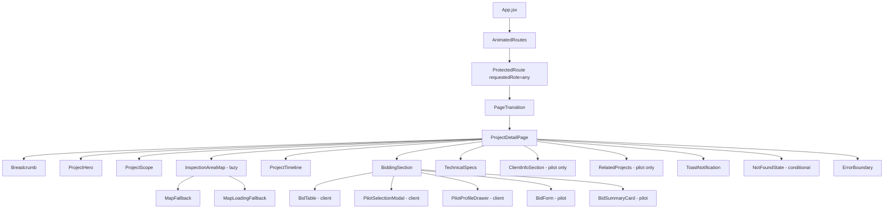
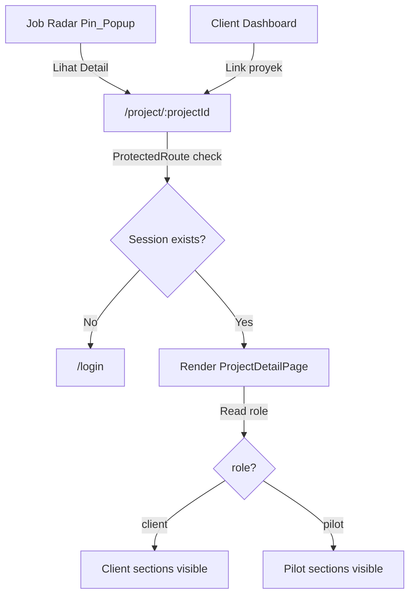
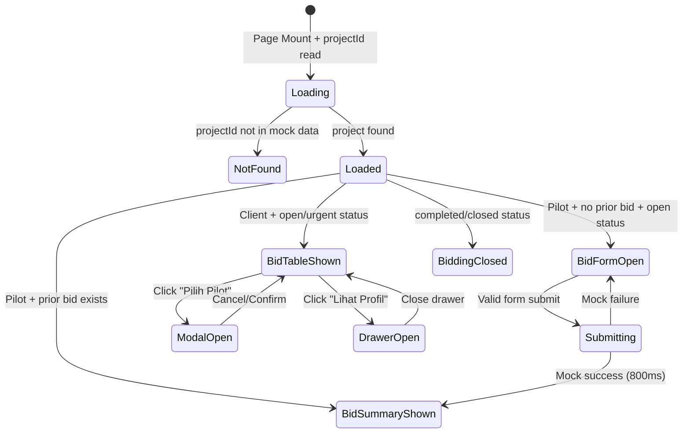

# Design Document: Project Detail Page

## Overview

Project Detail Page adalah halaman informasi lengkap proyek inspeksi pada route `/project/:projectId` yang dapat diakses oleh kedua role — Client dan Pilot. Halaman ini menjadi destinasi dari dua entry point utama: tombol "Lihat Detail" di Job Radar Pin_Popup (Pilot) dan link proyek di Client Dashboard (Client).

Halaman ini bukan sekadar halaman detail biasa, tetapi harus terasa seperti:

```text
SIAGA Project Intelligence Briefing
```

Kesan visual utama:

```text
premium, informatif, role-aware, glassmorphism, dark-cyan accent, aerospace-tech, professional, dan selaras dengan Job Radar / Client Dashboard / Auth Pages SIAGA
```

Project Detail Page menyediakan:
- Hero section dengan status badge, breadcrumb, dan CTA role-aware.
- Scope section dengan deskripsi, deliverables, dan spesifikasi ringkas.
- Peta area inspeksi (Mapbox polygon + marker titik inspeksi) — lazy loaded.
- Timeline horizontal 5 milestone dengan animasi progres.
- Bidding section role-aware: Client melihat Bid_Table + Pilot_Selection_Modal, Pilot melihat Bid_Form + competitor count.
- Technical Specs section (visible kedua role).
- Client Info section (Pilot only).
- Related Projects section (Pilot only).
- Toast notification untuk feedback aksi.
- Error boundary dan Not_Found_State.

Halaman ini diakses melalui route:

```text
/project/:projectId
```

dan dapat diakses oleh user dengan role:

```text
client ATAU pilot (role-aware conditional rendering)
```

---

## Key Design Decisions

- **Single page, dual rendering** — satu komponen `ProjectDetailPage` dengan conditional rendering berdasarkan role dari `AuthContext`. Tidak ada route terpisah per role.
- **Extended Mock Data** — data proyek di-extend dari `mock-data.js` Job Radar dengan field tambahan (polygon, milestones, bids, client_info, spesifikasi_teknis, dll). Single source of truth tetap terjaga.
- **Pure logic layer** — fungsi-fungsi seperti `getProjectStatus`, `getRelatedProjects`, `validateBidForm`, `getRoleVisibility` dipisah ke modul pure agar testable dengan fast-check.
- **Mapbox lazy loading** — `React.lazy()` + Suspense untuk bundle Mapbox agar Hero dan Scope section interaktif lebih dulu.
- **Viewport-triggered sections** — Intersection Observer untuk animasi/render section di bawah fold.
- **Bid state in sessionStorage** — bid yang sudah dikirim disimpan di sessionStorage (keyed by projectId) agar persist selama tab terbuka, konsisten dengan auth mock pattern.
- **CSS per component** — mengikuti pola existing project.
- **Framer Motion** — untuk page transition dan microinteraction section.
- **fast-check** — untuk property-based testing pure logic layer.
- **Design Tokens SIAGA** — wajib dipertahankan, tidak ada warna/font baru di luar token existing.

---

## Architecture

### High-Level Component Tree



### Route Integration



### State Management



---

## Data Flow

```text
Mock_Data_Module (extended from Job Radar mock-data.js)
        │
        ▼
ProjectDetailPage
(reads projectId from useParams, role from useAuth)
        │
        ├── getProjectById(projectId) → project | null
        │        │
        │        ├── null → render NotFoundState
        │        └── project found → render sections
        │
        ├── getProjectStatus(project) → derived status (handles expired)
        │
        ├── getRoleVisibility(role) → { showBidTable, showBidForm, showClientInfo, showRelated, showContractValue }
        │
        ├── getRelatedProjects(project, allProjects) → max 3 related
        │
        ├── validateBidForm(formData) → { ok, errors }
        │
        └── Bid state (sessionStorage keyed by projectId):
              - hasBid(projectId) → boolean
              - saveBid(projectId, bidData) → void
              - getBid(projectId) → bidData | null
```

---

## File Structure

```text
src/pages/ProjectDetail/
├── ProjectDetailPage.jsx
├── ProjectDetailPage.css
├── project-detail-data.js          # Extended mock data module
├── project-logic.js                # Pure functions (PBT target)
├── components/
│   ├── Breadcrumb/
│   │   ├── Breadcrumb.jsx
│   │   └── Breadcrumb.css
│   ├── ProjectHero/
│   │   ├── ProjectHero.jsx
│   │   └── ProjectHero.css
│   ├── ProjectScope/
│   │   ├── ProjectScope.jsx
│   │   └── ProjectScope.css
│   ├── InspectionAreaMap/
│   │   ├── index.js
│   │   ├── InspectionAreaMap.jsx
│   │   ├── InspectionAreaMap.css
│   │   ├── MapLoadingFallback.jsx
│   │   └── MapErrorFallback.jsx
│   ├── ProjectTimeline/
│   │   ├── ProjectTimeline.jsx
│   │   └── ProjectTimeline.css
│   ├── BiddingSection/
│   │   ├── BiddingSection.jsx
│   │   ├── BiddingSection.css
│   │   ├── BidTable.jsx
│   │   ├── BidTable.css
│   │   ├── BidForm.jsx
│   │   ├── BidForm.css
│   │   ├── BidSummaryCard.jsx
│   │   ├── PilotSelectionModal.jsx
│   │   ├── PilotSelectionModal.css
│   │   ├── PilotProfileDrawer.jsx
│   │   └── PilotProfileDrawer.css
│   ├── TechnicalSpecs/
│   │   ├── TechnicalSpecs.jsx
│   │   └── TechnicalSpecs.css
│   ├── ClientInfoSection/
│   │   ├── ClientInfoSection.jsx
│   │   └── ClientInfoSection.css
│   ├── RelatedProjects/
│   │   ├── RelatedProjects.jsx
│   │   └── RelatedProjects.css
│   ├── NotFoundState/
│   │   ├── NotFoundState.jsx
│   │   └── NotFoundState.css
│   └── ToastNotification/
│       ├── ToastNotification.jsx
│       └── ToastNotification.css
└── __tests__/
    ├── project-logic.property.test.js
    ├── project-detail.unit.test.js
    ├── project-detail.integration.test.jsx
    └── project-detail.a11y.test.jsx
```


---

## Layout Design

### Desktop Layout >= 1280px

```text
┌──────────────────────────────────────────────────────────────┐
│ Breadcrumb: Dashboard > Proyek > [Nama Proyek]               │
├──────────────────────────────────────────────────────────────┤
│ PROJECT HERO SECTION                                         │
│ [Status Badge] [Jenis Infrastruktur]                         │
│ H1: Nama Proyek                                              │
│ Lokasi • Deadline • Nilai Kontrak (client only)              │
│ [CTA Button role-aware]                                      │
├──────────────────────────────────────────────────────────────┤
│ PROJECT SCOPE                                                │
│ Deskripsi | Deliverables | Luas Area | Titik Inspeksi        │
├──────────────────────────────────────────────────────────────┤
│ INSPECTION AREA MAP (400px height, lazy loaded)              │
│ Mapbox polygon + markers                                     │
│ GPS coordinates below                                        │
├──────────────────────────────────────────────────────────────┤
│ PROJECT TIMELINE (horizontal 5 milestones)                   │
├──────────────────────────────────────────────────────────────┤
│ BIDDING SECTION (role-aware)                                 │
│ Client: Bid Table + Pilih Pilot + Lihat Profil               │
│ Pilot: Competitor count + Bid Form / Bid Summary             │
├──────────────────────────────────────────────────────────────┤
│ TECHNICAL SPECS (grid layout)                                │
├──────────────────────────────────────────────────────────────┤
│ CLIENT INFO (pilot only) │ RELATED PROJECTS (pilot only)     │
└──────────────────────────────────────────────────────────────┘
```

### Tablet Layout 768px - 1279px

- Map height reduces to 300px.
- Bid_Table becomes horizontally scrollable.
- Related Projects uses 2-column grid.
- Padding reduces proportionally.

### Mobile Layout < 768px

- Map height reduces to 250px.
- Bid_Table converts to card stack (one card per bid).
- Related Projects stacks vertically.
- Timeline becomes compact (smaller dots, shorter labels).
- Hero section reduces font size and padding.
- No horizontal scroll at any viewport >= 320px.


---

## Components and Interfaces

### ProjectDetailPage

```jsx
// Props: none (reads from URL params + AuthContext)
// Route: /project/:projectId

// State:
// project: Project | null (from mock data lookup)
// isNotFound: boolean
// bidFormData: { harga: number, estimasiHari: number, catatan: string, droneType: string }
// bidFormErrors: { harga?: string, estimasiHari?: string }
// isBidSubmitting: boolean
// hasBid: boolean (from sessionStorage)
// submittedBid: BidData | null
// selectedPilotId: string | null (for modal)
// isModalOpen: boolean
// isDrawerOpen: boolean
// drawerPilotId: string | null
// toastMessage: string | null
```

#### Responsibilities

- Read `projectId` from `useParams()`.
- Read `session.role` from `useAuth()`.
- Lookup project from extended mock data.
- Compute derived status (handle expired deadline).
- Determine role-based visibility.
- Manage bid form state and submission.
- Manage modal/drawer open state.
- Provide toast feedback.
- Reset all local state when `projectId` changes (via useEffect on projectId).

---

### project-logic.js (Pure Functions — PBT Target)

```js
/**
 * Get project by ID from extended mock data.
 */
export function getProjectById(projects, projectId) {}

/**
 * Compute derived project status.
 * If deadline < today AND status === 'open', returns 'expired'.
 * Otherwise returns original status.
 */
export function getProjectStatus(project, today = new Date()) {}

/**
 * Get status badge visual config.
 * Maps status to { color, label, cssClass }.
 */
export function getStatusBadgeVisual(status) {}

/**
 * Determine which sections/elements are visible per role.
 */
export function getRoleVisibility(role, projectStatus, hasBid) {}

/**
 * Get related projects: same jenis_infrastruktur, exclude current.
 * Fallback: same provinsi if no infra match.
 * Max 3 results.
 */
export function getRelatedProjects(currentProject, allProjects) {}

/**
 * Validate bid form data.
 * Returns { ok: boolean, errors: { harga?: string, estimasiHari?: string } }
 */
export function validateBidForm(formData) {}

/**
 * Check if deadline has passed.
 */
export function isDeadlinePassed(deadline, today = new Date()) {}

/**
 * Format date to Indonesian format (e.g., "15 Maret 2026").
 */
export function formatTanggalIndonesia(dateString) {}

/**
 * Determine the correct hero CTA based on role + status + hasBid.
 */
export function getHeroCTA(role, projectStatus, hasBid) {}

/**
 * Get dashboard path for role (for breadcrumb/not-found navigation).
 */
export function getDashboardPath(role) {}

/**
 * Verify milestone consistency with project status.
 * If status is 'in_progress', at least one milestone must be 'in_progress'.
 */
export function isMilestoneConsistent(projectStatus, milestones) {}
```


---

### ProjectHero

```jsx
<ProjectHero
  project={project}
  derivedStatus={derivedStatus}
  role={role}
  hasBid={hasBid}
  onCTAClick={handleHeroCTA}
/>
```

#### Visual Requirements

- Background: navy gradient using `--color-primary`.
- Title: H1, Montserrat 700/800.
- Status badge: pill shape, color mapped by status.
- Info row: ikon infrastruktur + lokasi + deadline (format Indonesia).
- Contract value: visible for Client only (hidden for Pilot unless completed+selected).
- CTA button: gradient `--color-accent`, role-aware text.

---

### Breadcrumb

```jsx
<Breadcrumb
  role={role}
  projectName={project.nama}
/>
```

Format: `Dashboard > Proyek > [Nama Proyek]`

- Uses `<nav aria-label="Breadcrumb">`.
- "Dashboard" links to `/dashboard/client` or `/dashboard/pilot` based on role.
- "Proyek" is non-clickable label.
- Current project name is non-clickable, bold.

---

### ProjectScope

```jsx
<ProjectScope project={project} />
```

Displays:
- Deskripsi lengkap.
- Jenis infrastruktur + ikon.
- Luas area (km²).
- Jumlah titik inspeksi.
- Deliverables list (chips/tags).
- Ringkasan spesifikasi teknis.

Style: card with `--color-surface` background, consistent border radius.

---

### InspectionAreaMap (Lazy Loaded)

```jsx
const InspectionAreaMap = lazy(() => import('./InspectionAreaMap'));

<Suspense fallback={<MapLoadingFallback />}>
  <InspectionAreaMap
    polygonCoords={project.polygon_area}
    inspectionPoints={project.titik_inspeksi}
    center={project.lokasi}
  />
</Suspense>
```

#### Mapbox Settings

- Token: `import.meta.env.VITE_MAPBOX_TOKEN`.
- Style: `mapbox://styles/mapbox/dark-v11`.
- Container height: 400px (desktop), 300px (tablet), 250px (mobile).
- Polygon fill: `--color-accent` at 20% opacity.
- Polygon stroke: `--color-accent` solid.
- Markers: cyan dots at each `titik_inspeksi`.
- Auto-fit bounds to polygon bounding box.
- GPS coordinates displayed below map.

#### Error Handling

- `MapErrorFallback`: shows "Peta tidak tersedia" + text list of coordinates.
- Does not crash the page.

---

### ProjectTimeline

```jsx
<ProjectTimeline
  milestones={project.milestones}
  projectStatus={derivedStatus}
/>
```

Five milestones in order:
1. Posted
2. Bidding Open
3. Pilot Selected
4. Inspection In Progress
5. Report Ready

Visual per milestone status:
- `completed`: checkmark icon, `--color-success`, filled connector line `--color-accent`.
- `in_progress`: pulse animation `--color-accent`, duration 1.2s–2s.
- `upcoming`: reduced opacity 0.3–0.5, grey connector line.

Style consistent with Client Dashboard timeline design language.


---

### BiddingSection

```jsx
<BiddingSection
  role={role}
  project={project}
  derivedStatus={derivedStatus}
  hasBid={hasBid}
  submittedBid={submittedBid}
  bidFormData={bidFormData}
  bidFormErrors={bidFormErrors}
  isBidSubmitting={isBidSubmitting}
  onBidFormChange={handleBidFormChange}
  onBidSubmit={handleBidSubmit}
  onSelectPilot={handleSelectPilot}
  onViewProfile={handleViewProfile}
/>
```

#### Client View (role === "client")

Renders `BidTable` with columns:
- Avatar
- Nama Pilot
- Badge SIAGA Verified
- Rating (stars + numeric)
- Harga Bid (Rupiah format)
- Estimasi Hari
- Drone Type
- Aksi: "Pilih Pilot" + "Lihat Profil"

Row hover: highlight `--color-accent` at 8% opacity.

If status "completed" or "closed": show message "Bidding telah selesai untuk proyek ini" instead of table.

#### Pilot View (role === "pilot")

Shows:
- "[N] pilot sudah mengajukan bid" (from `jumlah_bidder`).
- **NEVER** shows bid prices, names, or details of other pilots.

Conditional rendering:
- If `hasBid === false` AND status is open/urgent/deadline_dekat: show `BidForm`.
- If `hasBid === true`: show `BidSummaryCard`.
- If status completed/closed: show "Bidding telah ditutup untuk proyek ini".
- If deadline passed AND status open: show disabled form with message.

---

### BidForm

```jsx
<BidForm
  formData={bidFormData}
  errors={bidFormErrors}
  isSubmitting={isBidSubmitting}
  isDisabled={isDeadlinePassed}
  onChange={onBidFormChange}
  onSubmit={onBidSubmit}
/>
```

Fields:
- Harga Penawaran (Rp) — number input, required.
- Estimasi Hari Pengerjaan — number input, required.
- Catatan Teknis — textarea, optional.
- Drone yang akan digunakan — dropdown select.

Validation (via `validateBidForm`):
- `harga` empty or 0 → "Harga penawaran wajib diisi"
- `estimasiHari` empty or 0 → "Estimasi hari wajib diisi"

Submit flow:
1. Validate form.
2. If errors → show inline errors, no submit.
3. If valid → set `isBidSubmitting = true`, disable button, show spinner.
4. Wait 800ms mock delay.
5. Save bid to sessionStorage.
6. Show Toast "Penawaran berhasil dikirim!".
7. Replace form with BidSummaryCard.
8. Update hero CTA to "Bid Terkirim ✓" disabled.

Double-submit prevention: button disabled while `isBidSubmitting === true`.

---

### PilotSelectionModal

```jsx
<PilotSelectionModal
  isOpen={isModalOpen}
  pilot={selectedPilot}
  onConfirm={handleConfirmSelection}
  onCancel={handleCancelModal}
/>
```

Content:
- Pilot name + avatar.
- Confirmation warning text.
- "Batal" button (secondary).
- "Konfirmasi Pilihan" button (primary, accent gradient).

Behavior:
- Focus trap while open.
- Escape closes.
- Confirm → close + Toast "Pilot berhasil dipilih!".
- Returns focus to trigger button on close.

---

### PilotProfileDrawer

```jsx
<PilotProfileDrawer
  isOpen={isDrawerOpen}
  pilot={drawerPilot}
  onClose={handleCloseDrawer}
/>
```

Slides from right. Content:
- Avatar large.
- Nama pilot.
- Badge SIAGA Verified.
- Rating.
- Drone yang dimiliki.
- Jumlah proyek selesai.
- Area operasi.

Behavior:
- Focus management on open.
- Escape closes.
- Overlay click closes.

---

### TechnicalSpecs

```jsx
<TechnicalSpecs specs={project.spesifikasi_teknis} />
```

Grid/table layout with Lucide icons:
- Resolusi foto minimum.
- Format output (RAW, TIFF, MP4, LAS).
- Standar (ISO, SNI).
- Peralatan minimum (drone type, sensor).
- Kondisi cuaca yang diizinkan.
- Jam operasional penerbangan.

Visible for both roles.


---

### ClientInfoSection (Pilot Only)

```jsx
{role === 'pilot' && <ClientInfoSection clientInfo={project.client_info} />}
```

Card content:
- Nama perusahaan.
- Rating sebagai client (stars).
- Jumlah proyek selesai di SIAGA.
- Member since (tahun).
- Badge "Verified Company".

Style: `--color-surface` background, consistent border radius.

---

### RelatedProjects (Pilot Only)

```jsx
{role === 'pilot' && (
  <RelatedProjects
    currentProject={project}
    allProjects={allProjects}
  />
)}
```

Logic (in `getRelatedProjects`):
1. Filter projects with same `jenis_infrastruktur`, exclude current `id`.
2. If < 3 results, fallback to same `provinsi`.
3. Return max 3.

Card style: glassmorphism dark panel, hover glow cyan (consistent with Job Radar Mission Cards).

Each card shows: nama, jenis infrastruktur, lokasi, nilai kontrak compact, status badge.

Click navigates to `/project/:otherId`.

---

### NotFoundState

```jsx
{isNotFound && (
  <NotFoundState role={role} onBack={handleBackToDashboard} />
)}
```

Content:
- Illustration (simple SVG or icon).
- "Proyek tidak ditemukan".
- Button "Kembali ke Dashboard" → navigates to role-appropriate dashboard.

---

### ToastNotification

```jsx
<ToastNotification message={toastMessage} onDismiss={clearToast} />
```

- Glass style, cyan accent, rounded 18–22px.
- Auto dismiss 3–5 seconds.
- `aria-live="polite"` for screen reader announcement.


---

## Data Models

### Extended Project (project-detail-data.js)

```ts
interface ProjectDetail {
  // Base fields (from Job Radar mock-data.js)
  id: string;
  nama: string;
  jenis_infrastruktur: InfraType;
  nilai_kontrak: number;
  lokasi: {
    lat: number;
    lng: number;
    kota: string;
    provinsi: string;
  };
  deadline: string;              // ISO date string
  status: ProjectStatus;
  jumlah_bidder: number;
  deskripsi: string;
  client_nama: string;

  // Extended fields for Project Detail Page
  luas_area: number;             // km²
  jumlah_titik_inspeksi: number;
  deliverables: string[];        // e.g. ["Foto RAW", "Video 4K", "Orthomosaic", "Point Cloud"]
  spesifikasi_teknis: TechnicalSpec;
  polygon_area: [number, number][];  // Array of [lng, lat] for Mapbox polygon
  titik_inspeksi: InspectionPoint[];
  milestones: ProjectMilestones;
  client_info: ClientInfo;
  bids: BidEntry[];
}

type InfraType =
  | 'SUTET'
  | 'Jembatan'
  | 'Kilang'
  | 'Solar Panel'
  | 'Bendungan'
  | 'Tower';

type ProjectStatus =
  | 'open'
  | 'urgent'
  | 'deadline_dekat'
  | 'in_progress'
  | 'completed'
  | 'closed';

// Derived status (computed at runtime)
type DerivedStatus = ProjectStatus | 'expired';
```

### TechnicalSpec

```ts
interface TechnicalSpec {
  resolusi_foto: string;         // e.g. "20MP minimum"
  format_output: string[];       // e.g. ["RAW", "TIFF", "MP4"]
  standar: string[];             // e.g. ["ISO 19157", "SNI 8202:2015"]
  peralatan_minimum: string;     // e.g. "DJI Matrice 300 RTK + Zenmuse H20T"
  kondisi_cuaca: string;         // e.g. "Cerah, angin < 20 knot"
  jam_operasional: string;       // e.g. "06:00 - 17:00 WIB"
}
```

### InspectionPoint

```ts
interface InspectionPoint {
  lat: number;
  lng: number;
  label: string;                 // e.g. "Titik 1 - Tower A"
}
```

### ProjectMilestones

```ts
interface ProjectMilestones {
  posted: MilestoneEntry;
  bidding_open: MilestoneEntry;
  pilot_selected: MilestoneEntry;
  inspection_in_progress: MilestoneEntry;
  report_ready: MilestoneEntry;
}

interface MilestoneEntry {
  status: 'completed' | 'in_progress' | 'upcoming';
  date: string | null;           // ISO date or null if upcoming
}
```

### ClientInfo

```ts
interface ClientInfo {
  nama: string;
  rating: number;                // 1-5
  proyek_selesai: number;
  member_since: number;          // year
  verified: boolean;
}
```

### BidEntry

```ts
interface BidEntry {
  id: string;
  pilot_id: string;
  pilot_nama: string;
  pilot_avatar: string;
  pilot_verified: boolean;
  pilot_rating: number;
  harga_bid: number;
  estimasi_hari: number;
  drone_type: string;
  catatan?: string;
}
```

### BidFormData

```ts
interface BidFormData {
  harga: number | '';
  estimasiHari: number | '';
  catatan: string;
  droneType: string;
}
```

### StatusBadgeVisual

```ts
interface StatusBadgeVisual {
  color: string;
  label: string;
  cssClass: string;
}
```

### RoleVisibility

```ts
interface RoleVisibility {
  showContractValue: boolean;
  showBidTable: boolean;
  showBidForm: boolean;
  showClientInfo: boolean;
  showRelatedProjects: boolean;
  showGenerateReport: boolean;
}
```


---

## Correctness Properties

*A property is a characteristic or behavior that should hold true across all valid executions of a system — essentially, a formal statement about what the system should do. Properties serve as the bridge between human-readable specifications and machine-verifiable correctness guarantees.*

PBT applies to this feature for the **pure logic layer**: project lookup, status derivation, role visibility, related projects filtering, bid form validation, and data consistency checks. It does NOT apply to visual layout, animations, Mapbox rendering, or modal/drawer behavior — those are covered by example-based component tests.

---

### Property 1: Project lookup is total and correct

*For any* valid projectId that exists in the mock data array, `getProjectById(projects, projectId)` returns the project object with matching `id`. *For any* string that does NOT exist as an `id` in the mock data array, `getProjectById(projects, projectId)` returns `null`.

**Validates: Requirements 1.4, 1.5, 11.4**

---

### Property 2: Status badge visual mapping is deterministic and total

*For any* valid derived status (`open`, `urgent`, `deadline_dekat`, `in_progress`, `completed`, `expired`), `getStatusBadgeVisual(status)` returns the correct visual configuration:
- `open` → `--color-accent` (#00D2FF), label "Open"
- `urgent` → `--color-danger` (#FF4C4C), label "Urgent"
- `in_progress` → `--color-warning` (#F5B740), label "In Progress"
- `completed` → `--color-success` (#00C48C), label "Completed"
- `expired` → grey (#8BA3BE), label "Expired"

Mapping is total (no status produces undefined) and deterministic (same input always produces same output).

**Validates: Requirements 2.3, 2.13**

---

### Property 3: Role-aware data isolation — Pilot never sees bid prices

*For any* project with bids and role "pilot", `getRoleVisibility('pilot', status, hasBid)` returns `showBidTable: false`. Furthermore, for any project data rendered in Pilot view, no bid price (`harga_bid`), pilot name, or bid detail from the `bids` array is included in the visible output.

**Validates: Requirements 7.2, 7.14**

---

### Property 4: Role visibility is consistent and exhaustive

*For any* role `r ∈ {'client', 'pilot'}`, project status `s`, and bid state `hasBid`, `getRoleVisibility(r, s, hasBid)` returns a complete `RoleVisibility` object where:
- Client: `showBidTable = (s not in ['completed', 'closed'])`, `showBidForm = false`, `showClientInfo = false`, `showRelatedProjects = false`, `showContractValue = true`
- Pilot: `showBidTable = false`, `showBidForm = (!hasBid && s in ['open', 'urgent', 'deadline_dekat'])`, `showClientInfo = true`, `showRelatedProjects = true`, `showContractValue = false` (unless completed+selected)

**Validates: Requirements 1.7, 2.5, 2.6, 6.10, 7.3, 7.11, 7.12, 9.1, 9.2, 10.1, 10.2**

---

### Property 5: Derived status correctly handles expired deadline

*For any* project where `deadline < today` AND `status === 'open'`, `getProjectStatus(project, today)` returns `'expired'`. *For any* project where `deadline >= today` OR `status !== 'open'`, `getProjectStatus(project, today)` returns the original `status` unchanged.

**Validates: Requirements 2.13, 15.3**

---

### Property 6: Bid form validation rejects invalid inputs and accepts valid ones

*For any* `BidFormData` object, `validateBidForm(formData)` returns `ok: true` if and only if `harga > 0` AND `estimasiHari > 0`. Otherwise it returns specific error messages: "Harga penawaran wajib diisi" when harga is empty/0, "Estimasi hari wajib diisi" when estimasiHari is empty/0.

**Validates: Requirements 7.6, 7.7**

---

### Property 7: Related projects filtering excludes current and matches criteria

*For any* project and array of all projects, `getRelatedProjects(currentProject, allProjects)` returns an array where:
- Length is at most 3.
- Current project's `id` is never included.
- All results share `jenis_infrastruktur` with current project (primary), OR share `provinsi` (fallback when infra match < 3).

**Validates: Requirements 10.3, 10.4, 10.5**

---

### Property 8: Hero CTA is deterministic based on role + status + hasBid

*For any* combination of role, derived status, and hasBid, `getHeroCTA(role, status, hasBid)` returns exactly one CTA configuration:
- Client + completed → "Generate Report"
- Client + open/urgent/deadline_dekat → "Lihat Bidding" (scrolls to bidding)
- Pilot + open/urgent/deadline_dekat + !hasBid → "Bid Sekarang" (scrolls to bidding)
- Pilot + hasBid → "Bid Terkirim ✓" (disabled)
- Otherwise → null (no CTA)

**Validates: Requirements 2.9, 2.10, 2.11, 2.12**

---

### Property 9: Milestone consistency with project status

*For any* project, if `getProjectStatus(project)` returns `'in_progress'`, then at least one milestone in `project.milestones` has `status === 'in_progress'`. If project status is `'completed'`, all milestones have `status === 'completed'`.

**Validates: Requirements 5.7**

---

### Property 10: Mock data schema validation

*For any* project in the extended mock data array:
- All required fields exist and have correct types.
- `status` is a valid `ProjectStatus`.
- `jenis_infrastruktur` is a valid `InfraType`.
- `nilai_kontrak` is positive.
- `lokasi.lat` is between -11 and 6, `lokasi.lng` is between 95 and 141 (Indonesia bounding box).
- `jumlah_bidder` equals `bids.length`.
- `polygon_area` has at least 3 coordinate pairs.
- `milestones` has all 5 keys.

**Validates: Requirements 11.3, 11.5, 11.6**


---

## Error Handling

| Scenario | Handling Strategy | User Experience |
|----------|------------------|-----------------|
| projectId not found in mock data | Render `NotFoundState` | User sees "Proyek tidak ditemukan" + "Kembali ke Dashboard" button |
| No auth session | `ProtectedRoute` redirects | User redirected to `/login` |
| Mapbox token invalid / network error | Error boundary around map, render `MapErrorFallback` | User sees "Peta tidak tersedia" + text coordinates |
| Mapbox lazy chunk fails | Suspense fallback then error boundary | Loading state then fallback |
| Bid form validation fails | Inline error messages per field | User sees specific error below each invalid field |
| Bid submit mock failure | Toast error + form remains editable | User can retry |
| Double-submit bid | Button disabled + spinner while submitting | Prevents duplicate |
| Deadline passed + status open | Derived status "expired", form disabled | User sees "Proyek sudah melewati deadline" message |
| Navigate to different projectId | useEffect resets all local state | Fresh render with new project data |
| Unexpected exception | Page-level error boundary | "Terjadi kesalahan" + "Muat Ulang" button |
| Status completed/closed | Bidding section shows closed message | Clear feedback, no broken form |

### Error Boundary Hierarchy

```text
App ErrorBoundary (existing)
  └── ProjectDetailPage
        ├── NotFoundState (conditional, not error)
        ├── ProjectHero
        ├── ProjectScope
        ├── MapErrorBoundary
        │     └── InspectionAreaMap (lazy + Suspense)
        ├── ProjectTimeline
        ├── BiddingSection
        │     ├── PilotSelectionModal
        │     └── PilotProfileDrawer
        ├── TechnicalSpecs
        ├── ClientInfoSection
        └── RelatedProjects
```

---

## Accessibility

Requirements:
- Semantic HTML: `<main>`, `<section>`, `<nav>` for Breadcrumb, `<h1>` for project title, `<h2>` for section titles.
- Breadcrumb: `<nav aria-label="Breadcrumb">`.
- Status badge: `aria-label` describing status (e.g., "Status proyek: Urgent").
- Map: `aria-label="Peta area inspeksi proyek"`, `role="img"` as fallback.
- Bid form: every input has `<label htmlFor>`, errors use `aria-describedby` + `aria-invalid="true"`.
- Modal: focus trap, Escape closes, returns focus to trigger.
- Drawer: focus management, Escape closes.
- Toast: `aria-live="polite"`.
- Timeline: `aria-label` describing progress (e.g., "Progres proyek: 3 dari 5 tahap selesai").
- All interactive elements: visible focus indicator `--color-accent`.
- Tab order follows visual order.
- No keyboard traps outside modal/drawer.


---

## Testing Strategy

### Library Choice

- **Property-based testing**: `fast-check` (already in devDependencies).
- **Test runner**: Vitest (`vitest run` for single execution).
- **Component tests**: `@testing-library/react` + `@testing-library/jest-dom`.
- **Accessibility**: `vitest-axe`.
- **Mock**: `vi.mock` for router navigate, sessionStorage stub.

### Property Tests

Library: `fast-check`
Minimum: `100 iterations per property`
Location: `src/pages/ProjectDetail/__tests__/project-logic.property.test.js`

Each property from the Correctness Properties section maps to one property-based test:

| Property | Generator Highlights |
|---|---|
| 1. Project lookup | `fc.constantFrom(...validIds)` + `fc.string()` for invalid IDs |
| 2. Status badge visual | `fc.constantFrom('open', 'urgent', 'deadline_dekat', 'in_progress', 'completed', 'expired')` |
| 3. Role data isolation | Generate project with bids + role='pilot', assert no price leaks |
| 4. Role visibility | `fc.constantFrom('client', 'pilot')` × `fc.constantFrom(...statuses)` × `fc.boolean()` |
| 5. Derived status (expired) | `fc.date()` for today, projects with various deadlines |
| 6. Bid form validation | `fc.record({ harga: fc.oneof(fc.constant(0), fc.nat()), estimasiHari: fc.oneof(fc.constant(0), fc.nat()) })` |
| 7. Related projects | Generate project arrays with varying infra types and provinces |
| 8. Hero CTA | All combinations of role × status × hasBid |
| 9. Milestone consistency | Generate milestone objects with various status combinations |
| 10. Mock data schema | Validate every project in the actual mock data array |

Configuration:
```js
fc.assert(fc.property(...), { numRuns: 100 })
```

Tag format:
```js
// Feature: project-detail-page, Property {N}: {property text}
```

### Unit Tests (Example-Based)

Location: `src/pages/ProjectDetail/__tests__/project-detail.unit.test.js`

Covers:
- `formatTanggalIndonesia` with specific dates.
- `getDashboardPath` for each role.
- `getRelatedProjects` with edge cases (no matches, fewer than 3 available).
- `validateBidForm` with boundary values.
- Bid sessionStorage round-trip (save → read).
- `getProjectStatus` with today = deadline day (boundary).

### Integration Tests

Location: `src/pages/ProjectDetail/__tests__/project-detail.integration.test.jsx`

Covers:
- Route `/project/:projectId` renders page for valid ID.
- Invalid projectId shows NotFoundState.
- No session redirects to `/login`.
- Client role sees Bid_Table, does NOT see Client_Info or Related_Projects.
- Pilot role sees Bid_Form, Client_Info, Related_Projects, does NOT see Bid_Table.
- Pilot role does NOT see bid prices anywhere in DOM.
- Bid form submit flow: fill → submit → loading → toast → summary card.
- "Kembali ke Dashboard" navigates to correct dashboard per role.
- Related project card click navigates to new project route.
- projectId change resets state (simulate navigation).

### Accessibility Tests

Location: `src/pages/ProjectDetail/__tests__/project-detail.a11y.test.jsx`

Uses: `vitest-axe`

Covers:
- No accessibility violations on initial render (client view).
- No accessibility violations on initial render (pilot view).
- Breadcrumb has correct ARIA.
- Bid form labels connected to inputs.
- Modal focus trap works.
- Toast uses aria-live.
- Timeline has descriptive aria-label.
- Focus indicators visible.

### Visual QA Checklist

Check at viewport: 320px, 768px, 1280px, 1440px.

Must verify:
- No horizontal scroll.
- Hero section readable on all sizes.
- Map responsive.
- Timeline readable on mobile.
- Bid table → card stack on mobile.
- Related projects stack on mobile.
- Glassmorphism consistent with other pages.
- Design tokens respected throughout.
- Page transition smooth.

---

## Design Tokens

Reuse existing SIAGA tokens. No new tokens introduced.

### Core Tokens

```css
--color-primary: #0A192F;
--color-accent: #00D2FF;
--color-surface: #F4F7F6;
--color-danger: #FF4C4C;
--color-success: #00C48C;
--color-warning: #F5B740;
```

### Typography

```text
Display font: Montserrat (headings H1, H2)
Body font: Inter (body, labels, inputs, badges)
```

### Glassmorphism (for cards, sections)

```css
background: rgba(6, 26, 51, 0.72);
backdrop-filter: blur(24px);
border: 1px solid rgba(0, 210, 255, 0.18);
box-shadow: 0 20px 60px rgba(0, 15, 35, 0.25);
border-radius: 18px;
```

### Hover Effects

```css
transform: translateY(-6px);
transition: transform 200ms ease-out, box-shadow 200ms ease-out;
box-shadow: 0 12px 40px rgba(0, 210, 255, 0.15);
```

---

## Notes for Implementation

- Extend `mock-data.js` from Job Radar — do NOT duplicate base project data. Import and extend.
- Route must be added to `App.jsx` with `ProtectedRoute` that accepts BOTH roles.
- `ProtectedRoute` currently only supports single `requestedRole`. May need to add support for array of roles or a new "any authenticated" mode.
- Bid state stored in sessionStorage keyed as `siaga_bid_{projectId}` to persist during tab session.
- Use `useParams()` from react-router-dom to read projectId.
- Use `useEffect` with `[projectId]` dependency to reset state on navigation between projects.
- Reuse `formatRupiah` and `formatCompactRupiah` from Job Radar `filters.js` — import directly.
- Reuse `PageTransition` wrapper and `CustomCursor` (already global).
- Map component should be in its own chunk via dynamic import.
- Intersection Observer for below-fold sections (map, timeline, bidding, specs, related).
- Toast component can be shared with Job Radar if already implemented, otherwise create in ProjectDetail scope.
